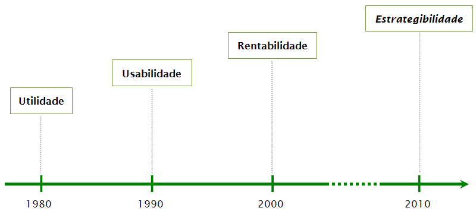
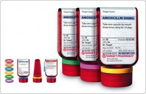
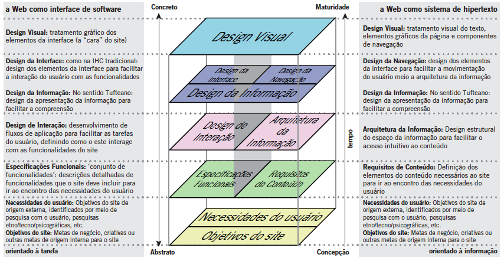

# Experiência do Usuário

*"Quando nada acontece, há um milagre que não estamos vendo." -- João Guimarães Rosa*

## O que é Experiência do Usuário?


Experiência do Usuário (UX, de User Experience) é um tema bastante subjetivo. É difícil de maneira
objetiva e direta dizer como desenhar uma experiência do usuário, mas é possível aprendermos como
desenhar um produto, serviço ou ambiente que proporcione uma experiência satisfatória para alguém
que os use, identificando todos os aspectos da interação do usuário com esse produto (ou serviço ou
ambiente).

> **Experiência do Usuário**
> Como uma pessoa se sente ao usar um produto. Ou mais formalmente, de acordo com a definição dada
> pela ISO 9241-210, são as respostas e percepções de uma pessoa resultantes do uso de um produto,
> sistema ou serviço.


Como disciplina, é uma palavra guarda-chuva que tem relação com os princípios de **Design Centrado no Usuário  (UCD)**, **Design de Interação (IxD)** e **Usabilidade**, todos vistos ao longo dos capítulos. É multidisciplinar, incorporando aspectos da psicologia, antropologia, ciência da computação, design gráfico, design industrial e ciência cognitiva.

Apesar da Experiência do Usuário estar presente tanto em produtos físicos como virtuais, serviços
ou ambientes, será abordado um tipo específico de produto: as aplicações web.

## ISO 9241-210

Em 2011, foi criada a ISO 9241-210. A série 9241 aborda ergonomia e a interação homem-máquina e a nova parte 210 o design centrado em pessoas em sistemas interativos, que define a experiência do usuário como as respostas e percepções de uma pessoa resultantes do uso de um produto, sistema ou serviço.

Ela possui seis princípios chaves:

1. O projeto é baseado no entendimento explícito de usuários, tarefas e ambientes.
2. Os usuários estão envolvidos em todo projeto e desenvolvimento.
3. O projeto é conduzido e refinado por avaliações centradas no usuário.
4. O processo é iterativo.
5. O projeto aborda toda a experiência do usuário.
6. A equipe de design inclui competências multidisciplinares e perspectivas.


## A Evolução da Experiência do Usuário

O termo "Experiência do Usuário" foi cunhado pela primeira vez por Don Norman em meados de 1990.
Segundo o próprio Norman comentou em uma entrevista:

```
"Eu inventei o termo porque achava que interface do usuário e usabilidade eram muito
restritos, eu queria cobrir todos os aspectos da experiência de uma pessoa com o
sistema,  incluindo design industrial, gráficos, a interface, a interação física
e o manual. Desde  então o termo tem se espalhado amplamente..."
```

Mas mesmo antes de serem batizados, os conceitos da Experiência do Usuário já vinham sendo usados
através do tempo.


### Utilidade
Uso do computador para facilitar operações de rotina.

### Usabilidade
Facilidade e eficiência no uso.

### Rentabilidade
Análise de aspectos de UX (visitantes, funil de vendas, comportamento do usuário) para aumentar a
lucratividade.

### Estrategibilidade
Design da Experiência do Usuário influenciando a estratégia do negócio.

## Para saber mais: O Caso ClearRX

ClearRX é um sistema de embalagem para quem usa medicamentos com receita, que torna mais fácil as
pessoas saberem como tomar seus remédios. Ele é um exemplo de como UX pode influenciar toda uma estratégia de negócio.

A motivação que levou a estudante de design Deborah Adler a fazer esse sistema como sua tese de
mestrado foi sua avó ter tomado o remédio de seu avô por engano.



Suas características:

* contém a prescrição e posologia no frasco para que não haja enganos;
* o nome do medicamento está escrito não só na face lateral como no topo;
* na outra das faces há importantes informações pessoais e relativas ao medicamento;
* tem faces planas para que a informação seja lida com mais facilidade;
* se, mesmo assim, ainda for difícil perceber o que está escrito, o frasco vem com um "cartão-lupa" para ler o texto;
* existem anéis de diferentes cores para que, no caso de existir mais que um frasco em casa, se possa diferenciar que frasco pertence a quem;
* o frasco para líquidos está adaptado à entrada de seringas orais para uma medição mais fácil.

Depois de concluir sua tese, Deborah levou a idéia a Target e juntos criaram um sistema completo.
Veja mais em http://www.adaptivepath.com/ideas/essays/archives/000812.php

## Elementos da Experiência do Usuário

O processo de design de experiência do usuário procura garantir que nenhum aspecto de experiência do usuário com o produto aconteça sem a sua intenção consciente, explícita.

Uma maneira de atacar esta complexidade é quebrar o trabalho de elaboração da experiência do usuário em elementos que a compõem, facilitando o entendimento da tarefa como um todo.

A experiência do usuário acaba sendo resultado de um conjunto de decisões tomadas na criação de um produto, sistema ou serviço: como vai se aparecer, como vai se comportar, o que pode ser feito, e por aí vai. Dividir essas decisões em camadas ajuda a compreender como essas decisões são feitas.

## Planos da Experiência do Usuário

Jesse James Garret, em seu livro *Elements of User Experience* propõe
**cinco planos** que facilitam a compreensão das decisões feitas em cada um deles.
Cada decisão de um plano superior depende do inferior. Esses planos são:
**estratégico**, **escopo**, **estrutura**, **esqueleto** e **superfície**.
O primeiro mais **abstrato** até chegar ao último, mais **concreto**.

### Problema de comunicação
O problema ainda era o de nomenclatura, porque parte da comunidade em Experiência do
Usuário tratava os problemas como de Design de Aplicação com soluções tradicionais
(transação, segurança, escalabilidade, etc). A outra parte via a web como meio de
distribuição e captura de informação, aplicando soluções do meio de publicações, mídia
e ciência da informação (marqueteiros).

### Solução: dois contextos
Para resolver essa dualidade Garret dividiu cada plano em dois contextos: a web como
**funcionalidade** (interface de software) e a web como **meio de informação**
(sistema de hipertexto). Para cada contexto, um elemento se destaca.



### A responsabilidade é de todos
Esse diagrama apresenta os elementos organizados em planos, do mais abstrato ao mais concreto, e
nos faz perceber como todas as áreas de uma empresa têm grande responsabilidade no processo de
desenvolvimento da experiência do usuário, já que o que vai ser desenvolvido pelos planos mais
concretos é baseado e influenciado pelo que foi definido nos mais abstratos.

### Time de Experiência do Usuário multidisciplinar
Por esse motivo, algumas empresas que criaram um time de Experiência do Usuário o
fizeram de maneira multidisciplinar, envolvendo diversos tipos de competências, indo
de psicólogos a engenheiros de softwares, passando por analistas de especificação e
designers.

Vejamos cada um dos planos a seguir.

### Estratégia
**Pergunta:** por que estamos fazendo este produto?

A estratégia alinha as necessidades dos usuários com os objetivos do negócio.
Necessidade dos usuários são os objetivos para sua aplicação que vem de fora da
organização.

Deve-se entender o que sua audiência quer e como isso casa com outros objetivos
do negócio que existem. Um web site falha não por questões tecnológicas ou de experiência do Usuário, mas por não responder a duas perguntas:

* O que queremos do produto?
* O que os usuários querem dele?

O segredo aqui é **tornar tudo explícito**. Para entender o que o usuário deseja, pesquisas são necessárias.

### Escopo
**Pergunta:** o que faremos?

Marca o início da divisão entre a Web como interface de software e a Web como sistema de hipertexto. Pelo contexto de interfaces de software, a estratégia do plano anterior é traduzida em escopo através dos **requisitos funcionais**. Pelo de sistema de hipertexto, o escopo toma a forma de **requisitos de conteúdo** (descrição dos vários elementos de conteúdo que serão necessários).

### Estrutura
**Pergunta:** como funcionalidades e dados se encaixam?

Define como os requisitos e funcionalidades da aplicação se encaixam.
O Escopo ganha estrutura, no contexto de interfaces de software, através do **Design de
Interação**, onde é definido como o sistema se comporta em resposta às ações do usuário.
Do lado de sistema de hipertexto, a estrutura é formada pela **Arquitetura da Informação**,
que organiza os elementos de conteúdo.

### Esqueleto

**Pergunta:** como apresentar os elementos da interface na tela?

É a forma mais concreta da Estrutura. Ele define o lugar de cada
elemento de interface em uma tela, otimizando a disposição desses elementos para
maximizar a eficiência no seu uso.

*No contexto de interface de software*, o **Design de Interface** organiza os elementos da interface para permitir que o usuário
interaja com as funcionalidades do sistema. Define o mundo dos botões, campos e outros componentes da interface. Ele fornece aos usuários a habilidade de fazer coisas.

*No contexto de sistema de hipertexto*, o **Design da Navegação** determina o conjunto de elementos de tela que permite que o
usuário se mova através da arquitetura da informação.

*Em ambos os contextos*, o **Design de Informação** é responsável pela apresentação a informação para uma comunicação efetiva.

### Superfície
Nela você vê uma séria de páginas ou telas feitas de imagens e
textos. É o Esqueleto já aplicado o *look and feel* do produto final.


