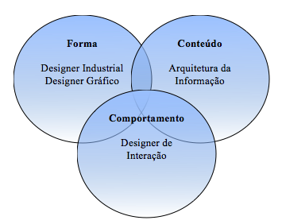
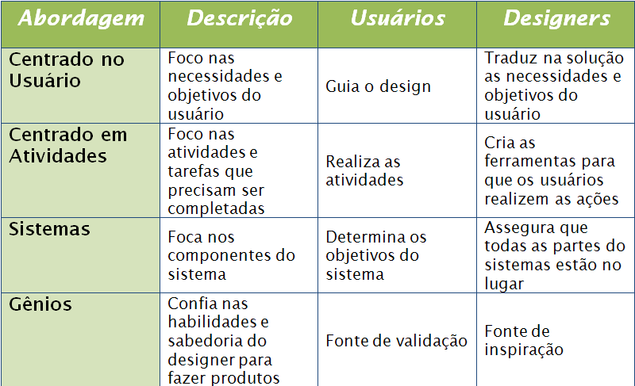

# Design de Interação

*"A maior parte das pessoas é tão feliz quanto resolve ser" -- Abraham Lincoln*

Design de Interação e Arquitetura de Informação compartilham o plano de Estrutura e dão ênfase na
definição de padrões e sequências para as opções que serão apresentadas ao usuário. O plano de
Estrutura é o limiar no desenvolvimento do produto entre as questões mais abstratas e mais concretas.

Design de Interação se preocupa com as opções necessárias para que o usuário realize e complete
tarefas. Arquitetura da Informação, por sua vez, trata com as opções envolvidas em expor as
informações para o usuário.

> **Design de Interação**
> Desenvolvimento de fluxos de aplicação para facilitar as tarefas do usuário, definindo como esse
> interage com as funcionalidades do sistema.

### Disciplina com identidade própria
Mas foi recentemente que o Design de Interação tornou-se uma disciplina isolada. Durante muito
tempo, ela era considerada como parte do Design de Interface.

O Design de Interface define o mundo dos botões, campos e outros componentes da interface.
Ele fornece aos usuários a habilidade de **fazer coisas**. Já o Design de Navegação é uma
especialização do design de interface responsável por apresentar espaços de informação. Ele fornece
aos usuários a possibilidade de **ir a lugares**. E permeando ambos os contextos (interface de
software e sistema de hipertexto) temos o Design de Informação, que é responsável por apresentar a
informação para uma comunicação efetiva. Ele **comunica idéias** aos usuários.

Tanto o Design de Interface, de Navegação e de Informação já fazem parte do plano mais concreto, o
Esqueleto, mas tratam de questões muito interligadas ao Design de Interação ou Arquitetura de
Informação.

### Holística
Em se tratando de contexto, dificilmente uma aplicação será apenas uma interface de
software ou apenas um sistema de hipertexto, e por isso todos esses elementos devem ser considerados
como uma unidade no desenvolvimento de um produto, não devendo ser tratados isoladamente.

### Responsabilidades
De qualquer maneira, cada uma dessas disciplinas não necessariamente é exercida por um único papel.
O atual Designer de Interação costuma - e é altamente recomendado - ter as habilidades necessárias
para fazer o design de interação, de interface, a arquitetura de informação, o design de navegação e
de informação.

Essas múltiplas habilidades, incluindo até o design visual, é o que diferencia um bom
designer de interação de um **excelente** designer de interação!

Considerando isso, podemos ter como entregáveis de um trabalho de design de interação:

* Avaliação de usabilidade
* Fluxos e mapas de navegação
* Casos de uso e/ou cenários
* Personas
* Mapas do site e inventário de conteúdo
* Wireframes
* Prototótipos (de baixa ou alta fidelidade, para provas de conceito ou testes de usabilidade)
* Especificações escritas (que descrevem o comportamento ou design)
* Layouts visuais (do resultado final esperado)

## Quatro Abordagens para Design de Interação

No momento que o designer se depara com um problema para solucionar, ele pode se apoiar em quatro
abordagens principais para encontrar uma melhor solução. Todas essas abordagens tem seus méritos na
criação de produtos de sucesso e depende do designer decidir aquela que melhor funciona à sua forma
de trabalho, ao projeto que está em desenvolvimento e a cultura de sua empresa.
Grandes designers são aqueles que podem trabalhar com todas essas abordagens, aplicando a melhor
para a situação específica que está lidando. E mais, conseguir aplicar múltiplas abordagens dentro
de um único projeto.

As quatro abordagens são:

* Design Centrado no Usuário
* Design Centrado em Atividades
* Design de Sistemas
* Design de Gênios

A tabela abaixo fornece uma rápida comparação entre cada uma das quatro abordagens:

### Design Direcionado a Objetivos
Uma quinta abordagem, que pode ser considerada como uma derivação do Design centrado no Usuário, é o
**Design direcionado a Objetivos**, metodologia criada por Alan Cooper para o desenvolvimento de
produtos.

O Design Centrado no Usuário nos servirá de guia a partir de agora. Vejamos mais detalhadamente esta metodologia a seguir.

> **Para saber mais**
> **Livro: Designing for Interaction**
> Creating Smart Applications and Clever Devices
> **De Dan Saffer**
> http://www.designingforinteraction.com/
> **Livro: About Face 3**
> The Essentials for Interaction Design
> **De Alan Cooper, Robert Reimann e David Cronin**
> http://www.cooper.com/about

## Design Centrado no Usuário

A filosofia por trás do design centrado no usuário é simples: os usuários sabem
melhor. As pessoas que utilizarão o produto ou serviço sabem quais são suas
necessidades, objetivos, preferências, e cabe ao designer encontrar todas essas
coisas para eles.

Este tipo de design destaca-se em afastar o design de suas próprias preferências
e focando-o nas necessidades e objetivos dos usuários.

Seu conceito já existe há um bom tempo com raízes no design industrial, ergonomia
e na crença de que os designers deveriam tentar encaixar seus produtos as pessoas e
não o contrário.

### Contexto histórico
Enquanto os designers industriais lembram desse legado, engenheiro de softwares eram
cegos para ele, criando aplicações voltadas para como o computador trabalhava e não
como as pessoas trabalhavam. Isso era em parte devido às limitações das máquinas
no passado.

Com a melhoria das máquinas por volta de 1980, designers e cientistas trabalhando na
área de interação homem-máquina começaram a questionar a prática de deixar engenheiros
elaborarem a interface para computadores. Novos tipos de interface já eram possíveis e
um movimento de design de software centrado nos usuários começou.

### Objetivos são importantes
Objetivos são realmente importantes no DCU: o designer foca no que o usuário quer
realizar. Então, o designer determina quais serão as tarefas e os meios necessários
para se atingir esse objetivo, mas sempre com as preferências do usuário em mente.

