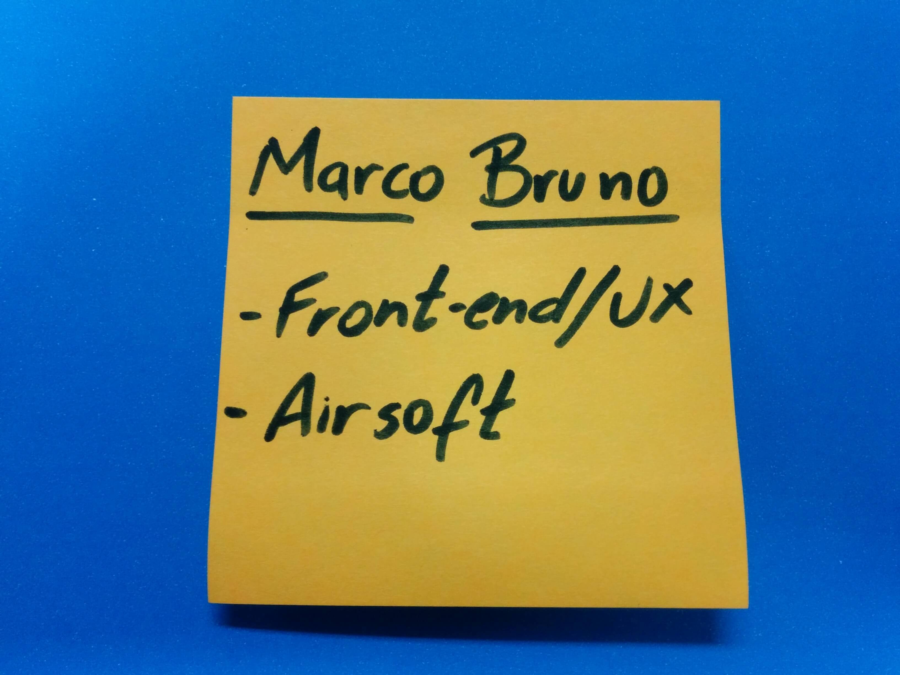
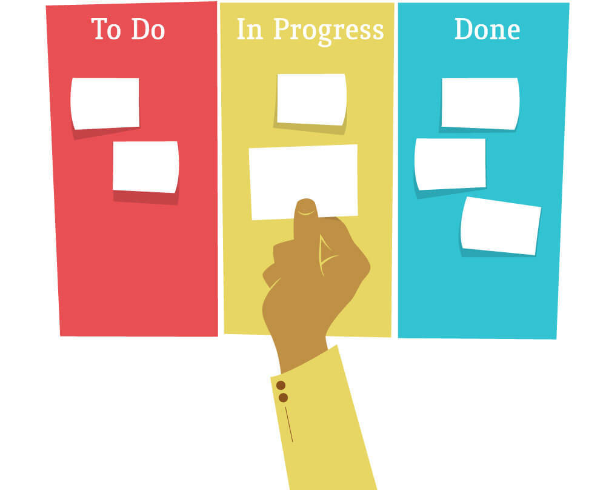
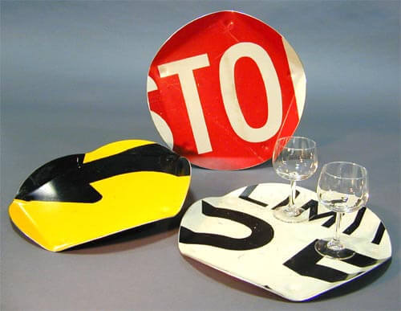
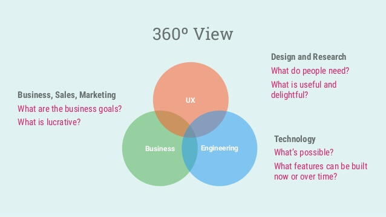
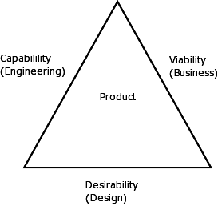

# Time e Projeto

Uma das melhores definição de time esta no manifesto ágil de software ([http://www.manifestoagil.com.br/](http://www.manifestoagil.com.br/)), uma das
primeiras linhas diz:

**Indivíduos e interação entre eles** mais que processos e ferramentas

Dentro dos 12 princípios do software ágil ([http://agilemanifesto.org/iso/ptbr/principles.html](http://www.manifestoagil.com.br/principios.html))
têm pontos importantes sobre time:

Pessoas de negócio e desenvolvedores devem trabalhar
diariamente em conjunto por todo o projeto.

Construa projetos em torno de indivíduos motivados.
Dê a eles o ambiente e o suporte necessário
e confie neles para fazer o trabalho.

O método mais eficiente e eficaz de transmitir
informações para e entre uma equipe de desenvolvimento
é através de conversa face a face.

Simplicidade, a arte de maximizar a quantidade de
trabalho não realizado, é essencial.

As melhores arquiteturas, requisitos e designs
emergem de equipes auto-organizáveis.

Em intervalos regulares, a equipe reflete sobre como
se tornar mais eficaz e então refina e ajusta seu
comportamento de acordo.

## Gamestorming - Montar time heterogêneo

### Objetivo
Montar times heterogêneos para melhorar as dinâmicas que vamos desenvolver
durante o curso.

### Ambiente
1. Um papel de post-it por aluno da dinâmica;
2. Uma caneta por aluno.

### Regras
1. Duração de 15 minutos;
2. Mínimo de 4 integrantes por time e máximo de 5.

### Passo a passo
Trinta segundos para cada aluno escrever no post-it:
* Nome;
* Profissão e/ou formação;
* Maior lazer.

Exemplo de como deve ficar o post-it:

Os alunos levantam com o objetivo de montar o time de no mínimo 4 integrantes, conversando entre eles.

## Kanban
Sempre associado com o famoso Kanban de colunas (To Do, Doing, Done) que times ágeis de desenvolvimento de software utilizam pra gerenciar as tarefas que vão executar em um tempo previamente determinado.

Esse é um tipo de Kanban, mas não é o significado da palavra.

### O que significa Kanban?

**Kanban** é uma palavra de origem japonesa que significa "cartão visual" ou "sinalização visual". Ou seja, Kanban é qualquer elemento de comunicação que passe uma ou mais informações de forma rápida e objetiva. É correto dizer que placas de trânsito são kanbans.

> "Se o time não pergunta como funciona o Kanban e não está utilizando. Pense no que erramos e jogue o Kanban fora." 

A Toyota é a empresa que popularizou a forma como aplicamos kanban em **Agile** e **UX**. Dentro da Toyota o Kanban é utilizado como Kanban de Produção e Kanban de Movimentação sendo uma ferramenta pra aplicar o sistema de produção Just in Time (JIT) sem a necessidade de formulários longos e burocráticos.

### O que é o sistema de produção Just in Time?

É um sistema de produção focado em diminuir o desperdício. Só se compra a matéria prima e fabrica-se o produto após a sua venda. Também conhecido como **produção sob demanda**.

> "Se o time pergunta como funciona o Kanban e está utilizando. Acabamos de fazer um bom trabalho."

## Os Kanbans de UX
Os métodos ágeis ajudaram o Kanban a se popularizar dentro de UX. Hoje temos times criando seu próprios kanbans focados em solucionar dúvidas de UX.

### UX Canvas
Tem como objetivo criar artefatos com base nas informações levantadas com stakeholders, usuários, cliente e suas limitações e recursos. Veremos ele em detalhes nos próximos capítulos.

> "Se o time não perguntou como funciona o kanban e está utilizando de forma diferente do que pensamos. Fizemos um bom trabalho sem querer. Só aceitar."

### 360º View
Apresentado por Nelson Vasconcelos no Design Sprint Methods, esse kanban responde: duas dúvidas de negócios, vendas e marketing; duas dúvidas de design e pesquisa; duas dúvidas de tecnologia. Sendo elas:

#### Negócios, Vendas e Marketing
* Quais são os objetivos de negócios?
* O que é lucrativo?

#### Design e Pesquisa
* O que as pessoas precisam?
* O que é útil e agradável?

#### Tecnologia
* O que é possível?
* Que funcionalidades podem ser construidas agora ou mais pra frente?

> "Se o time não pergunta como funciona o Kanban e está utilizando. Acabamos de fazer um ótimo trabalho."

## Gamestorming - Definir projeto mobile

### Objetivo
Cada time definir o seu projeto mobile para desenvolver durante o curso.

### Ambiente
1. Muitos post-its;
2. Uma caneta por aluno;
3. Cartolina;
4. Canetão;
5. Fita crepe.

### Regras
1. 05 minutos para levantamento de problemas;
2. 15 minutos para definir qual problema o time quer resolver;
3. Cada integrante fala por 2 minutos;
4. Projeto tem que ser mobile;
5. Projeto não pode ser focado apenas para o público feminino ou para o público masculino.

### Passo a passo
Colar na parede um pedaço de cartolina escrito **Problema**.
Em post-its, cada integrante do time escreve problemas que gostaria de resolver
com um projeto mobile e cola abaixo da cartolina. (05 minutos)
**Obs.** Um problema por post-it.

Com todos os integrantes de cada time em frente a parede que estão os post-its,
para definir qual projeto o time vai realizar durante o curso.

## O triângulo de ouro

A inclusão consciente de design levou a ascensão da tríade moderna identificada por
Larry Keely composta por **desejabilidade**, **viabilidade** e **capacidade** também
chamada de **triângulo de ouro**. Se algum ponto da tríade for fraco em um produto,
provavelmente ele fracassará com o tempo.

### Time "core" para desenvolvimento do produto

Para cuidar de cada um desses processos, precisamos de três competências:

* **Designer**: responsável pela desejabilidade.
* **Gerente de produto**: responsável pela viabilidade.
* **Desenvolvedor**: responsável pela capacidade.

Esse trio é considerado o "core" para o desenvolvimento do produto e devem estar bem alinhados
na fase de descoberta do produto.

Vejamos cada um desses processos:

### Viabilidade - o que sustentará o negócio?

O **Gerente de Produto** tem duas responsabilidades principais: avaliar as
oportunidades do produto e definir o produto que será construído. Depois de avaliado
e decidido que vale a pena desenvolver o produto, ele inicia a fase de descobrir
exatamente como o produto deve ser (junto com o time *core* mencionado acima),
incluindo as funcionalidades necessárias, a experiência do usuário e os critérios
para o lançamento.

Também está em suas mãos determinar o modelo de negócio que deverá ser seguido,
interagindo com praticamente todas as outras áreas da empresa para
definir questões jurídicas, contábeis, financeiras, de marketing, de distribuição, etc.

### Desejabilidade - o que as pessoas precisam?

Aqui entra a Experiência do Usuário. Há vários papéis em um time de UX, mas o que
trabalha em maior colaboração com o Gerente de Produto é o **Designer de Interação**.
Ele é responsável por buscar um profundo entendimento dos usuários, descobrir suas
motivações, comportamentos e habilidades; ajudar na definição dos requisitos e, assim,
desenhar uma interface que torne a interação do usuário com o produto a mais simples e
eficiente possível e que, além disso, atenda aos objetivos do negócio.

### Capacidade - o que podemos construir?

O **Engenheiro ou Desenvolvedor de Software** é o responsável por efetivamente
construir o produto. É importante seu papel na fase de descoberta do produto
para dizer ao gerente e ao designer de interação o que é possível ser feito,
avaliar o custo das diferentes idéias propostas e ajudar a identificar as
melhores soluções. É sua responsabilidade definir a tecnologia e arquitetura mais
apropriada para desenvolver um produto de qualidade.

### Iniciando o desenvolvimento do produto
Ao iniciar o desenvolvimento de um produto, devemos começar perguntando *"O que as
pessoas desejam?"*. Com essa resposta, se pergunte *"Das coisas que as pessoas desejam, o que
sustentará o negócio?"* e, por último, *"Das coisas que as pessoas desejam e que sustentará o
negócio, o que pode ser construído?"*.

## Gamestorming - Triângulo de Ouro

### Objetivo
Indentificar pontos positivos e negativos do projeto separado em:

* Desejabilidade;
* Viabilidade;
* Capacidade.

### Ambiente
1. Flip-chart;
2. Canetão;
3. Muitos post-its;
4. Uma canetinha por integrante.

### Regras
1. 2 minutos para desenhar o triângulo de ouro;
2. 15 minutos para time definir pontos positivos e negativos.

### Passo a passo
1. Desenhar triângulo de ouro na cartolina;

2. Escrever pontos positivos e negativos de desejabilidade e colocar no triângulo de ouro;

3. Escrever pontos positivos e negativos de viabilidade e colocar no triângulo de ouro;

4. Escrever pontos positivos e negativos de capacidade e colocar no triângulo de ouro;

5. Verifique se é possível resolver os pontos negativos de qualquer lado do
triângulo (desejabilidade, viabilidade e capacidade). Achando uma solução, anote
em um post-it e cole próximo ao ponto negativo.

## Gamestorming - 360˚ View

### Objetivo
Identificar pontos positivos e negativos do projeto separados em:

* PM & Marketing, Vendas e Estratégia de Produto;
* Experiência do Usuário;
* Engenharia.

### Ambiente
1. Cartolina;
2. Canetão;
3. Muitos post-its;
4. Uma canetinha por integrante.

### Regras
1. 2 minutos para desenhar o triângulo de ouro;
2. 15 minutos para time definir pontos positivos e negativos.

### Passo a passo
1. Desenhar 360˚ View na cartolina;

2. Escrever pontos positivos e negativos de PM & Marketing, Vendas e Estratégia de Produto e colocar no 360˚ View;

3. Escrever pontos positivos e negativos de Experiência do Usuário e colocar no 360˚ View;

4. Escrever pontos positivos e negativos de engenharia e colocar no triângulo de ouro;

5. Verifique se é possível resolver os pontos negativos de qualquer círculo
(negócio, UX e engenharia). Achando uma solução, anote em um post-it e cole
próximo ao ponto negativo.

