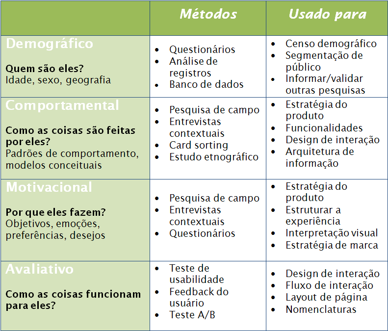
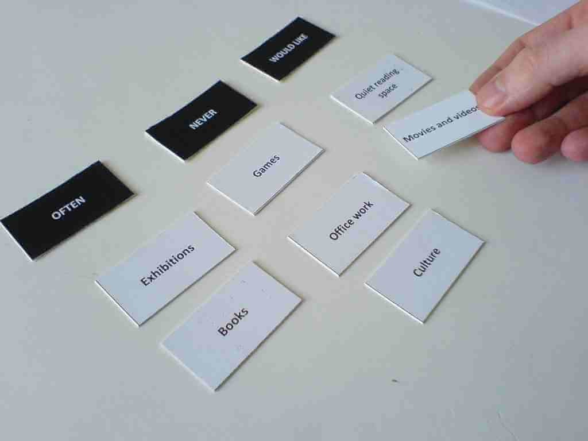

# Pesquisa

*"A inteligência é útil para tudo, mas não é suficiente para nada" -- Henri-Frederic Amiel*

Uma das etapas do desenvolvimento de um produto, principalmente na fase de descoberta, é a Pesquisa
de Design.

> ### Pesquisa de Design
> É o ato de investigar, através de várias fontes, o potencial de um produto ou serviço, seus usuários
> e ambientes existentes.

### Métodos
Os métodos utilizados podem ser quantitativos ou qualitativos, exploratórios ou avaliativos, como ou
sem a participação do usuário, variando de observações e entrevistas contextuais, aplicação de
questionários (online ou pessoalmente), grupo de foco e etnografia a leitura sobre temas
relacionados ao domínio do negócio, análise competitiva, análise heurística, *card sorting* e
testes de usabilidade com protótipos ou produtos já existentes (seu ou dos concorrentes).

Os exploratórios normalmente são usados no início de um projeto, na fase de concepção do produto,
para entender as reais necessidades do usuário e do negócio e projetar interfaces mais adequadas ao
seu uso.

Os avaliativos são usados para analisar a qualidade da interface e interação de um produto, podendo
ser de produtos já existentes ou em desenvolvimento.

### Benefícios da pesquisa
Pesquisas, principalmente as qualitativas, ajudam-nos a entender:
* Comportamentos, atitudes e aptidões de potenciais usuários do produto;
* O domínio do produto que será desenvolvido - contexto técnico, de negócio e ambientais;
* Vocabulário e outros aspectos do domínio em questão;
* Como os produtos já existentes são usados;
* Limites e restrições;
* Qual o problema que teremos que resolver.

### Plano estratégico
Se tudo começa do plano mais abstrato, o plano estratégico, algumas perguntas devem ser respondidas no que diz respeito aos objetivos do site a as necessidades do usuário.

## Onde Buscar Informações?

Há várias fontes para obtermos informações nas pesquisas:
* Entrevista com stakeholders, que podem ser os executivos da empresa, pessoas da área de negócios,
  de marketing e desenvolvedores;
* Entrevista com especialistas no domínio do produto (SME - Subject Matter Expert) são normalmente
  úteis em domínios muito complexos e especializados;
* Entrevista com clientes. Clientes nem sempre é o mesmo que usuário. Por exemplo, em um produto de
  CRM, o usuário pode ser os gerentes de conta de uma empresa enquanto o cliente é o Diretor
  Comercial ou de Marketing;
* Entrevista com usuários.

E além de entrevistas, há vários outros métodos que abordaremos em um próximo tópico.

Muitos dados já são obtidos dessas entrevistas citadas acima e é importante saber quais tipos de
informação deve-se obter de cada uma delas.

O que conseguimos obter dos *stakeholders*:
* Visão preliminar do produto: *Cada stakeholder tem sua própria visão do produto, mesmo que apenas
  ligeiramente diferente dos demais. Nessas entrevistas o designer deve então alinhar essas visões,
  inclusive com as dos usuários e clientes*;
* Orçamento e cronograma: *O que sair desse tópico permitirá saber o escopo de esforço do design e
  servirá como subsídio para que o gerente decida o quanto investir em pesquisa de usuário*;
* Limitações técnicas: *Entender claramente o que é viável de fazer dado o orçamento, prazo e
  limitações técnicas*;
* Objetivos e direcionamentos do negócio: *É importante que o designer entenda quais são os
  objetivos do negócio, para saber levantar pontos de decisão quando a pesquisa com o usuário
  indicar conflitos entre as necessidades do negócio e dos usuários*;
* Percepção dos stakeholders sobre o usuário: *Os stakeholders que mantém algum tipo de
  relacionamento com usuários têm suas próprias percepções sobre eles e essas servem de insights
  para a entrevista com o usuário*.

> ### Stakeholders
> Stakeholders (partes interessadas) são pessoas que têm uma participação no produto. Eles podem incluir pessoal de marketing,
> pessoal de desenvolvimento e representantes de serviço ao cliente.

**O que conseguimos obter dos clientes**:
* Seus objetivos em comprar o produto;
* Suas frustrações com as soluções atuais;
* Processo de decisão usado para comprar um produto do tipo que você está desenhando;
* Regras para instalação, manutenção e gerenciamento do produto.

**O que conseguimos obter dos usuários**:
* Problemas e frustrações com a solução atual;
* Conhecimento do negócio, o que eles precisam saber para realizar seu trabalho;
* Contexto geral de suas atividades e não apenas focado ao produto;
* Entendimento das tarefas atuais, tanto aquelas que eles realizam na solução atual como as que essa
  solução não suporta;
* Entendimento claro de seus objetivos e motivações para usar o produto.

## Métodos e Propósitos

Pesquisa não tem como foco um ou outro método. Pesquisas são, sobretudo, questionamentos e respostas.
Os métodos são apenas os meios utilizados para obter essas respostas.  Ou seja, não existe um método
que deve sempre ser aplicado. Diferentes métodos têm diferentes propósitos e, em algumas situações,
mais de um método pode ser usado em uma pesquisa de design.

Abaixo estão alguns métodos e quando é mais indicado o seu uso:

> ### Para saber mais
> **When to Use Which User Experience Research Methods** - 
> Artigo da newsletter Arletbox de Jakob Nielsen
> [http://www.useit.com/alertbox/user-research-methods.html](http://www.useit.com/alertbox/user-research-methods.html)

## Entrevistas
A entrevista permite onhecer as características de pessoas, suas preferências, opiniões
e necessidades, permitindo que o entrevistado exprima suas ideias e fornece um contexto.
Para que haja rapport entre ambos, o entrevistador deve ser empático.

> **Rapport**
> Rapport é a capacidade de entrar no mundo de alguém, fazê-lo sentir que você o entende e
> que vocês têm um forte laço em comum. É a capacidade de ir totalmente do seu mapa do
> mundo para o mapa do mundo dele. É a essência da comunicação bem-sucedida.

### Simpatia X Empatia
A simpatia, por definição, é a compreensão do outro com base em nossa experiência, o que pode levar a uma falsa compreensão. Por exemplo: A pessoa A se divorciou e para ela foi o fim do mundo, mas para a pessoa B o divórcio foi libertação.

Calcar-se na experiência pessoal para compreender o outro pode levar a um falsa compreensão. Cognitivamente a simpatia é facilmente empreendida pelo cérebro, pois ele só repete um padrão, gastando assim, menos energia. O cérebro tem como padrão conservar energia.

A empatia já é diferente: compreendemos o outro tentando nos colocar em seu lugar, olhando com seus olhos. Cognitivamente é mais difícil, mas não impossível. Há um gasto considerável de energia, além disso, o entrevistador deve estar atento não apenas ao que o entrevistado fala, mas ao seu comportamento e emoções.

Por fim, na empatia, só saberemos se compreendemos corretamente o outro se tivermos o feedback dele, sendo assim, verificar constantemente com o outro se estamos no caminho certo é fundamental.

 ### Designer de Interação Vs Pesquisas
 Os designers de interação não são exigidos que façam pesquisas. Muitas vezes eles usam sua intuição,
 conhecimento e experiência para desenvolver produtos com uma boa experiência para o usuário.

 Em projetos menores, mais  simples ou com prazos e orçamentos bem limitados, essa é uma abordagem
 bastante adotada. Contudo, para projetos maiores e mais complexos, onde o domínio do negócio,
 cultura ou área de atuação é desconhecida pelo designer, não fazer pesquisa alguma pode ser um
 grande risco.

 Designers normalmente trabalham em projetos fora de sua área de atuação (design!) e a
 única maneira de compreender o contexto onde o produto será inserido é realizando pesquisas.

## Card Sorting

As pessoas organizam as coisas de maneira muito pessoal, sendo assim, a ideia do Card Sorting é explorar diversas formas de categorizar itens e determinar aquela que funciona melhor com o seu projeto. Muitas vezes ele é utilizado para melhorar a organização atual que não funciona.

Geralmente esta técnica vem resolver problemas de Arquitetura de Informação no que diz respeito à navegação. Outro emprego é validar ideias de como o conteúdo deve ser organizado: é uma ferramenta que nos ajuda a entender as pessoas para quem estamos projetando.

### Como funciona
Você solicita às pessoas que classifiquem os cartões em pilhas de acordo com o que há de semelhante e descrevam os grupos os quais fazem parte (Card Sorting aberto). Ou você pode dar às pessoas um conjunto de cartas de conteúdo além de um conjunto de categorias e pedir-lhes para classificar os cartões nas categorias pré-determinadas (Card Sorting fechado). O resultado é aplicado ao projeto.

### Benefícios
Você aprende muito sobre como as pessoas pensam sobre categorias e conceitos, como descrevê-los, e as informações que pertence a uma categoria. Isto é extremamente útil quando você quer organizar as informações de uma forma para que outras pessoas possam encontrá-las. Inclusive, ele pode demonstrar que o usuário sequer sabe o que determinada categoria significa.

### Etapas do Card Sorting
Os principais passos são os seguintes:
* Decida o que você quer aprender.
* Selecione o método (aberto ou fechado)
* Escolha o conteúdo
* Escolha e convide os participantes.
* Inicie o card sorting e registre os dados
* Analise os resultados.
* Aplique o resultado em seu projeto.

### Consenso
Card sorting ajuda o time a entrar num consenso, já que cada integrante pode ser uma visão diferente de como a informação deve ser apresentada.

> ### Ferramentas
> Existem diversas ferramentas no mercado que permitem o levantamento de informações
> sobre os usuários que acessa o seu website.
> Algumas delas:
>
>* Crazy Egg
>* Google Analytics
>* Kiss Metrics
>* Hotjar

## Recrutamento

Quando pensamos em recrutamento para testes e pesquisas, contratar uma empresa especializada é
sempre o caminho mais fácil e rápido. Infelizmente, normalmente também é o mais caro e nem sempre
seu projeto tem orçamento disponível para isso.

Se você mesmo tem que recrutar pessoas para suas pesquisas e testes, tenha em mente as seguintes
dicas:
* É muito importante ter claro o perfil de usuário que você quer pesquisar (mesmo quando
  terceirizamos o recrutamento, essa informação precisa ser passada para a empresa de recrutamento
  para que eles consigam os candidatos certos);
* Clientes - existentes ou em potencial - são sempre candidatos a participarem de pesquisas;
* Mantenha uma lista de pessoas interessadas em participar de testes e pesquisas. Você pode fazer
  isso convidando interessados através de um questionário de recrutamento colocado no site ou blog
  de sua empresa, através de convites em ferramentas de mídias sócias ou buscando interessados em
  eventos que sua empresa promova;
* Os melhores candidatos a pesquisas são aqueles que têm algum tipo de motivação em fazer a pesquisa
  e que tenha uma boa habilidade de comunicação;
* Mesmo com uma listagem de interessados, para cada pesquisa existe um perfil de usuário desejado.
  Antes de efetivamente fazer o convite para participar da pesquisa, certifique-se de que as pessoas
  que você está contatando se encaixam nesse perfil;
* Crie um questionário com perguntas que lhe permitam fazer essa classificação (screening);
* Essa classificação pode ser feita através de um contato por telefone, e-mail ou até questionário
  online;
* Sempre entre em contato com muito mais candidatos que o número que você pretende pesquisar. São
  vários os motivos que fazem um candidato, mesmo que interessado na pesquisa, não poder participar;
* E além disso, sempre espere uma grande taxa de não comparecimento, mesmo quando um candidato
  confirma a presença;
* Existe vários meios de incentivar a participação: dar uma ajuda de custo, pagar estacionamento ou
  providenciar o transporte do participante; fornecer descontos na compra dos produtos de sua
  empresa (ou gratuidade de alguns meses para produtos com pagamento recorrente); brindes; deixar o
  ambiente da pesquisa agradável, com lanches, refrigerantes, cafés; etc.

Mesmo assim, o recrutamento pode ser uma tarefa árdua. Em último caso, use seus companheiros de
trabalho que não estejam tão envolvidos no projeto, amigos, familiares...

> ### Dica de livro
> **Recruiting without Fear - **
> How to Find First-Rate Participants for Design Studies
>
> **de Will Schroeder, David Brittan e Jared M. Spool**
> [http://dev.uie.com/reports/recruiting_without_fear](http://dev.uie.com/reports/recruiting_without_fear)

## Destilando a Pesquisa
Depois de realizar uma pesquisa, as informações e dados obtidos (seja em notas, imagens, gravações
ou simplesmente na cabeça do designer) serão completamente inúteis se não forem estruturados e
organizados de uma forma que faça sentido e possa ser usado no desenho da aplicação. O designer deve
dar uma forma e significado a essas informações.

As formas para organizá-las podem ser inúmeras e cada um tem uma que para ele melhor funcione: pode
ser através de planilhas, tabelas, *postits* grudados em um quadro branco, etc. E a idéia é juntar
essas informações em grupos que tenham ligação e que dêem algum significado aos dados obtidos.

## Gamestorming - Entrevista, tirando dúvidas com o usuário

### Objetivo
Solucionar dúvidas sobre o projeto com o usuário para desenvolver a persona
primária.

### Ambiente
1. Folhas A4 de rascunho;
2. Uma folha por aluno para pergunta;
3. Uma folha por aluno para resposta;
4. Uma caneta por aluno.

### Regras
1. 25 minutos para realizar a dinâmica;
2. Entrevista deve durar no máximo 2 minutos.

### Passo a passo
1. Time define os objetivos para entrevista;
2. Time define cortes de recrutamento;
3. Com base nos objetivos o time cria o roteiro para entrevista;
4. Cada integrante realiza uma entrevista com um integrante de outro time.

Quando for realizar a entrevista (passo 4) não podemos nos esquecer de:
* Explicar o projeto;
* Ter empatia pelo entrevistado (empatia é diferente de simpatia);
* Caso o entrevistado não entre no corte, explique o motivo do fim da entrevista;
* Sempre agradeça o entrevistado.
