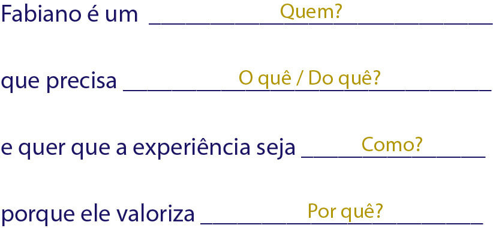
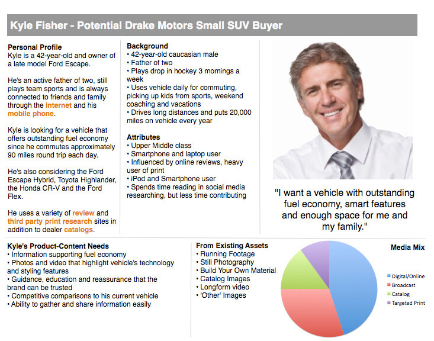
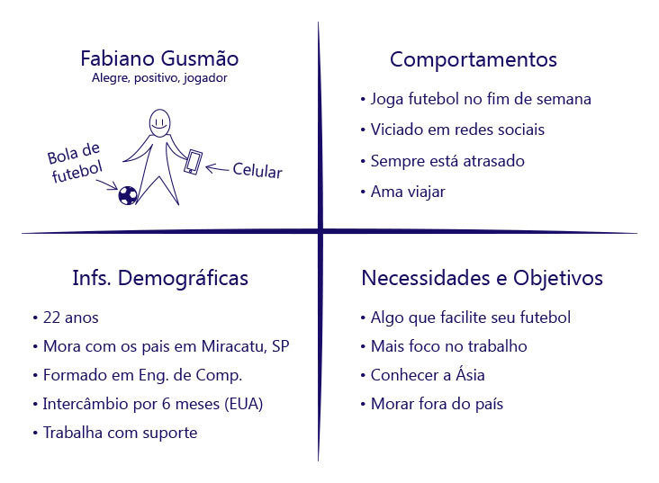
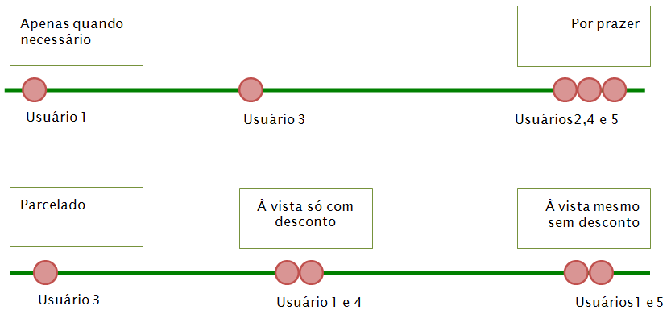
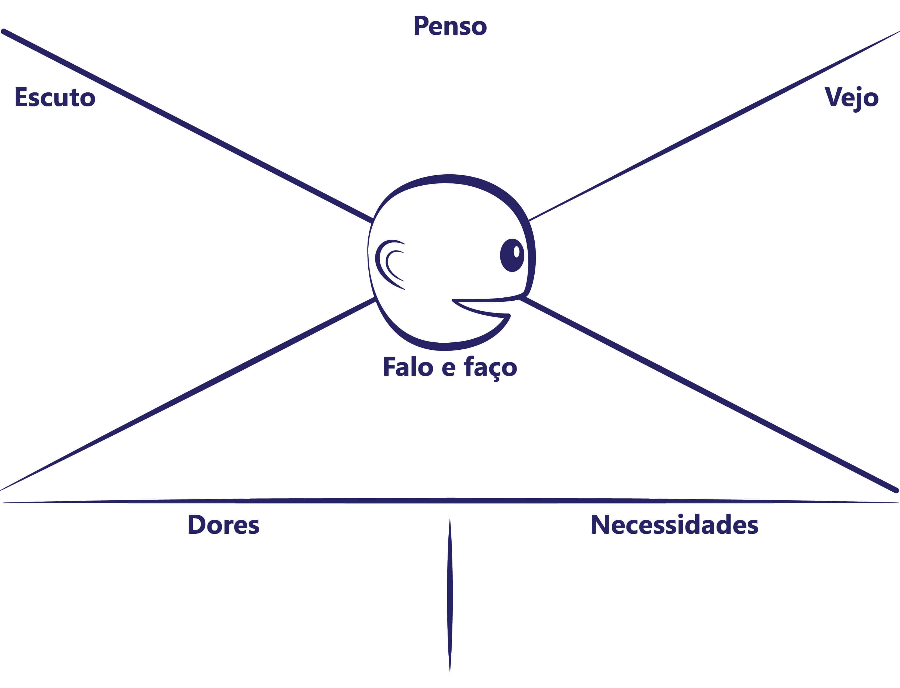
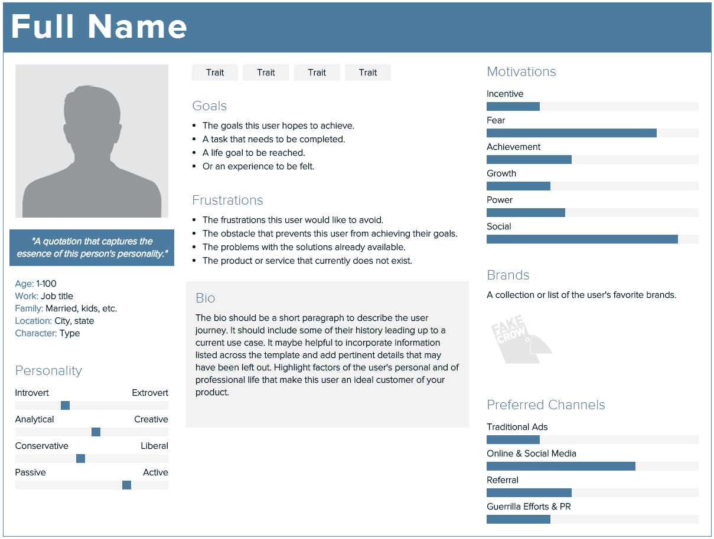
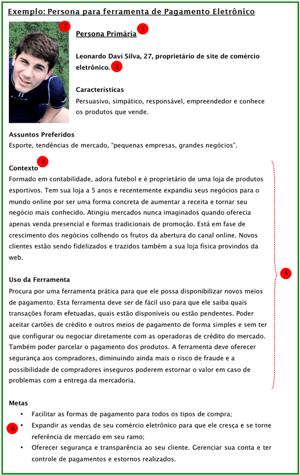

# Personas

*"Época difícil a nossa na qual é mais difícil se quebrar um preconceito do que um átomo"
-- Albert Einstein*

Coletar todos os tipos de dados  sobre seus usuários pode ser extremamente valioso, mas às vezes você pode perder de vista as pessoas reais por trás de todas as estatísticas. Você pode tornar seus usuários mais reais, transformando-os em personas.

**Personas são modelos descritivos de usuários criados de dados de pesquisas que nos
fornecem uma forma de entender como os usuários se comportam, como eles pensam, o
que eles desejam e por que**.

> **Modelo**
> Modelos são utilizados nas ciências naturais e sociais para representar
> fenômenos complexos através de abstrações. Um exemplo de modelo é o de
> mercado criado por economistas para prever o seu comportamento.

Esses modelos não são pessoas reais, mas são baseados em comportamentos e motivações
de pessoas reais. Personas são atualizadas com o passar do tempo sempre que necessário.

## Design Centrado no Usuário
Colocando um rosto e um nome sobre os dados de pesquisas de usuários, a persona pode
nos ajudar a **manter os usuários em mente** durante o processo de design, ao mesmo tempo
em que cria uma **linguagem comum** que faça sentido. Esta técnica
permite o **Design Centrado no Usuário** e sua força esta em trazer ao design discussões.

> ****
> Para que os esforços de designers tenham sucesso, ele precisa assegurar que cada membro do
> time do produto entenda pelo menos as características fundamentais e as necessidades de
> seus usuários, ou muito tempo será gasto numa conversa em círculos.

## O que personas não representam
Também é importante deixar claro o que personas **não** representam:

* Média estatística, pois a variação é mais importante que a média;
* Pessoas reais, pois cada pessoa tem suas particularidades e não representariam um grande número de
  pessoas - mas personas são baseadas em dados reais;
* Segmentos de mercado, pois segmento de mercado é um grupo de pessoas que respondem a mensagens
  similares e não que tem objetivos similares e padrões de uso;
* Job description ou funções, pois funções são definidas pelas tarefas que as pessoas fazem e não
  pelos objetivos e comportamentos.

## Benefícios

Personas medem a eficácia do design já que opções de design podem ser testadas
com elas. Elas não substituem testes com usuários reais, mas permitem que
iterações de design sejam feitas de maneira rápida e barata num quadro-branco.

A persona traz benfícios não só para o Design, mas também para toda a equipe multidisciplinar.
Personas:

* **Tornam explícita suposições sobre os usuários, criando uma linguagem comum com significado**

	* Dados (em grande parte qualitativos) e informações são indispensáveis, sendo o fundamento das personas.

* **Permitem que você foque um conjunto de usuários específicos  (que não são você!) ajudando na tomada de melhores decisões**

	* Limitando nossas escolhas, personas ajudam na tomada de decisões de design. Criar um produto para um tipo de usuário terá mais sucesso do que para uma vasta audiência (Cooper).

* **Geram  empatia para com os usuários, envolvendo sua equipe de uma forma que outras representações de dados do usuário não conseguem**

	* Personas são engraçadas e ganham vida quando os membro da equipe as aceitam.

Diferente de wirefames e protótipos, personas não são utilizadas numa parte específica do processo, pelo contrário, elas ajudam o processo inteiro.

> ****
> Há diversas maneiras de consolidar os achados de sua pesquisa de usuário, mas apenas personas são
> capazes de engajar o cérebro a pensar em termos humanos.

## Impedimentos
Existem problemas que podem impedir o uso de Personas:

* **Recusa por parte da equipe envolvida com o desenvolvimento do produto**

	* Utilizar personas pode ser uma alteração radical no processo de desenvolvimento de produto e na cultura da empresa.

* **Falta de credibilidade da persona em relação aos dados da pesquisa**

	* A persona deve ter como base dados de pesquisa e, ainda sim, se esses dados estiverem muito desconectados, a equipe não terá confiança nela.

* **Má comunicação de personas**

	* Se a equipe não sabe o que é persona, mesmo que o líder do projeto saiba, seu emprego falhará. Se a equipe não for lembrada constantemente da persona, ela será esquecida.

* A equipe não sabe utilizá-las

## A importância dos objetivos

Todos os seres humanos possuem **motivações que guiam seus comportamentos**; alguns óbvios e
outro sultis. É fundamental que as personas captem essas motivações na forma de **objetivos**.

O insight fundamental de Cooper era o de que as personas tinham objetivos e
comportamentos que poderiam ser atendidos por produtos através do design
para seu comportamento, garantindo assim maior probabilidade do design ser
bem sucedido.

Se personas fornecem o contexto para um conjunto de comportamento observado,
os objetivos são os condutores por trás desses comportamentos. Designers podem
criar cenários e então perguntar-se:

* Esta persona realizará esta tarefa?
* Esta persona realizará a tarefa como foi planejada?

A persona sem objetivos pode servir como uma ferramenta de comunicação útil, mas
não  tem utilidade como ferramenta de design.

A inferência dos objetivos é uma das etapas da criação de personas que será vista com mais detalhes no próximo capítulo.

> **Objetivos da Persona**
> Os objetivos que enumeramos para nossas personas são anotações abreviadas
> que não apontam apenas para padrões de uso específicos, mas também fornecem
> uma razão para a existência desses comportamentos. Compreender por que um
> usuário realiza determinadas tarefas dá aos designers grande poder de
> melhorar ou mesmo eliminar as tarefas e ainda assim alcançar os mesmos
> objetivos.

## Criando Personas

O mais importante para a construção de uma persona é a identificação dos principais padrões que
acabam saltando aos olhos quando começamos a analisar os achados:

* Como as variáveis comportamentais e demográficas identificadas se agrupam para formar padrões. Variáveis demográficas só entram se influenciarem o comportamento como idade e habilidade técnica.
* Se um agrupamento de entrevistados aparece em meia-dúzia dessas variáveis, você pode ter a base
  para uma persona;
* Quando achar que identificou um padrão, procure por outros.

## Número de Personas
Uma "regra de ouro" para o número de personas é criar no mínimo duas e no máximo onze.

> ## Personas ad hoc
> Dependendo do tempo e dos recursos do projeto, é possível criar personas
> *ad hoc* a partir das informações levantadas com os stakeholders,
> inclusive o design pode contribuir com sua experiência. Ainda sim,
> uma persona calcada em dados de pesquisa tem maior credibilidade.

## Persona simples
Uma outra maneira de se criar uma persona, principalmente quando queremos passar apenas uma ideologia rápida para a equipe, é de se fazer uma persona mais simples, em formato de cartão.

Esse cartão deve responder as seguintes perguntas:

* Quem?
* O quê / do quê?
* Como?
* Por quê?

## Proto-persona

Muitas vezes no andamento dos nossos projetos ficamos muito focados em cumprir prazos e metas. Tão focados, que acabamos esquecendo para quem estamos desenvolvendo o site ou aplicação: **o usuário**. Em primeira instância pegar o perfil de usuário qualquer pode parecer a solução ideal, afinal, ele é um de muitos, e talvez represente boa parte desses 'muitos'. O problema é que ele pode não representar a maioria dos seus usuários.

E para compilar tanta informação perdida, a respeito das necessidades, dos costumes e até da personalidade do nosso público-alvo que existem **as personas**, já estudadas aqui.

### Uma persona mais simples 
O "chato" das personas são os custos. Para montar uma persona tradicional, as informações devem ser retiradas de pesquisas efetivas sobre os usuários da empresa e/ou do projeto. Mas como toda empresa conhece pelo menos um pouco dos seus usuários, possuem algum tipo de informação relevante sobre eles, mesmo que não validadas de alguma forma, há a possibilidade de se criar uma variante mais simples da persona, a **proto-persona**.

Ela é uma solução de contorno para a persona comum, ou seja, é aconselhável que não seja algo definitivo e que suas informações sejam validadas com usuários reais posteriormente.

Contudo, é melhor uma proto-persona na mão, do que duas personas voando.

### Conteúdo da proto-persona

É interessante que a proto-persona possua as seguintes informações:
- Quem é esse usuário e como ele é (personalidade)
- Alguns comportamentos
- Informações demográficas como idade e profissão
- E o **ponto chave:** suas necessidades e/ou objetivos

O layout da proto-persona pode variar conforme a criatividade do time.
Um template bastante usado é onde as informações são separadas em quatro quadrantes, como no exemplo abaixo:

Tanto as personas tradicionais quanto as proto-personas ajudam a nortear o time na maioria das decisões que envolvem o projeto.
A proto-persona é interessante para começar a introduzir a cultura de DCU (Design Centrado no Usuário) na empresa, por ser algo barato e mais simples de ser desenvolvido.

## Gamestorming - Criando proto-personas

### Objetivo
Criar três proto-personas

### Ambiente
1. Canetinhas;
2. A4 Branca;
3. Pesquisas;

### Regras
* 40 minutos de duração.

### Passo a passo
1. Individualmente, cada integrante do time monta uma proto-persona;

2. Cada integrante apresenta para o próprio time sua ideia;

3. O time opina sobre quais características são realistas ou não, podendo ser feitas alterações nesse momento;

3. O time deve escolher **três** proto-personas e colá-las na parede;

## Os sete passos para criar Personas
Para criar uma persona, Alan Cooper, em seu livro *About Face 3*, descreve **sete** passos principais:

* **Passo 1:** identificar variáveis comportamentais e demográficas.
* **Passo 2:** mapear entrevistados nas variáveis.
* **Passo 3:** identificar principais padrões de comportamento.
* **Passo 4:** listar características e objetivos relevantes.
* **Passo 5:** checar todo o conjunto de persona para eliminar redundâncias.
* **Passo 6:** desenvolver a narrativa.
* **Passo 7:** determinar tipos de personas.

### Passo 1: Identificar as variáveis comportamentais
Liste os aspectos distintos do comportamento observado nos participantes da pesquisa como um conjunto
de variáveis comportamentais. Variáveis demográficas só valem a pena serem identificadas e
consideradas se, de alguma forma, afetam o comportamento (Ex.: produto para crianças - idade).

Normalmente identificamos padrões distintos de comportamento se focarmos nas seguintes variáveis:

* **Atividades:** o que o usuário faz, frequência e volume;
* **Atitudes:** como o usuário pensa sobre o negócio e tecnologia associados ao produto;
* **Aptidões:** qual educação e treinamento o usuário tem; capacidades de aprendizado;
* **Motivações:** por que o usuário está engajado no negócio referente ao produto;
* **Habilidades:** capacidade do usuário relacionada ao negócio e tecnologia associados ao produto.

Não há um número exato de quantas variáveis devem existir, mas algo em torno de 20 a 30 variáveis é
normal.

> **Aplicações corporativas e perfis de usuários**
> Para aplicações corporativas, variáveis comportamentais são normalmente associadas às funções
> desempenhadas no trabalho e é sugerido que as variáveis sejam listadas para cada função
> separadamente (administrador, usuário, etc.)

### Passo 2: Mapear os entrevistados nas variáveis identificadas

Depois de identificadas as variáveis, **rotule as extensões** de valores para cada variável.

Para algumas variáveis, essa extensão é contínua e rotulamos dois valores extremos e opostos. Por
exemplo, para uma aplicação de comércio eletrônico, os valores de uma variável chamada "motivos para
comprar" pode ir de "apenas quando necessário" até "por prazer".

Para outras variáveis, fica
impossível uma variação contínua e podemos usar opções com múltiplas escolhas. Um exemplo seria a
variável "preferência de pagamento" que poderia ter as opções "parcelado", "à vista só com desconto"
ou "à vista mesmo sem desconto.

### Mapear participantes nas extensões
Agora já podemos mapear cada participante da pesquisa dentro dessas extensões de valores de cada
variável. A melhor forma é ver todos os participantes para uma variável e depois passar a próxima. O
mais importante é posicionar cada participante relativo aos outros participantes. A precisão na
posição absoluta é menos significante.

Para exemplificar como o mapeamento é feito, usaremos as duas variáveis citadas acima (você pode
fazer isso de forma simples, usando um quadro-branco):

### Passo 3: Identificar principais padrões de comportamento
Depois de ter mapeado os entrevistados em todas as variáveis, procure por aqueles que normalmente
aparecem juntos. Se um mesmo agrupamento de usuários aparecer em seis a oito variáveis, já pode
significar um padrão de comportamento que será a base para uma persona. Quando achar que identificou
um padrão, procure por outros.

Mas cuidado que alguns aparentes relacionamentos podem induzir a falsos padrões. Perceba os
relacionamentos que realmente fazem sentido. Por exemplo, há uma lógica se os padrões apresentarem
que pessoas que compram frequentemente normalmente compram parcelado. Mas não faz sentido ter um
padrão que mostre que o pessoal que gosta de fazer compras também é vegetariano!

### Nomeando os padrões encontrados
Identificado os principais padrões, dê a eles nomes curtos e descritivos, como por exemplo "o
comprador consciente" ou "o comprador compulsivo", etc.

### Passo 4: Listar características e objetivos relevantes
Identificar objetivos e expressá-los sucintamente é uma das **tarefas mais críticas na modelagem de uma persona**, pois essses objetivos guiarão o design. Cada objetivo deve **inferido** das variáveis comportamentais identificadas e expressado como uma sentença simples.

Objetivos do usuário servem como uma lente através da qual os designers devem considerar as funções de um produto. A função e comportamento do produto devem atender objetivos através de tarefas, um pequeno número de tatefas absolutamente necessárias. Lembre-se, as tarefas são apenas um meio para um fim; objetivos são esse fim.

Para cada padrão que você identificou no passo anterior, sintetize os detalhes a partir das informações que você tem
das pesquisas, descrevendo:

* Principais tarefas e fluxo do dia-a-dia;
* Problemas com as soluções atuais;
* Ambiente de casa ou do trabalho;
* Características comportamentais e demográficas;
* Objetivos.

> **Profissão**
> A escolha da profissão da persona ajuda a lembrar o contexto no qual ela vive.
> Um psicólogo encontra várias pessoas ao dia, enquanto um professor de educação
> física encontra adolescentes uma vez por semana.

Sintetizar os objetivos é a parte mais importante desse passo, já que são esses objetivos que
queremos que a aplicação que estamos desenhando atenda. Uma forma de **inferir os objetivos** é observar as ações que as pessoas - de cada agrupamento que levou a um padrão - fazem e por qual motivo: como
estão agindo e se comportando atualmente? O que elas querem atingir com essas ações?

Os objetivos, de uma certa forma, tem que ser relacionados ao produto a ser desenvolvido. Se não é
diretamente relacionado, é irrelevante para direcionar o design do produto.

Em seu livro *Emotional Design*, Donald (Don) Normam define três processos cognitivos: *visceral* (reação a estímulos antes de uma ação), *comportamental* (principal foco dos designers de interação) e *reflexivo* (reflexão consciente de experiências passadas).

Alan Cooper traduz cada um desses processos cognitivos respectivamente como objetivos de **experiência**, **finais** e de **vida**. Vejamos cada um deles:

### Os objetivos de experiência
Descrevem como alguém quer se sentir usando o produto. Tipicamente
uma persona tem não mais que um objetivo desses, ou até nenhum, a menos que seja um produto de
entretenimento. Exemplos de objetivos de experiência são:

* "sentir-me inteligente"
* "ter divertimento"
* "atingir uma sensação de plenitude"

### Objetivos finais
Descrevem o que uma persona quer realizar; e o produto pode ajudar
diretamente ou indiretamente nisso. Eles são os mais úteis para determinar o design do produto e
normalmente uma persona pode ter de 3 a 5 objetivos finais. Exemplos de objetivos finais são:

* "finalizar meu trabalho até às 17h"
* "ser pró-ativo e não reativo"
* "descobrir problemas antes que eles se tornem críticos"

### Objetivos de vida
São mais úteis em produtos orientados ao consumidor, mas não é apropriado
usá-los a menos que atingir esse objetivo seja a motivação principal para usar o
produto. Normalmente identificar um ou nenhum objetivo de vida em uma persona é considerado comum.
Exemplos de objetivos
de vida são:

* "me aposentar aos 45 anos"
* "ser a próxima Madonna"
* "ser promovido a diretor de arte"

Responder aos objetivos de vida faz a diferença entre um usuário satisfeito e um usuário fiel e fanático.

### Passo 5: Checar todo o conjunto de personas para eliminar redundâncias
A partir de agora as personas começam a ficar mais evidentes. Cheque todos os mapeamentos, padrões
identificados com suas características e objetivos para ver se falta alguma coisa. Para ter certeza
de que não esteja criando personas redundantes, veja se elas diferem uma das outras em ao menos um
comportamento significante. Se duas ou mais personas estão muito similares e a única coisa que as
difere são questões demográficas, procure eliminar uma das duas ou ver se é possível ajustar as
características para ficarem mais distintas.

### Passo 6: Desenvolver a narrativa
Personas contam histórias e assim se tornam mais convincentes. Uma lista de itens não transmitem o
que queremos tão bem quanto a narrativa. Inclua alguns poucos detalhes pessoais. São pequenas coisas
que não afetam o design do produto: onde fez faculdade, hobbies, etc. Um ou dois detalhes
pessoais são suficientes - muitos podem desviar sua atenção dos importantes dados comportamentais
que a persona deve representar. Algumas dicas de como fazer a narrativa:

* Liste os itens e agrupe os que são relacionados;
* Transforme cada grupo em um parágrafo;
* Adicione a "personalidade" por último;
* Citações também são legais de serem usadas.

Um exemplo de como transformar uma lista de itens em uma narrativa:
> **Itens**
> * Itens
> * Ocupada
> * Interrupções frequentes

> **Narrativa**
> O dia de Glória é tão agitado que às 15h20, finalmente, ela consegue comer a outra metade do
> sanduíche que havia deixado na sua mesa desde a hora do almoço!

### Passo 7: Determinar tipos de personas
Depois de identificado uma ou mais personas, é preciso determinar o tipo de cada uma. As principais
são a persona primária e a secundária, mas existem vários outros tipos, como a negativa, suplementar,
*served persona*.

### Primária
A **primária** é aquela que precisa ser atendida de todo jeito pelo produto. Ela não ficará
satisfeita caso o design seja feito para qualquer outra persona. Se fizermos a persona primária
feliz, as outras não ficarão tristes.

## Secundária
A **secundária** no geral fica satisfeita com a interface feita para a primária, mas tem algumas
necessidades adicionais específicas. Faça o design para a primária e depois, na medida do possível,
acomode as necessidades da secundária.

### Suplementar
Não são nem primeira nem secundária, mas são satisfeitas com as soluções da primeira ou da segunda.
Geralmente são empregadas para materializar as suposições dos stakeholders.

### Negativa
A persona negativa é aquela para qual o produto não foi feito. É mais uma camada de validação dos dados da pesquisa.

### Served persona
A *served* persona não utiliza o produto diretamente, mas é afetada pelo seu uso. Por exemplo, aquela pessoa que aguarda a atendente fazer a sua reserva de quarto.

### Como determinar o tipo
Uma forma de identificar o tipo das personas é por eliminação. Pergunte-se quem **não poderia** ser
primária. Faça a pergunta: se fizer o design para esta persona, as outras ficariam insatisfeitas? Se
a resposta for **sim**, essa não seria a persona primária. As personas são tão diferentes que
precisam de interfaces totalmente diferentes? Ou poderia uma delas atender a maioria das
necessidades? Se existirem personas com necessidades muito diferentes, provavelmente teremos mais de
uma persona primária e cada uma provavelmente terá sua própria interface.

> **Evite caricaturas**
> É essencial que a persona não seja algo caricaturado ou estereotipado. Mesmo sendo um "personagem", ela
> deve ser realista e plausível, e que capture a essência do tipo de usuário que seu produto tem ou
> virá a ter.

Resumindo, alguns pontos principais que devem fazer parte da persona:

* Tipo da persona;
* Uma foto que ajuda a dar o toque "humano";
* Um nome. Algumas pessoas preferem juntar ao nome algo que identifique o perfil principal da
  persona, como por exemplo "Leonardo Silva, o empreendedor inovador";
* Inclua alguns detalhes pessoais, coisas que não afetam o design da solução, mas sem exageros;
* Uma narrativa;
* E muito importante, liste os objetivos finais que a persona quer atingir e que o produto deverá
atender.

## Mapa de empatia
Para entender as necessidades e objetivos do usuário a fim de melhorar o produto ou serviço existe uma ferramenta visual que descreve o perfil desse usuário de maneira simples e fácil, o **Mapa de Empatia**. 

Semelhante à proto-persona, pode ser baseado em uma hipótese do perfil do público-alvo. E o interessante é que já pode ser usado para direcionar melhor os planos de ação e ajudar na tomada de decisões sobre o projeto.

O Mapa possui seis quadrantes, todos relacionados ao usuário:

### Penso
O que é importante para ele? Quais são suas esperanças e sonhos?

### Escuto
O que o influencia de alguma forma? Amigos, chefe?

### Vejo
Do que ele gosta de falar? Como é seu ambiente? Como ele costuma agir? 

### Falo e faço
Como ele é em público? Aparência? Comportamento com os demais?

### Dores
Quais obstáculos ou desafios ele possui? Quais são essas barreiras?

### Necessidades
Quais seus desejos? O que ele almeja atingir? Como ele pode medir seu sucesso?

É interessante também a escolha do **nome** e da **idade** desse perfil hipotético, para que ele se torne mais crível.

## Templates de persona
O layout da persona em si depende apenas da criatividade do responsável. Há alguns templates na internet, mas o ideal é criar o próprio, a fim de ser reutilizado na empresa sempre que houver a necessidade de se criar personas.

Uma ferramenta online que auxilia na criação da persona é a Xtensio (http://xtensio.com/user-persona).
Nela você usa um template padrão e apenas vai alterando as informações da persona, como a foto e o nome por exemplo. Ela ainda permite remanejar as seções desse template.

## Discussão: As narrativas são realmente necessárias?

Talvez um dos aspectos mais controversos das personas são as narrativas coloridas em torno delas. Quem poderia se importar que a persona Marta tem um fusca rosa? Ou que ela é alérgica à camarão?

Mesmo quando as histórias são centradas em torno do trabalho, há sempre alguém questionando a relevância e aplicabilidade das informações que estão sendo inventadas.

Discuta sobre a necessidade ou não de narrativas das personas.

## Gamestorming - Criando Persona no dia a dia

### Objetivo
Ter o usuário primário mais próximo do time.

### Ambiente
1. Canetinhas;
2. Foto da persona;
3. A4 Branca;
4. Pesquisas;
5. Post-its.

### Regras
* 45 minutos de duração.

### Passo a passo
1. Com as pesquisas em mãos, cada integrante do time anota em um post-it o nome e uma resposta da pergunta;

2. Um integrante do time agrupa os post-its na parede;
3. Em frente aos post-its os integrantes discutem as caracteristicas da persona, conforme vai definindo cada ponto um
integrante do time anota em um post-it cada caracterisca da persona primária que sendo definida;

4. Agora basta realizar a narrativa ou dia a dia da persona em uma folha racunho;
5. Coloque todos os dados levantados da persona primária na folha A4.

