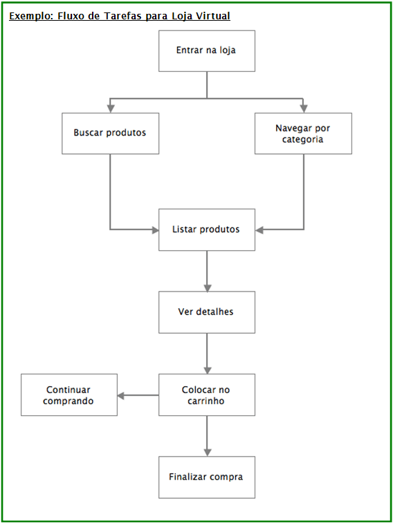
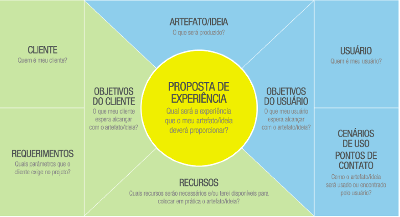
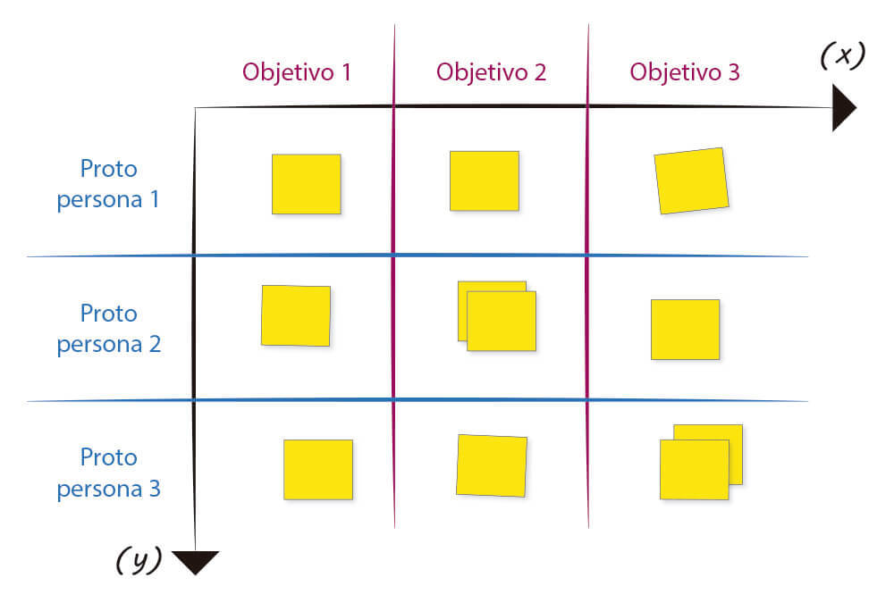
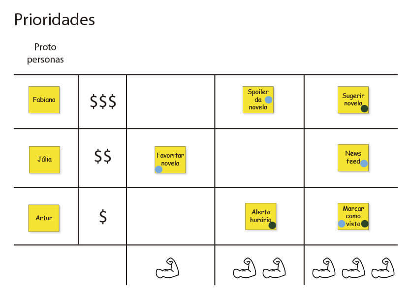

# Modelando e identificando requisitos

*"Eduquemos os jovens para que não se condenem os homens" -- Friedrich Nietzsche*

Depois de definir o projeto e realizar a pesquisa de design, como já dito anteriormente, o designer
deve dar forma e significado aos dados obtidos. O designer de interação constrói então uma série de
modelos, diagramas e documentações, como uma forma de visualizar e analisar tudo o que ele aprendeu
até agora. Um desses modelos, as Personas, já mencionamos anteriormente. Outros modelos podem ser
modelos mentais, cenários, análise de tarefas, fluxo de tarefas, etc.

### Qual documentação produzir?
A quantidade de documentação que o designer precisa elaborar e o que deve ser elaborado é uma questão
que sempre gera debates. Alguns sugerem que já se deve pular diretamente ao desenho da interface ou
até para protótipos e implementação do design em HTML, sem perder tempo com qualquer tipo de
documentação. Outros discordam, pois consideram a documentação uma parte importante para estruturar
o projeto e não deixar passar nada importante.

Mas o bom senso deve prevalecer: o designer deve elaborar a documentação que for necessária para
executar o projeto da melhor forma. Alguns documentos podem ser exigência do cliente, que os
consideram como parte dos entregáveis do projeto, outros porque os designers ou os desenvolvedores
envolvidos no projeto consideram úteis para desenvolver a interface e a aplicação. E mais uma vez,
tudo depende! Depende dos recursos disponíveis para o projeto, das exigências do cliente, do modo de
trabalho da sua empresa.

### Documentação e Serviço Terceirizado
Normalmente quando o design está sendo feito como um trabalho terceirizado e
que será repassado para o cliente implementar, a necessidade de documentações e especificações são
maiores. Mas quando o time de design está inserido na equipe de desenvolvimento do produto, essa
necessidade tende a diminuir, já que os designers estarão lado-a-lado com os implementadores.

Mas, independentemente de quais documentos você precisará desenvolver em seus projetos, vamos
descrever aqui alguns principais que ajudam numa melhor identificação dos requisitos necessários para
o desenho da interação e da interface.

## Modelo Mental

As pessoas não precisam entender de toda a complexidade que está por trás de qualquer produto que
elas usam. Um celular não funciona do mesmo jeito que um telefone fixo.

Um celular faz sua transmissão via ondas de rádio que trocam conexões dentro de uma rede consistindo
de várias antenas pertencentes às operadoras de telefonia móvel. Mas saber desse funcionamento não
ajuda às pessoas a entenderem como usar um celular, a como interagirem com ele.

A maneira como pessoas imaginam como algo funciona, mas que não necessariamente reflete seu real
mecanismo, é chamado **modelo mental** ou modelo conceitual. Ele não captura apenas a intenção
cognitiva de uma pessoa, mas também a emoção, ambiente social e traços culturais.

> **Modelo Mental**
> Determina como as pessoas pensam sobre algo e identifica a expectativa do usuário
> de como ele deve se comportar.

### Características chave
Modelos mentais têm as seguintes características-chave:

* Incluem o que uma pessoa pensa que é verdade, mas que não necessariamente é realmente verdade;
* São similar em estrutura às coisas ou conceitos que eles representam;
* Permitem uma pessoa predizer os resultados de suas ações;
* São mais simples que as coisas ou conceitos que eles representam. Incluem apenas informações
  suficientes para permitir previsões mais precisas.

### Muda lentamente
Modelos mentais evoluem lentamente e podem ser aplicados em outros projetos, diferente
das personas, que são específicas por projeto.

### Validado por Personas
Apesar do modelo mental guiar a estruturação do site, de nada adiantará se ele não atende as necessidades das personas criadas, sendo assim, a persona é um instrumento poderoso para validar o modelo metal escolhido.

### Exemplo de Modelo Mental
Um exemplo é o modelo mental para o componente "carrinho de compras" de uma loja online, que é o de
um container. Esse modelo influencia tanto o design do componente como a linguagem que é usada na
interface. Dessa forma, nós "colocamos" ou "tiramos" coisas do carrinho e a aplicação de comércio
eletrônico deve ter funcionalidades para atender a essas tarefas.

> **Exemplo: Modelo Mental para Loja Virtual**
> * É influenciado pela experiência com lojas e catálogos físicos;
> * Expectativas:
>   * É óbvio como achar um produto ou é fácil pedir por assistência humana;
>   * Tudo que precisa saber sobre o produto está acessível (na caixa do produto) ou é fácil pedir ajuda;
>   * Ter uma forma de marcação das coisas que vai querer comprar depois ou mostrar para amigos (como marcar a página do catálogo).
> * Unidades básicas de dados: produtos, que tem cores, tamanho, etc.

## Cenários

**Cenários** são narrativas que fornecem uma maneira rápida e eficaz
para imaginar os conceitos de design caso o produto tivesse sido construído.
Os protagonistas dessas histórias são as **personas** as quais procuramos atender
seus **objetivos** (levando em consideração modelos mentais) sejam finais,
de experiência ou de vida. Em certo sentido, os cenários são
protótipos **construídos de palavras**.

### Linguagem comum e fácil de entender
Esta técnica descreve os requisitos numa linguagem fácil de entender e validar por
todas as pessoas relacionadas com o projeto, motivando-as a discutir e a participar,
obtendo assim um maior feedback sobre o que será desenvolvido.

### Dão início ao plano de escopo
Os cenários demarcam a entrada no plano de escopo, pois são deles que serão extraídos
os requisitos funcionais e de conteúdo. Não é raro a aparição de novos requisitos
durante a criação do cenário, completando aqueles definidos no plano estratégico.

> **Cenário**
> É uma narrativa que descreve interações previsíveis dos usuários com o sistema.
> Incluem informações sobre objetivos, expectativas, motivações, ações e reações.

### De onde começar?
É muito comum começar com o cenário de primeira utilização: o quê acontece quando
personas encontram o produto ou serviço pela primeira vez?

> **Exemplo: um cenário para loja virtual**
> Alice quer comprar presente de aniversário para um amigo, mas não tem nada em mente. Ela sabe que ele gosta de cozinhar.
> Ela entra em uma loja virtual e de artigos diversos e olha os produtos em oferta e lançamentos que aparecem
> numa área de produtos da primeira página.
> Ela vê algo relacionado a livros de culinária e acha que pode ser uma boa ideia! Quais tipos de livros sobre esse assunto
> estão disponíveis? Qual deles seria um bom presente? Ela procura algo na lista de produtos relacionados ao tema.
> A lista mostra uma imagem de capa do livro e algumas outras informações como título, autor, preço. A lista esta ordenada por
> título e ela ordena por preço, do menor para o maior, porque não quer gastar muito.
> Ela vê três livros interessantes e seleciona o primeiro deles, informações mais detalhadas sobre o
> livro são mostradas em uma área de detalhes do produto e ela lê as opiniões que outras pessoas já dera sobre ele.
> Ela não gosta desse primeiro livro e volta a listagem para selecionar outra. Esse segundo ela achou bem interessante,
> mas para ela e não para o seu amigo, então quer marcá-lo para poder comprar depois.
> Finalmente ela encontra um livro que o amigo dela provavelmente vai adorar. Na área de detalhes do produto ela clica na opção para comprar e o seu carrinho de compras é mostrado já com o livro incluído. Ela pensa em voltar para comprar também aquele livro para ela, mas acaba desistindo e prossegue para pagar a compra.

### Tipos de Cenário
O cenário de mais alto nível é chamado **cenário de contexto**. Como tudo é feito sob o ponto de vista da persona, as coisas acontecem "magicamente", não havendo a necessidade descrever como as coisas acontecem por debaixo dos panos.

Quando o design esta a um passo de começar o design, é criado o cenário de caminho chave, que já utiliza o vocabulário do design e realiza os detalhamentos necessários.

## Gamestorming - Criando cenário

### Objetivo
Criar um cénario com foco na persona primária que criamos no exercício anterios.
Dos cenários criados vamos criar as histórias para o desenolvimento do app mobile.

**Obs.** Lembre-se de entrar no modelo mental da persona primária.

### Ambiente
1. Folhas A4;
2. Um caneta por aluno;
3. 3 bolinhas verdes (votos positivos) por integrante do time;
4. 1 bolinha vermelha (voto negativo) por integrante do time.

### Regras
* Duração de 25 minutos.

### Passo a passo
1. Cada integrante do time vai desenvolver um cenário com base nas necessidades da
persona primária;
2. Cole os cenários na parede para que cada integrante do possa ler todos os cenários;
3. Utilize as bolinhas para votar, primeiro os votos positivos (obrigatórios) e
em seguida o negativo (não é obrigatório);
4. Time entra em acordo de qual história vai resolver primeiro. Se o time achar
necessário pode melhor o cenário escolhido.

## Análise de Tarefas
Análise de tarefas é especialmente útil para validar se o design
suporta todas as tarefas requeridas pela aplicação, sejam elas dos
requisitos do negócio ou das necessidades dos usuários.

> **Análise de tarefas**
> Lista as tarefas que o design final terá que suportar. As tarefas podem
> ser categorizadas por importância, nível de acesso e até pelas personas
> que realizarão a tarefa.

Normalmente essa lista é montada a partir de requisitos de negócios,
achados das pesquisas, produtos existentes, cenários e casos de uso.

A categorização por grau de importância (primárias, secundárias,
terciárias ou dispensável), ajuda o time de design a focar seu
tempo nas tarefas mais importantes e a perceber aquilo que pode ser
dispensado no design.

## Fluxo de Tarefas
Depois que as tarefas foram listadas, organizá-las através de um diagrama que põe uma ordem que torna
óbvio como ir de uma a outra, fazendo o processo seguir um fluxo lógico, é o próximo e importante passo a ser feito.

> **Fluxo de tarefas**
> Detalha como um usuário vai completar todas as tarefas em uma aplicação, do
> começo ao fim.

Colocar as tarefas em um fluxo pode sugerir a ordem que as telas serão apresentadas na aplicação e
ajuda o designer a ver as conexões lógicas que serão construídas posteriormente nos *wireframes*.

A diagramação do fluxo de tarefas é o início da concretização dos requisitos e é quando o designer
começa ver o produto tomando forma.

## Sintetizando os Requisitos de Design

Assim que o designer tiver estruturado as informações obtidas, identificando os requisitos
necessários para o desenvolvimento da aplicação, ele pode sintetizá-los, agrupando em requisitos de
dados e de funcionalidades, ou seja, os dados e ações que devem ser representados no design da
interação e dos elementos da interface.

**Dados:** Objetos e informações que o usuário precisa ver.

**Funcionalidades:** Operações ou ações que os usuários farão com os dados ou em resposta a eles.
Normalmente são traduzidos em componentes de controle da interface ou em lugares onde os objetos e
informações serão dispostos na interface.

Uma forma de identificar os requisitos de dados e funcionalidades é separando as ações (verbos) e
objetos (substantivos) dos modelos (cenários, fluxo de tarefas) que foram elaborados.
Por exemplo:

> *Adicionar* (ação) *um produto* (objeto) *no carrinho* (objeto) *a partir do resultado da busca*.

Outros requisitos também podem ser úteis separar, como no exemplo acima, o requisito de contexto
*"a partir do resultado da busca"*.

Além disso, tudo o mais que possa afetar o design, como a habilidade dos usuários no uso do produto,
o ambiente onde o produto será inserido, prazo para desenvolver a solução, recursos disponíveis
(pessoas, orçamento), etc.

### Organização dos requisitos
Não existe uma forma padrão para a documentação desses requisitos. No geral, colocá-los em uma tabela
separados por tipo (dados, funcionalidades, contexto) é o suficiente.
A partir de agora, o designer tem subsídios suficientes para iniciar o desenho da interface, o que,
relembrando, não significa que ele não podia ter começado a esboçá-la em qualquer momento antes!

## User stories
Usualmente, as tarefas a serem executadas ela equipe são escritas no formato de **User Stories**, ou simplesmente Histórias.
Essas, são pedidos de itens de valor para o projeto que se está desenvolvendo e contém três
informações importantes:

* por que é importante que o sistema tenha essa funcionalidade;
* que tipo de usuário se benecia mais com essa funcionalidade;
* objetivamente, o que se quer que o soŸftware faça.

Sabendo da motivação e importância de cada história, conseguimos priorizá-las melhor. O pedido
objetivo de uma parte nova facilita aos envolvidos entenderem o que deve ser produzido. O tipo de
usuário que utilizará o sistema facilita muito também para os desenvolvedores, que saberão com quem tirar dúvidas, se essas surgirem e mesmo qual é o foco dessa funcionalidade.

## Escrevendo boas histórias
Uma boa história deve poder ser lida flžuentemente, como uma historinha mesmo. Tome cuidado
para não escrever a motivação para a construção da história da visão de uma pessoa e dizer que
o maior interessado é outro.
Veja um mau exemplo de história:

> PAGAMENTO EM BOLETO
> Para que **o comprador** possa pagar sem cartão de crédito
> Eu, como comprador
> Quero que o sistema dê suporte à emissão de boletos

Uma pequena alteração da grafia faz muito mais sentido e torna a leitura mais žfluente:

> PAGAMENTO EM BOLETO
> Para que **eu consiga** comprar produtos nessa loja
> Eu, como comprador que não tem cartão de crédito
> Quero que o sistema dê suporte ao pagamento em boleto

## Gamestorming - Criando histórias com foco no usuário

### Objetivo
Criar histórias retiradas dos cenários que desenvolvemos no exercício anterior.

### Ambiente
1. Cenário criado e definido pelo time no exercício anterior;
2. Duas fichas pautadas por integrante.

### Regras
1. Duração de 15 minutos;
2. Só utilizar um lado do cartão;
3. Cada integrante faz uma história pra cada proto-persona criada.

### Passo a passo
No cartão vamos adotar o seguinte padrão:

* **Para...** ver como a camisa fica de outras cores.
* **Eu, como...** comprador que gosta de um armario colorido.
* **Quero...** conseguir visualizar como a camisa fica nas cores disponiveis, com
alguma imagem ilustrativas que eu posso trocar de forma fácil.

Após o **Para...**, **Eu...** e o **Quero..** estiver preenchidos colocamos um título.

## Equilíbrio entre cliente e usuário
Apesar de sempre focarmos no usuário a maior parte do tempo na tomada de decisões do projeto, a opinião do **cliente** também precisa ser levada em consideração. Qualquer falha na definição dos objetivos ou mesmo falta de automatizadores de processos podem resultar em retrabalhos, insatisfação do cliente e/ou desmotivação da equipe.

Pode acontecer também do objetivo estar muito bem definido, mas a equipe desconhecer essa informação. Pode acontecer também da equipe nem mesmo conhecer o cliente e seus cnceitos, não conseguindo visualizar o quão importante é a sua tarefa atual.

Para melhorar a compreensão dos _stakeholders_ acerca das necessidades do usuário e dos rumos do projeto, e também da própria equipe envolvida no desenvolvimento (designers, desenvolvedores, etc),  foi criada uma ferramenta para deixar isso de uma forma totalmente visual e interativa, o **UX Canvas**, inspirado no clássico _Business Model Canvas_.

O diferencial dessa ferramenta é o seu foco no conceito de experiência do uso do projeto, podendo ser aplicado a qualquer momento do projeto. Cabendo a equipe decidir o nível de detalhamento de cada bloco.

> **UX Canvas**
> Site com o relatório final sobre a ferramenta: http://uxcanvas.com

E de todos os blocos da ferramenta, a *proposta de experiência* é de fato o coração de tudo. Estratégico e subjetivo, pode ser o alinhamento de uso das expectativas do cliente e do usuário. Até mesmo a necessidade que o projeto está solucionando.

## Gamestorming - UX Canvas

### Objetivo
Juntar a visão do cliente e do usuário.

### Ambiente
1. Persona criada em gamestorming anterior;
2. Cenários e histórias criados neste capítulo;
3. Cartolina;
4. Canetinha azul, verde e preta.

### Regras
* Duração de 25 minutos

### Passo a passo
1. Desenhar o UX Canvas na cartolina utilizando as canetinhas;
2. Colocar a persona no canvas;
3. Colocar os cenários no canvas;
4. Colocar as histórias no canvas;
5. Um dos integrantes do time assume o papel do cliente para preencher o lado do
cliente no canvas.

## Features
A descrição de um interação ou ação com o sistema é o que chamamos de feature. Por exemplo, escrever uma mensagem pra compatilhar um ideia, pensamento ou conteúdo relevante dentro do **Twitter** é um feature que chamamos de tweet.

Toda feature (funcionalidade) tem que atender um objetivo (necessidade) que seja claro e relacionado a uma persona ou proto-persona do seu sistema. Por esse motivo, antes de sair pensando nas features do sistema, precisamos entender quem é o nosso público alvo.

Felizmente. Nós já temos nossas proto-personas criadas.

## Gamestorming - Brainstorm de features com objetivos

### Objetivo
Realizar um brainstorm de features classicados por proto-persona e objetivo.

### Ambiente
1. Proto-personas criadas em gamestorming anterior;
2. Histórias criadas neste capítulo;
3. Cartolina;
4. Canetinha azul, verde e preta.

### Regras
* 20 minutos.

### Passo a passo
1. Classificar as proto-personas no eixo Y;
2. Cada integrante do time define um objetivo pensando nas proto-personas;
3. Classificar os objetivos no eixo X;
4. Brainstorm de features pra solucionar os objetivos pensando em cada proto-persona.

## Priorizando features
Em alguns cenários coorporativos a priorização de feature é definida somente pelo cliente. A opinião do cliente realmente tem o seu valor. Mas é importante levarmos em consideração mais 4 valores: **valor pro usuário**, **valor pro negócio**, **esforço técnico** e **MVP**.

### Valor pro usuário:
Tem o objetivo de entender qual feature vai entregar mais valor pro cliente, e deixar ele mais feliz. Esse é o momento de entrarmos no **modelo mental** do usuário, pra classificar quais features entregam um valor pequeno, médio ou grande.

### Valor pro negócio:
Utilizado pra priorizar qual feature entrega mais resultado financeiro pro nosso cliente. Importante classificar junto com nosso cliente quais features tem um valor pequeno, médio ou grande.

### Esforço técnico:
É o valor que deve ser levantado com o time técnico do sistema. Com o objetivo de classificar quais features tem um esfoço pequeno, médio ou grande.

### MVP (Minimum Viable Product)
É uma versão com o mínimo de features que posso ser colocado em produção, agregando valor pro usuário e negócio.

## Gamestorming - Priorizando features com foco no usuário

### Objetivo
Priorizar tarefas com foco no usuário, levando em considereção o esforço técnico e o retorno financeiro.

### Ambiente
1. Proto-personas criadas em gamestorming anterior;
2. Histórias criadas neste capítulo;
3. Cartolina;
4. Canetinha azul, verde e preta.

### Regras
* Duração de 30 minutos

### Passo a passo
1. Criar o canvas;
2. Colocar as proto-personas;
3. Priorizar as histórias no canvas.

