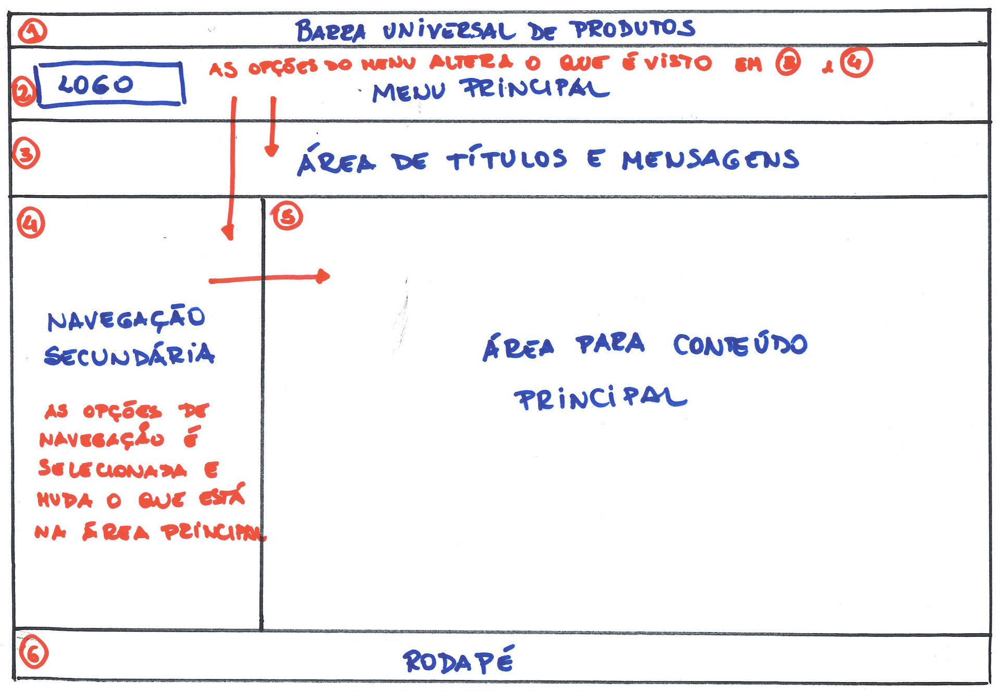
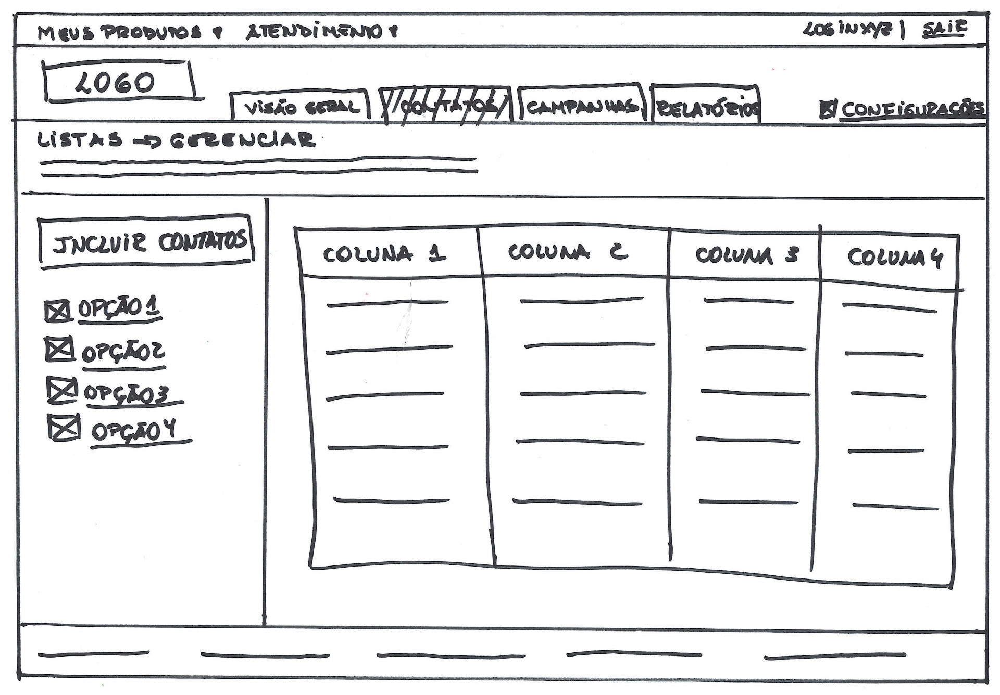
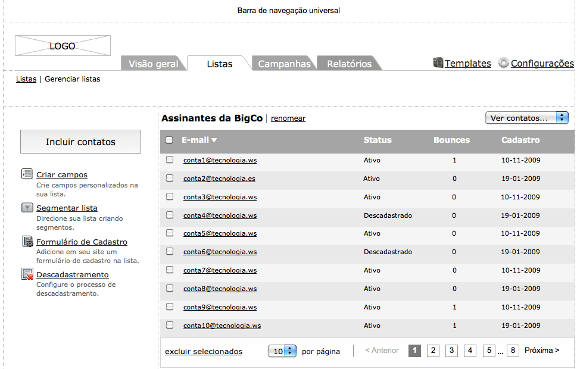

# Dos Requisitos ao Design

*"Não existe um caminho para a felicidade. A felicidade é o caminho." -- Mahatma Gandhi*

Nas sessões anteriores, foram apresentadas partes do processo de desenvolvimento do produto, como
descoberta e definição do produto, e a identificação dos requisitos de design. A partir de agora,
passaremos ao desenho da interface propriamente dito.

## Estrutura Geral

Esse é o momento de pensar na ::big picture:: no qual entramos no plano da
estrutura. Não inclui ainda o design visual, interações
detalhadas, elementos de interface. Fazendo uma analogia ao projeto de uma casa, nessa etapa seriam
definidos quais cômodos a casa teria, qual a disposição de um em relação ao outro, o tamanho relativo
de cada um. Ainda não seria necessário definir as dimensões exatas de cada um, onde estariam as
portas e janelas e quais móveis estariam em cada um, por exemplo.

Deve ser definido a estrutura geral de navegação e as interações macro da aplicação. Deve-se
considerar sua forma (será vista em uma tela de alta-resolução, em um celular, um quiosque?), qual
padrão postural a aplicação seguirá (transitório ou soberano?) e quais os métodos de entrada de dados
(teclado, mouse, voz, toque na tela?).

É o começo do esboço da aplicação. Identifique as **visões** principais que a aplicação precisa
(estados principais da tela). Normalmente, cada visão é determinada pelas diferentes atividades que o
produto precisa suportar. Para cada visão, inicie a "fase de retângulos", onde a visão é divida em
áreas retangulares correspondendo aos painéis, componentes de controles (como por exemplo barra de
ferramentas, menus) e outras áreas de mais alto-nível. Cada área é identificada com um nome e é
demonstrado os relacionamentos entre elas, ou seja, o que uma mudança em uma área influencia nas
outras. De uma visão para outra, pode-se mudar todas as áreas ou apenas uma principal.

Esse esboço pode ser feito inicialmente em um papel, guardanapo ou quadro-branco! Passe para uma
ferramenta de design quando achar que algo mais fechado já foi definido.

O design é um processo incremental que vai sendo refinado a cada iteração.

> ### Cenários de Validação
> É possível criar cenários de validação do tipo "se... então" para testar outras possibilidades no esboço feito.

## Refinando o Design

Da mesma forma que o design da interação está sendo definido, o estudo da linguagem que o design
visual terá também pode ser iniciado, a menos que exista um padrão de design visual já estabelecido.

Inicialmente é a exploração de diversos estilos, que incluem cores, tipografias, contrastes, formas e
estados que elementos da interface podem ter. Esse trabalho ainda não leva em consideração o design
de interação que está sendo feito.

Depois de escolhido um ou dois estilos visuais, deve-se aplicá-los nas telas chaves da aplicação,
para definir aquele que melhor atende ao design de interação. Nessa fase, o design de interação
dessas telas precisa estar mais elaborado, com detalhes suficientes para refletir melhor o design
visual, por isso, os esforços de interação e visual precisam estar sempre alinhados. Com um design
mais concreto, é melhor para fazer a avaliação das possibilidades da solução proposta e também de
obter feedback dos envolvidos no projeto.

### Wireframes

Wireframe é um dos mais importantes documentos que o designer de interação produz quando trabalha no
desenvolvimento de um produto no plano de esqueleto.

> ### Wireframe
> É uma visão detalhada de uma parte do produto, incluindo todos os componentes de uma tela e como eles
> se encaixam juntos.

Wireframes também são uma ótima ferramenta para se comunicar com vários níveis de audiência. Serve
para mostrar aos clientes como o design atende aos objetivos do negócio, para que os desenvolvedores
vejam como o produto funciona e se comporta, e assim saberem o que eles precisam codificar e para que
o designer visual saiba quais elementos visuais ele precisa desenhar.

Wireframes devem esboçar a forma do produto, moldando o conteúdo, as funcionalidades e os meios de
acessar ou navegar entre eles.

Conteúdo é um termo genérico que inclui textos, imagens, ícones, vídeos, gráficos, entre outros.
Dependendo de quão detalhado o wireframe seja, o conteúdo pode ser representado tanto como quadrados
com um "X" através deles (chamado ::placeholders::) com uma indicação do que ele significa, como com
uma representação mais real.

As funcionalidades consistem dos controles necessários para executar uma tarefa bem como o que a
aplicação apresenta em resposta ao uso desses controles: são botões, rótulos, caixas de texto,
checkboxes, radiobuttons, listboxes, sliders, mensagens de erros, links, etc.

Todos esses componentes da interface precisam estar documentados no wireframe mostrando sua
disposição geral e importância. E tudo que não estiver óbvio no wireframe, deve ter uma anotação
correspondente.

À medida que o wireframe vai se tornando mais estável, quando a possibilidade de mudanças diminui,
comece-o a detalhar ainda mais. Mostre no próprio wireframe como deve ser o comportamento de cada
funcionalidade e coloque conteúdos reais. Várias ferramentas de elaboração de wireframes permitem que
você desenvolva um nível excelente de fidelidade visual e funcional, inclusive servindo como
protótipo da sua aplicação. Muitas vezes o próprio wireframe é usado em testes de usabilidade ou
como especificação para a equipe de implementação.

### Ferramentas de Elaboração de Wireframes

Há várias ferramentas para esse propósito no mercado:

* Axure - www.axure.com (Win/Mac)
* Just in Mind - www.justinmind.com (Win/Mac)
* OmniGraffle - www.omnigroup.com (Mac)
* SmartDrawn - www.smartdraw.com (Win)
* iRise - www.irise.com (Win)
* Balsamiq - www.balsamiq.com (Win/Mac e online)
* Gliffy - www.gliffy.com (online)

## 8 steps
Uma ferramenta que busca juntar a informalidade e rapidez do rabiscoframe com as ideias e conceitos do wireframe é a chamada **8 steps**, ou *crazy eights*. Essa ferramenta foi criada pelo Google e é um componente importante na metodologia Design Sprint Method. 

A ideia é gerar novas ideias. As partes interessadas no projeto, seja desenvolvedor, gerente ou mesmo o próprio cliente, buscam soluções de forma rápida desenhando-as em um papel em poucos minutos. O motivo pelo qual deve ser feito rapidamente é que quando temos pouco tempo para rabiscar, focamos mais em ideias, e não em detalhes.

Cada *8 steps* é uma folha, dividida em oito partes iguais, e cada uma dessas partes é uma tela diferente do aplicativo. Sendo sempre focado em resolver uma história por vez, essa ferramenta deve mostrar o fluxo de navegação do usuário pelas telas do aplicativo. A parte interessante do rabiscoframe é importada aqui, pois não é necessário nenhum alto grau de habilidade artística para rabiscar uma ideia em um papel.

É interessante também o time acordar as cores que serão utilizadas por todos, como por exemplo, utilizar a cor preta para o desenho em si.

## Gamestorming - criando rabiscoframe e wireframe em time

### Objetivo
Desenvolver um wireframe com menos pontos de falhas de forma ágil.

**Obs.** A técnica que vamos utilizar foi criado pelo Google.

### Ambiente
1. Uma história criada em gamestorming anterior;
2. Folha A3;
3. Minímo de 4 cores de caneta por aluno;
4. Folhas A4 para rascunho;
5. 3 bolinhas (votos positivos) verdes por integrante do time;
6. 1 bolinha (voto negativo) vermelha por integrante do time.

### Regras
* Duração de 80 minutos;
* Cada integrante do time deve fazer um *8 steps* mesmo sem habilidades
artísticas.

### Passo a passo
1. Time escolhe um história para solucionar as interações;
2. Divide a folha A3 em 8 partes iguais, cada parte da A3 vai ser um tela ou interação
que o usuário tem que realizar com a finalidade de resolver a história escolhida pelo time.
3. O time precisa definir o que cada cor de caneta vai significar, por exemplo:
Preta - desenho;
Azul - Mouse;
Verde - Touch;
Vermelha - Teclado.
4. Com a história e as cores definidas basta partir para solução com telas e interações,
cada integrante com sua folha A3 sem colar;
5. Colar todas as soluções na parede;
6. Cada integrante apresenta sua solução para o restante do grupo;
7. Depois cada integrante vota de forma livre utilizando primeiro votos positivos depois o negativo (sem discussões nesse parte);
8. Com os votos finalizados o time se junta a frente dos desenhos e discutem sobre o que querem construir;
9. Por fim, o time se junta para criar um versão final da solução da história.

