# Padrões e Princípios do Design de Interação

*"O mundo já está cheio de feridas e infortúnios mesmo sem guerras para multiplicá-los"
-- J.R.R. Tolkien*

Os princípios e padrões de design de interação são aplicados durante o processo de desenho da
interface, ajudando os designers a traduzir os requisitos definidos para o produto em estruturas e
comportamentos na interface.

Os princípios de design de interação são *guidelines* ou regras, tipicamente baseadas em um
conjunto de valores e crenças que os designers têm, bem como nas sua experiência em tentar
corresponder a esses valores; que endereçam questões de comportamento, forma e conteúdo de uma
interface.

Já os padrões são considerados soluções recorrentes para problemas comuns, soluções estas que se
destacaram de práticas comuns e já bem testadas. Padrões de design de interação não só se preocupam
com a estrutura e organização dos elementos da interface, mas também com o comportamento dinâmico e
mudanças nesses elementos em resposta às ações do usuário.

O esforço de formalizar os conhecimentos sobre design de interação e melhores práticas permitem:

* Reduzir o tempo e esforço de design em novos projetos;
* Melhorar a qualidade das soluções de design;
* Facilitar a comunicação entre designers e programadores.

## As dez heurísticas de Nielsen

Um grupo de princípios bastante conhecido, devido a popularidade de quem os difundiu, são *As 10
Heurísticas de Nielsen*. São eles:

* 1 - Visibilidade do estado do sistema
* 2 - Correspondência entre o sistema e o mundo real
* 3 - Liberdade e controle do usuário
* 4 - Consistência e padrões
* 5 - Prevenção de erros (design defensivo)
* 6 - Reconhecimento em vez de memorização
* 7 - Flexibilidade e eficiência de uso
* 8 - Estética e design minimalista
* 9 - Ajudar os usuários a reconhecerem, diagnosticarem e recuperarem-se de erros
* 10 - Ajuda e documentação.

Vejamos cada um deles:

### 1. Visibilidade do status do sistema

É responsabilidade do sistema informar o que está acontecendo em real time pro usuário.

Quando estamos assistindo/ouvindo uma playlist do Youtube, do lado direito fica bem claro: qual vídeo estamos assistindo; qual é próximo; quais assistimos ou não.

### 2. Correspondência entre o sistema e o mundo real

Em relação ao **mundo real** podemos considerar: sons, visual e o tom de escrita que usuário utiliza para se comunicar. Implementamos bastante esta heurística quando utilizamos uma seta, ícones e utilizamos a cor vermelha para elementos negativos.

Um software que usa essa heurística é o Photoshop em sua barra de ferramentas.

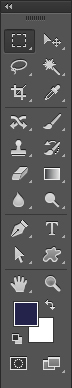

### 3. Liberdade de controle fácil pro usuário

Essa foi a heurística que me motivou a fazer esse post. Nesta heurística, a preocupação é de passar pro usuário a liberdade de ele fazer o que quiser dentro do sistema com exceção das regras que vão contra o negócio ou interferem em outra funcionalidade.

Por exemplo quando criamos um tweet é bacana poder deletá-lo se estivermos afim. Mas não dá pra editar um tweet. Imagina se você dá um retweet e depois o usuário que fez o tweet muda o texto pra uma coisa que você não acha legal. Sacanagem né!

### 4. Consistência e padrões

É importante manter a consistência e padrão visual (texto, cor, desenho do elemento, som e etc).

Por exemplo, no fórum GUJ (Grupo de usuário Java), quando vamos responder um post o botão para enviar a resposta sempre é da mesma cor, tamanho e texto. O elemento para cancelar a resposta sempre tem seus padrões:

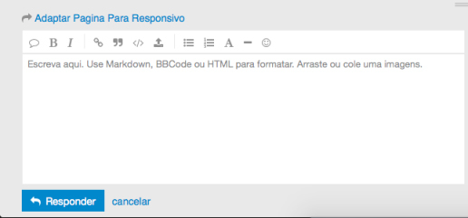

### 5. Prevenção de erros

Não é uma boa ideia deixar seu usuário errar sem explicar previamente o motivo do erro. Melhor do que isso, tente criar um interface que permite o usuário não errar.

A busca do Google faz isso de uma forma muito inteligente. No momento que começamos escrever nossa busca ele já te entrega algumas sugestões, mesmo se a gente escrever a busca com uma ortografia errada ele realiza a busca e pergunta se estamos procurando outra informação com a ortografia correta.

Realizando uma busca no Google:

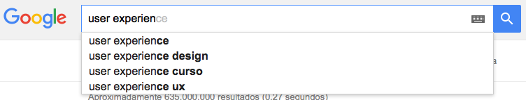

Resultado da busca com erro de ortográfica:

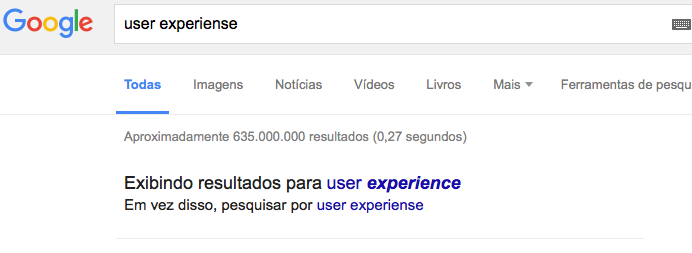

### 6. Reconhecimento em vez de memorização

O usuário não tem obrigação de decorar qual foi o caminho que ele fez pra chegar até a página.

Por exemplo, quando você entra em um produto do site da Locaweb é disponibilizado o caminho que você fez pra chegar até ele. Nós chamamos isso de _breadcrumb_.

### 7. Flexibilidade e eficiência de uso

É importante deixar uma experiência boa com seu sistema desde o usuário mais leigo até o mais avançado.

Por exemplo, dentro do Trello (kanban de tarefas online com base em colunas free) quando você está com o foco em um cartão você pode utilizar o mouse para navegar em outros cartões, as teclas direcionais (setas pra cima e pra baixo) ou as letras j (para baixo) e k (para cima). Teclas que são por sua vez utilizadas no VIM, editor de texto famoso entre os desenvolvedores.

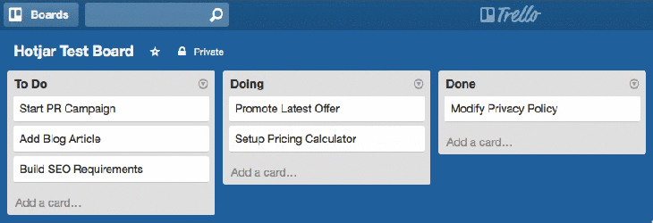

### 8. Estética e design minimalista

Por favor não encha linguiça. Todo informação extra que você deixar pro seu usuário pode na verdade adicionar mais uma dúvida, ou seja, deixe o seu layout e o conteúdo o mais simples e direto possível.

Um app que gosta muito dessa heurística é o da Nubank. Pra gerar o boleto de pagamento da sua fatura só são necessárias duas telas e elas são bem simples e realmente objetivas.

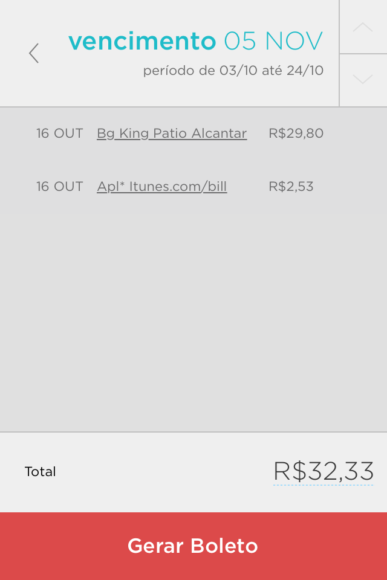
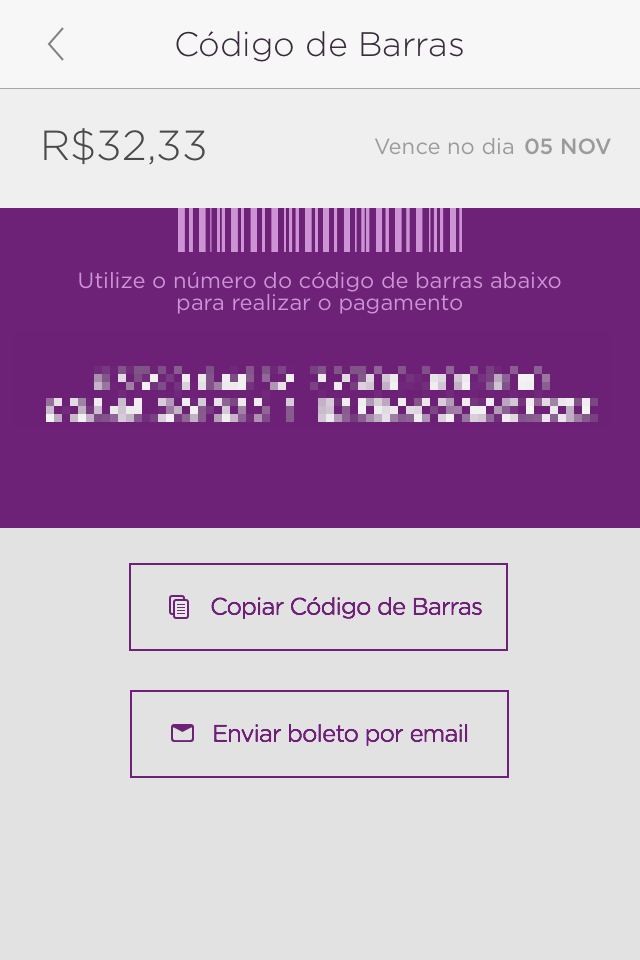

### 9. Ajude os usuários a reconhecerem, diagnosticarem e recuperarem-se de erros

As mensagens de erros tem que ser claras e próximas do conteúdo ou ação que causou o erro.

No formulário de cadastro do Spotify caso você não preencha os dados necessários ele deixa bem claro quais campos estão faltando, com um mensagem clara e objetiva.

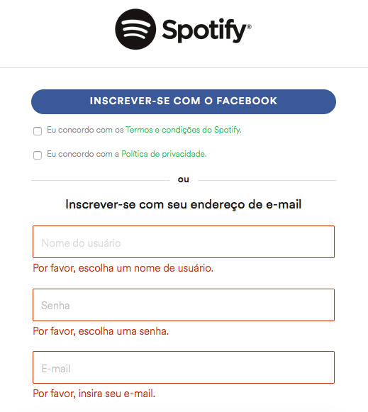

### 10. Ajuda e documentação

É uma boa não precisar dessa heurística. Implementar documentação e sistema de ajuda sempre é chato e muitos usuários têm o costume de ignorar ambos mas, se for realmente necessário, deixe a documentação próxima do usuário e do elemento ou ação que tenha necessidade de uma explicação mais detalhada.

Por exemplo, no formulário de pagamento do Walmart tem um campo pra preencher o código de segurança do cartão. Como não é algo muito óbvio, tem uma imagem próxima ao campo mostrando onde fica o código de segurança do cartão. Essa é uma boa forma de fazer uma documentação feliz.

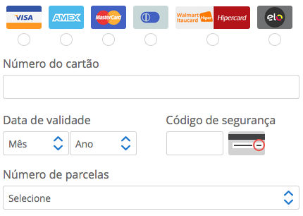

## Outros princípios para implementar interfaces eficazes

Além das dez heurísticas de Nielsen, existem outros principios para implementar interfaces eficazes.

### Apresente as etapas do processo
Sequências de ações devem ser organizadas em grupos com início, meio
e fim. O feedback informativo ao completar um grupo de ações dá ao usuário satisfação de realização,
senso de distinção e uma indicação que o caminho é claro para se preparar para o próximo conjunto de
ações.

### Faça uma navegação clara e eficiente
Uma boa navegação ajuda o usuário a saber onde ele está e
para onde quer ir. Os segredos de uma navegação eficiente incluem:

* Organização - separa as areas mais e menos importantes, reflete como as pessoas pensam e as
  prioridades do negócio;
* Dentro do "triângulo de ouro";
* Compacta, para deixar espaço para o conteúdo;
* Rótulos (labels) curtos;
* Mostra visualmente, com clareza, onde o usuário está.

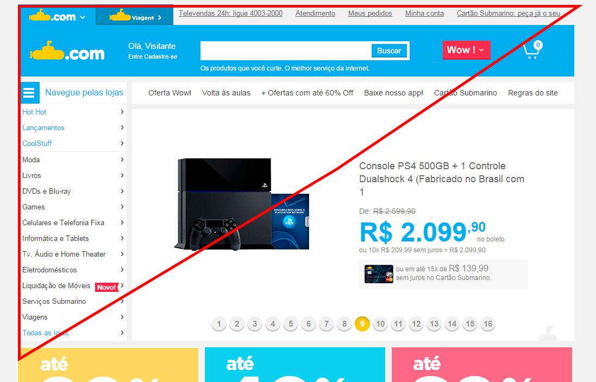

### Título das páginas reforça a navegação e orienta o usuário
Os elementos que tornam o título das páginas eficaz são:

* (Quase) sempre estão no mesmo lugar;
* Está destacado visulamente;
* É curto;
* O nome coincide com o que está na navegação;
* É consistente na capitalização das letras.

### Botões e Links
Normalmente, use botões para tarefas (ações), principalmente as primárias, e
links para navegação.

### Separe suas tarefas primárias, secundárias e terciárias
Dê às tarefas primárias lugar de destaque e foco visual. Tente limitar a uma ou duas
tarefas primárias por página.

### Deixe sua interface rápida
A aqui não estamos falando só de tempo de carregamento! Ela deve ser
fácil de escanear e ver o que fazer, possibilitar o mínimo de cliques para ir de um lugar a outro ou
para completar uma tarefa.

### Mantenha proximidade
Itens relacionados devem se manter próximos.

### Seletivamente copie interações comuns e já comprovadas
Inove só onde há algo único.

### Design visual deve ter total conexão com o de interação
O design visual deve ajudar o de
interação a atender os requisitos do produto. Nunca o design visual pode estragar um trabalho de
interação bem feito.

### Menos é mais
Interfaces do Usuário incríveis **devem ser quase invisíveis**.

## Padrões de Design de Interação

Padrões de design de interação podem ser hierarquicamente organizados a partir do nível da aplicação
e ir descendo até o nível de componentes individuais da interface. Podem ser divididos em três tipos:

* **Postural:** podem ser aplicados no nível conceitual e ajuda a determinar a postura geral do
  produto. Dois exemplos mais comuns é o padrão **transitório** e o **soberano**.
* **Estrutural:** resolve problemas relacionados a disposição dos elementos de dados e funcionais na
  tela. Consiste de visões, painéis e agrupamentos.
* **Comportamental:** usado em uma grande variedade de problemas relacionados a interações
  específicas com os elementos funcionais e de dados.

### Postural

Uma aplicação com **postura transitória** significa que uma pessoa a usa por um breve período de
tempo. A aplicação é chamada quando necessária, aparece, o usuário realiza seu trabalho nela e em
seguida a fecha, continuando suas atividade normais, provavelmente em uma aplicação com uma postura
soberana.

Por sua característica temporária, o usuário não tem a chance de se tornar muito familiar com ela.
Logo, a interface de uma aplicação desse tipo deve ser simples, clara e ir direto ao ponto; deve ser
óbvia, apresentar seus elementos claramente sem dar possibilidades a confusão ou erros. Normalmente é
limitada a uma única janela e visão.

Por exemplo, abrir o Windows Explorer para localizar e abrir um arquivo enquanto edita um outro com o
Word é um típico cenário transitório. A calculadora, Yahoo! Widgets e o iTunes são outros exemplos de
aplicações com a postura transitória.

Já programas que dominam a atenção do usuário por um longo período de tempo possui uma **postura
soberana**. Oferecem uma grande quantidade de funções relacionadas e os usuários tendem a mantê-la
rodando continuamente, ocupando toda a tela.

Como os usuários dedicam bastante tempo usando aplicações desse tipo, eles normalmente têm grande
interesse em crescer na curva de aprendizado e tornar-se logo usuários intermediários. Do ponto de
vista de design, isso significa que a aplicação deve ser otimizada para o uso de intermediários
permanentes e não ter como objetivo primário os iniciantes (ou *experts*).

Aplicações soberanas devem ser otimizadas para uso em tela-cheia ou maximizada e, como serão
utilizadas por longos períodos de tempo, deve-se tomar cuidado com a apresentação visual. Um design
excessivo, com o uso exagerado de cores e texturas, podem ser atrativos no início, mas com o passar
do tempo torna-se cansativo para quem usa muito a interface. Na medida do possível, mantenha um
estilo conservador. Pixels são preciosos.

Bons exemplos desse tipo de aplicações são processadores de textos, planilhas, clientes de e-mail,
entre outros.

### Estrutural

Os **padrões estruturais** são provavelmente os menos documentados. Um exemplo bem conhecido desse
padrão é a estrutura macro do Microsoft Outlook, com seu painel de navegação na esquerda, um painel
de visão geral na direita, em cima, e uma área de detalhes na direita inferior. Esse padrão é
vastamente utilizado, onde o painel vertical possibilita a navegação e direciona o conteúdo que será
mostrado no painel de visão geral. Ao selecionar um objeto neste painel, informações são mostradas no
painel inferior.

## Padrões de Interação Comportamentais

Padrões de uso normalmente são identificados através da observação de como os usuários usam os
elementos de uma interface e em quão útil esses elementos, e seus comportamentos, estão sendo para
que o usuário complete suas tarefas mais facilmente e mais eficientemente. Após descobrir esses
padrões de uso, criamos os padrões de interações para suportar esses padrões de uso comuns.

Por exemplo, softwares de CRM normalmente vêm com uma opção "novo" para criar um novo contato. Uma
vez clicado em "novo" aparece o formulário com as opções "salvar" e "cancelar".

Observando como os usuários usavam esse tipo de ferramenta, descobriu-se que o padrão de uso era, na
maioria das vezes, após clicar em "salvar", clicar em "novo" para cadastrar mais um contato.
Percebendo esse padrão de uso, apareceu um terceiro botão no formulário, o "salvar e novo":

A partir daí, esse comportamento pôde ser mapeado em um novo padrão de design de interação.

Aqui descreveremos alguns padrões conhecidos de design de interação, divididos em sete categorias
principais de padrões de uso:

* Exploratório
* Navegação em grandes bases de dados
* Busca avançada
* Entrada e alteração de dados
* Informação centralizada
* Guias
* Comunidade

### Exploratório

O padrão exploratório é aquele que permite ao usuário explorar a aplicação. Os padrões de interação
associados ao padrão de uso exploratório costumam ter as seguintes características:

* Suportam navegação segura e previsível;
* Provêem informações para que o usuário se encontre;
* Ajudam a unificar informação em uma única visão que de outra forma iria requerer muitos cliques
  para ser acessada;
* Colocam dados e ações relevantes próximos de uma informação principal.

Algumas vezes, em vez de um modo exploratório, pode ser interessante colocar o usuário em um modo
linear de ação. O modo linear, por exemplo, um wizard, pode ser muito útil em situações onde o
usuário não é um especialista, ou quando queremos dar uma opção simplificada de ação.

Para o padrão de uso exploratório, precisamos pensar em permitir erros e em mostrar dados e ações.

### Permitindo erros

**Itens de menu inteligentes:** São itens que dizem exatamente o que a aplicação vai fazer, incluindo
informação sobre qual objeto vai sofrer a ação, deixando a interface auto-explicativa. Nesse padrão
de interação, sempre que o usuário muda o objeto selecionado (em uso), os itens de menu relativos ao
objeto são também mudados.

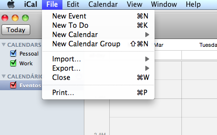
*Menu de uma aplicação de Calendário. Os itens de menu deixa claro qual ação será realizada ao
clicar nele.*

**Undo multi-nível:** Permite reverter facilmente uma série de ações feitas pelo usuário. Cada ação
fica no topo de uma lista à medida que é executada e cada undo reverte a ação que está no topo.

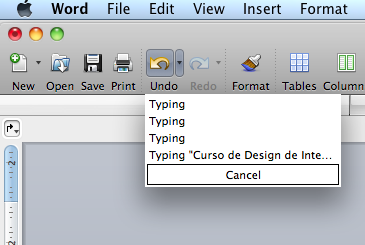
*É Possível selecionar uma ou mais ações para desfazê-las.*

**Sandbox:** Permite ao usuário salvar dados para que possa ser utilizado no futuro. Assim, é
fornecido ao usuário um lugar para armazenar aquilo que deve persistir durante o uso.

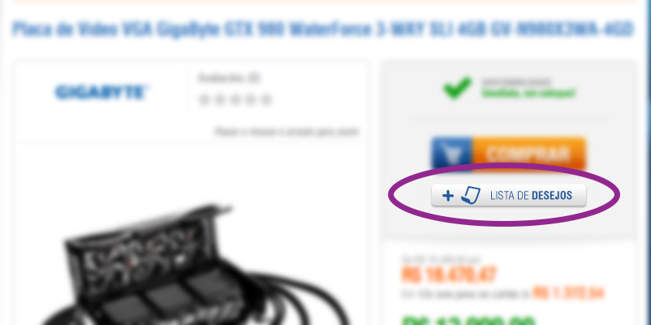
*Aqui é possível adicionar um produto a "lista de desejos" para poder decidir a compra no futuro.*

### Mostrando dados

**Inspeção:** o usuário precisa frequentemente ver mais informações sobre um determinado item na
mesma tela em que está vendo o item. Nesse caso, usa-se uma área para expor detalhes, normalmente
próxima à base da página. Esse tipo de elemento tipicamente usa o recurso de expandir/recolher.

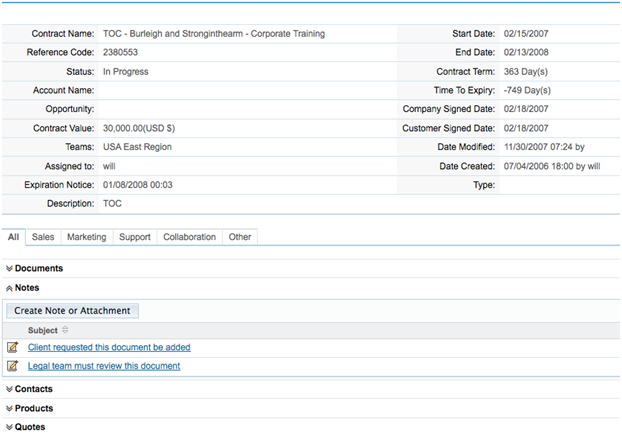
*Na parte de baixo, são mostradas informações mais detalhadas (documentos, notas, contatos,
produtos, cotas) sobre o item Contrato mostrado acima.*

**Tabs dentro de páginas:** Permite ver o conteúdo detalhado sobre o conteúdo principal que está
sendo mostrado.

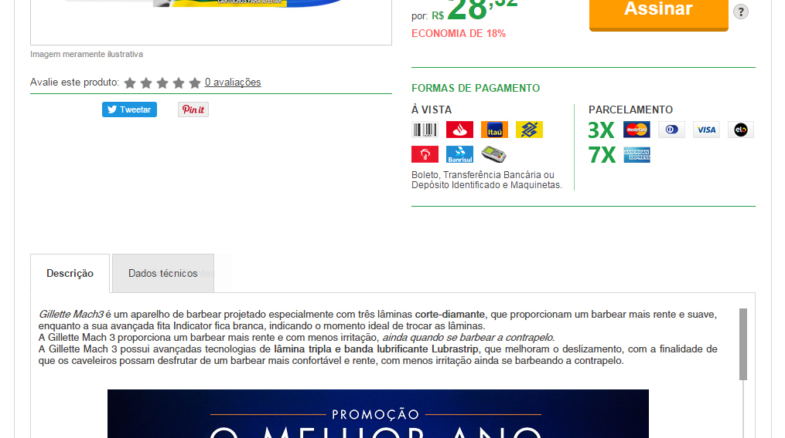
*As tabs Descrição e Dados Técnicos apresentam o conteúdo detalhado do produto.*

**Mouseover com conteúdo rico:** Utilizado quando queremos dar ao usuário a possibilidade de ver mais
informações, contextualizada, sobre um determinado item. Normalmente a informação apresentada contem
um conteúdo mais rico que apenas texto, tais como gráficos, links ou ações.

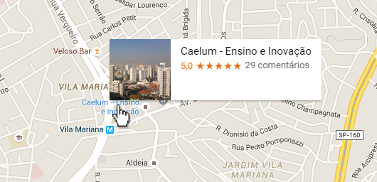
*Ao passar o mouse em um ponto do mapa, mais informações são mostradas referente a esse ponto. Além
de textos, algumas ações também são disponibilizadas.*

### Mostrando ações

**Ações inline:** O usuário precisa executar uma ação no item que está sendo mostrado. Coloque
botões, links e outras ações próximos aos itens relacionados à ação.

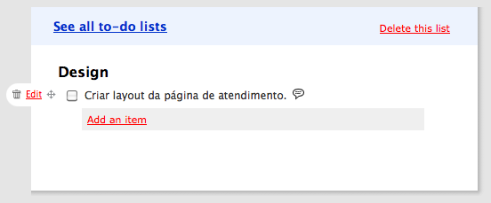
*As ações que podem ser realizadas no item são mostradas próximo ao próprio item.*

### Navegação em grandes bases de dados

Esse padrão mostra soluções para quando o usuário se depara com grandes quantidades de dados em nossa
aplicação. De forma geral, grandes conjuntos de dados são normalmente navegados por meio de
hierarquias. Existem algumas alternativas, uma vez que as hierarquias:

* São usadas em excesso;
* Podem ser difíceis de navegar por razões de performance e complexidade;
* Nos dão a tentação de mostrar os dados da forma que eles estão armazenados no banco de dados e não
  da forma que o usuário entende;
* Com 3 ou 4 níveis, a hierarquia já se torna muito difícil de navegar.
0

**Acordeão:** Quando a informação que se deseja mostrar não cabe em uma hierarquia, usa-se o acordeão
(como por exemplo, parágrafos de texto). No acordeão, ao clicar em um painel, uma outra área é
revelada com as informações que se quer apresentar.

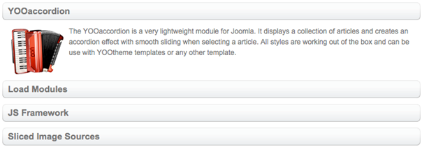
*Ao clicar em cada título, expande-se uma área com mais informações (texto ou outros elementos),
fazendo um efeito igual ao da sanfona. Para esconder a área, basta clicar novamente no título.*

**Tree-table:** Uma mistura de hierarquia com tabela, pois dessa forma se consegue mostrar mais
informações ao usuário para facilitar sua navegação. Coloque a hierarquia na primeira coluna e os
atributos do item nas demais colunas. As linhas - um item por linha - normalmente são clicáveis.

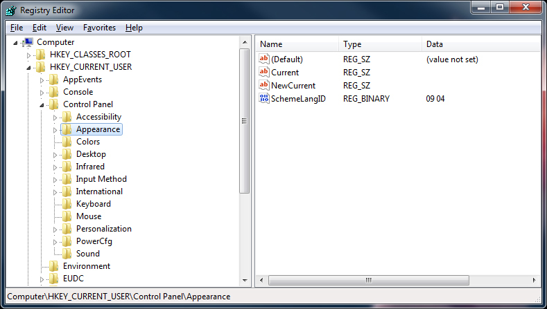
*A coluna Nome contém a árvore de hierarquia. Clicando no (+), os itens são expandidos e seus
atributos (localização, descrição) são mostrados nas demais colunas.*

**Gaveta:** Usado quando é necessário mostrar informações de um item da tabela que quebra a
formatação dessa tabela. Utilize, nesse caso, linhas de tabela expansíveis que "abre" apresentando o
conteúdo. A estrutura de grid deve ser diferente da usada na coluna da tabela, para evitar uma
visualização confusa.

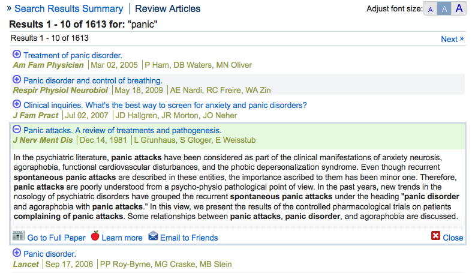
*A linha da tabela se expande para poder mostrar algum conteúdo relacionado a ela, mas bastante
extenso para caber adequadamente em uma coluna.*

**Filtro de coluna:** Quando a tabela contém muita informação e o usuário quer filtrar somente as
informações relevantes baseadas em um determinado critério.

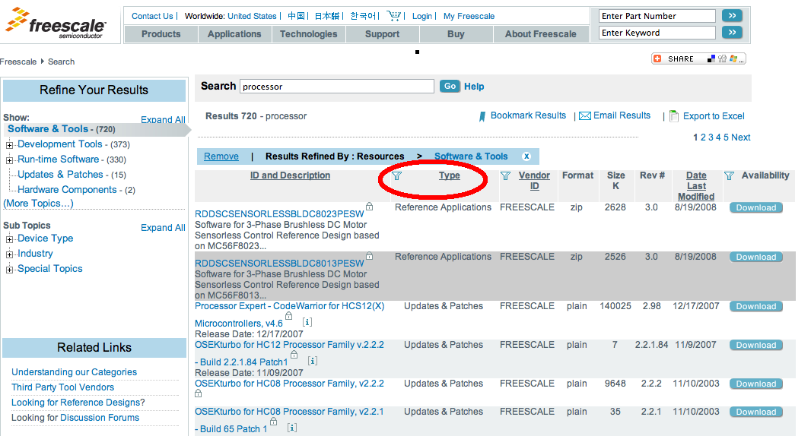

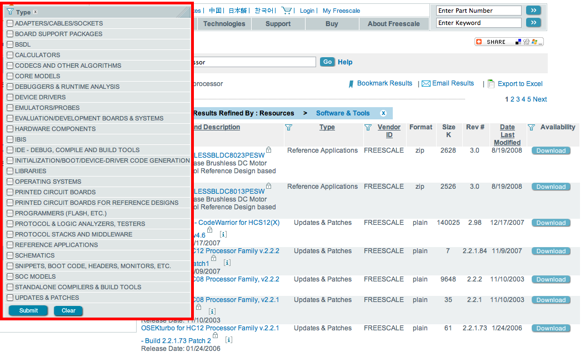
*Ao clicar na coluna, abre-se um modal com várias opções de filtro referente a coluna clicada.
Pode-se selecionar uma ou mais itens para que a tabela seja filtrada por essas opções.*

### Busca avançada

Quando falamos de busca, alguns pontos merecem atenção:

* Construir uma consulta de uma busca usando somente palavras-chave pode ser bem difícil dependendo
  dos dados;
* Buscas que não retornam informações úteis podem ser frustrantes. Os usuários podem nunca mais
  voltar a seu site, ou pior, abarrotar seus canais de atendimento;
* Mostrar atributos pode aumentar a probabilidade dos usuários chegarem ao conjunto de informações
  que eles procuram (algumas vezes compensa a falta de uma rotulação de conteúdo eficiente);
* Normalmente os usuários assumem que a busca é baseada em linguagem natural;
* Forneça exemplos de como pesquisar próximo à caixa de busca.

Para interações de busca avançada, apresentamos os 4 padrões abaixo:

**Busca baseada em atributos:** Utilizado quando se tem um número menor de atributos (de 1 a 10) que
podem ser usados para alcançar o resultado de busca desejado. Os campos devem ser organizados na
forma de formulário caso a quantidade de atributos seja grande.

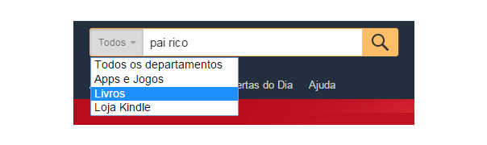
*Buscas utilizando apenas um atributo, que restringe a busca a um tipo de produto específico.*

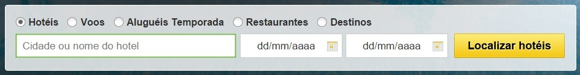
*Neste caso, com a quantidade maior de atributos, a organização dos campos é um ponto importante que deve ser bem pensado.*

**Busca baseada em contexto:** Se o número de atributos para escolher é muito grande - mais de 20 - a
busca por atributos torna-se ineficiente.  Uma solução é diminuir o escopo da busca forçando o
usuário a escolher antes um contexto onde deseja pesquisar e só depois apresentar os atributos
específicos.

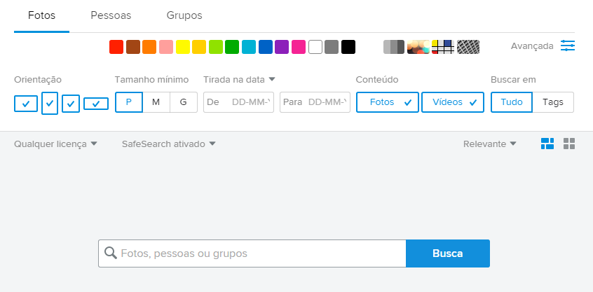
*Para fazer a busca é preciso primeiro escolher o contexto desejado. Neste caso, será para fotos. Apenas depois de escolher o contexto é que são mostrados os campos de atributos específicos
para ele.*

**Refinamento do resultado usando atributos:** Quando a busca retorna uma grande quantidade de
informação, o usuário pode selecionar alguns atributos para filtrar esse resultado. O ideal é
utilizar controles apropriados ao conteúdo para o filtro de atributos.

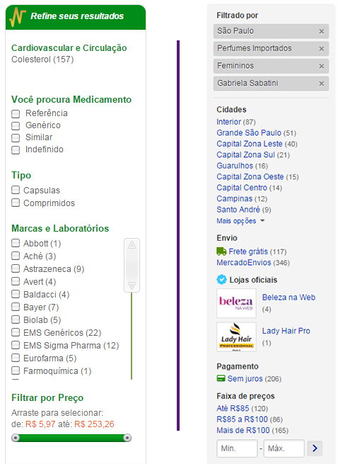
*Filtro de atributos para refinamento do resultado. Neste exemplos, pode filtrar por marcas, cidades, preços, etc.*

**Exibição do volume de conteúdo retornado:** Usado para controlar o volume dos dados sendo
apresentados. Pode ser através de links que ajustam o layout da página para mostrar mais ou menos
detalhes ou outros controles que ajustam o volume em si do conteúdo, apresentando mais ou menos
informações.

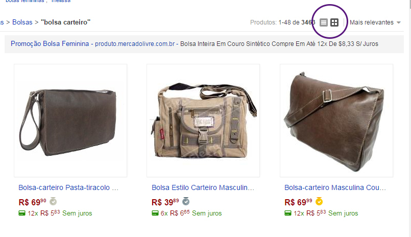

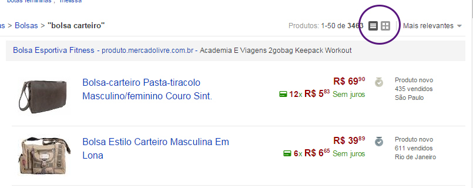
*Na primeira imagem, a forma de exibição é em lista e na segunda, o mesmo resultado em tabela*

### Entrada e alteração de dados

São padrões utilizados quando o usuário precisa informar dados.

**Autocompletar:** Utilizado quando o usuário precisa entrar uma informação em um campo texto e pode
não saber exatamente o que informar ou tem grandes chances de digitar incorretamente.

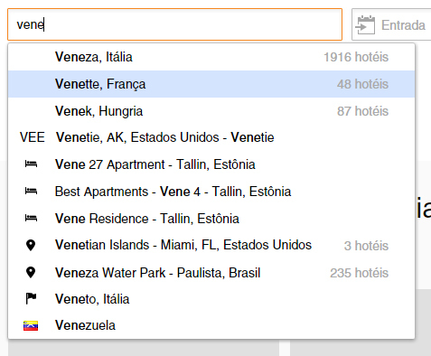
*Nesse exemplo, ao digitar "VENE" uma lista aparece com sugestões que completam o que o usuário
escreveu no campo.*

**Apresentação visual de seleção:** Usado quando é difícil explicar apenas em texto as opções
disponíveis para seleção. Nesses casos, o uso de imagem mais texto é bem indicado.

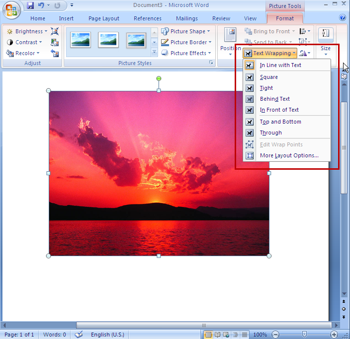
*Além do label indicando o tipo de alinhamento, também tem uma imagem para cada opção que apresenta
visualmente como a figura será posicionada com relação ao texto.*

**Save for later:** Esse padrão normalmente é usado quando uma tarefa é muito longa para ser
completada de uma vez só, ou quando existe um fluxo de ações que possibilite início/parada/reinício.
Nessas situações, dê ao usuário a opção de salvar para continuar depois.

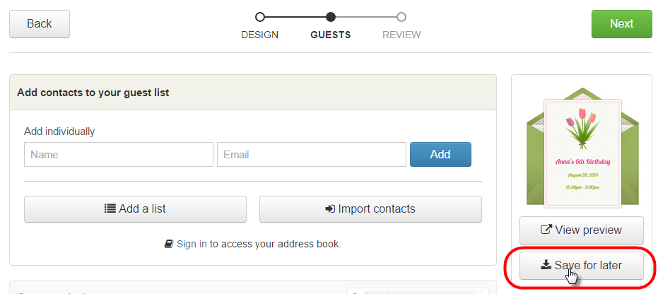
*Um botão é disponibilizado para que o usuário possa salvar um documento (artigo, notícia, página)
e depois voltar a ele para continuar com o fluxo de edição (passar para revisão, publicar, etc).*

### Informação centralizada

Nesses padrões, serão mostradas algumas maneiras comuns de apresentação de informações que precisam
ser compreendidas pelo usuário (ou ao menos fazerem sentido) quando ele "passa o olho" por elas.

São três principais: cabeçalhos, visualizações interativas e painéis (dashboards).

**Cabeçalho:** Usado quando o usuário precisa de um contexto mais abrangente que apenas um título de
página para entender a informação apresentada. Nesses casos, o topo da página mostra uma área com
dados relacionados ao conteúdo. O cabeçalho também pode fornecer ações relevantes para a página e
que, quando utilizadas, interferem no conteúdo sendo apresentado. É interessante disponibilizar o
recurso de expandir/ocultar a área do cabeçalho para que o usuário utilize o espaço da forma mais
conveniente.

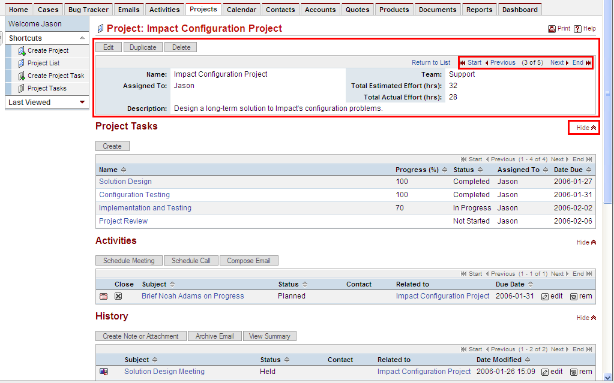
*O cabeçalho mostra alguns dados que identificam o projeto que está sendo manipulado na página e
também possibilita a navegação por projetos existentes. Ao navegar de um projeto ao outro,
automaticamente o conteúdo da página é atualizado. Aqui o usuário pode esconder (hide) o cabeçalho.*

**Visualização interativa:** Esse padrão é usado quando a informação fica muito confusa se
apresentada apenas com textos. Os dados mostrados graficamente e com opções interativas ajudam na
compreensão do que está sendo visualizado.

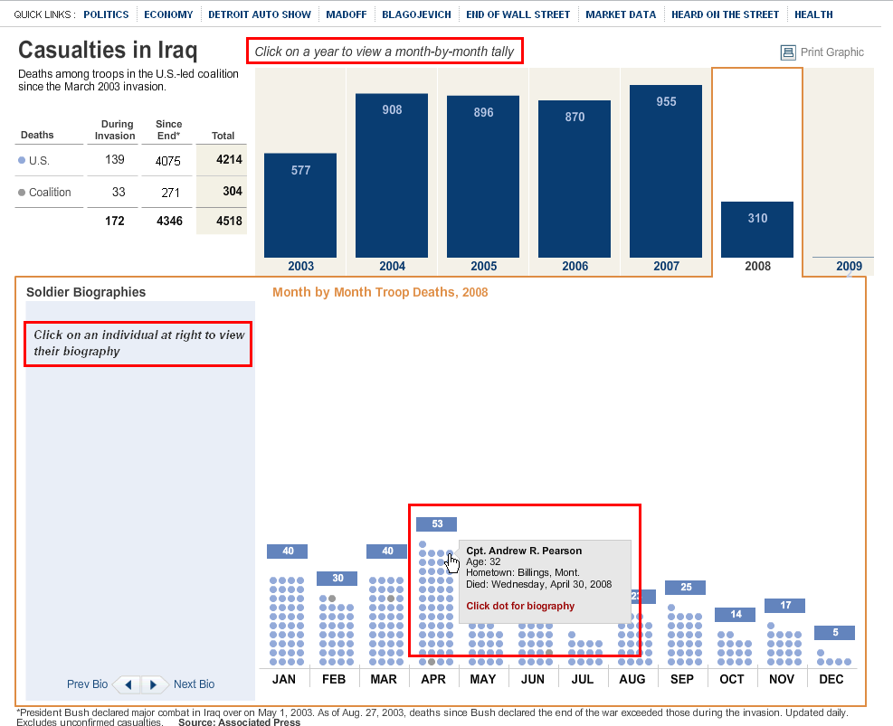
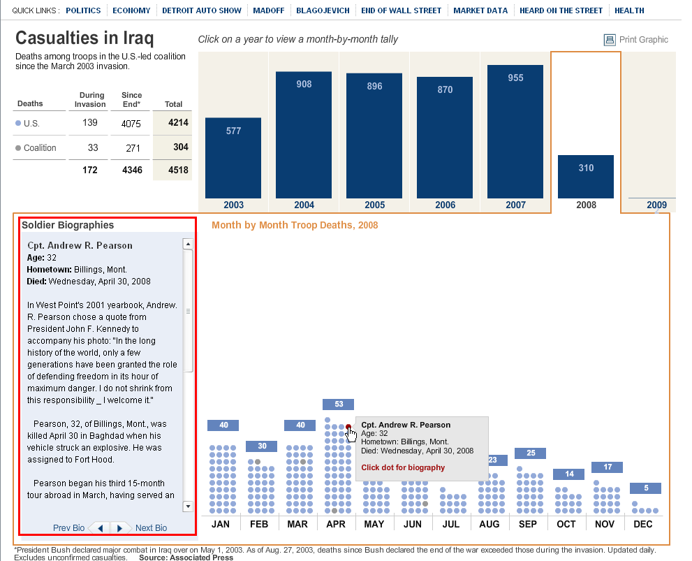

*Apresentação de informações usando gráficos. Clicando em um ano (primeira imagem) são mostrados os
dados mês a mês. E em cada mês, também é possível interagir para obter mais informações sobre o
assunto (segunda imagem).*

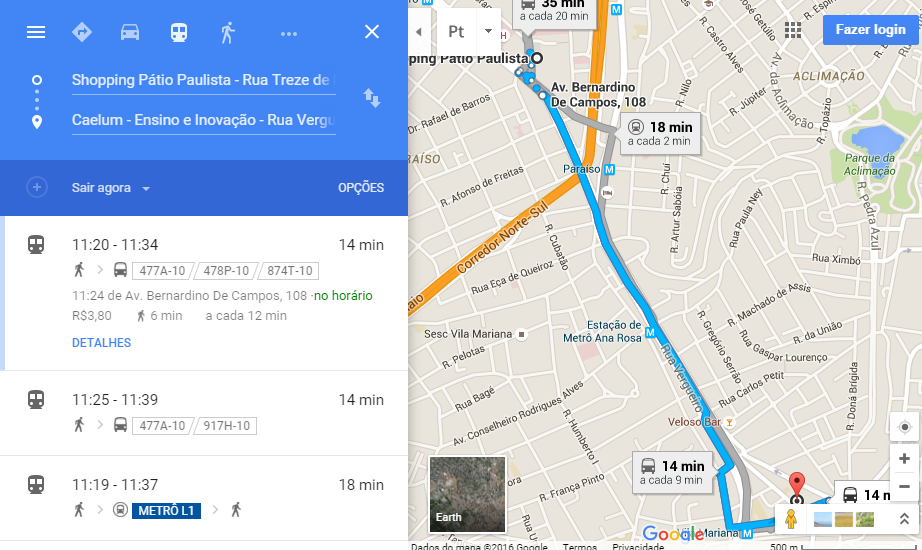

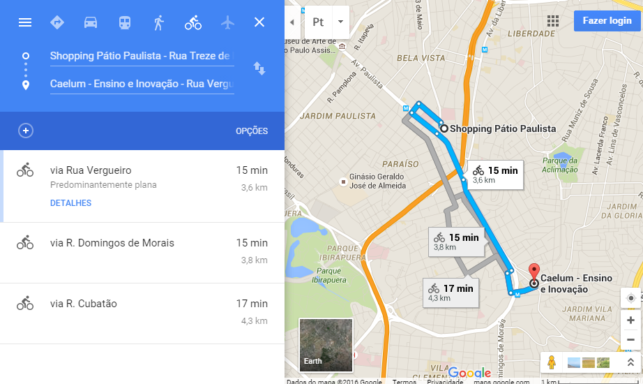
*Exemplo com mapas. Na primeira imagem você visualiza no mapa a rota de um ponto a outro, feita de
transporte público. É possível interagir, arrastando a rota para alterá-la ou escolhendo algumas ações diretamente
no mapa. Na segunda imagem, a rota feita com bicicleta. Em ambos os casos, o trajeto é apresentado textualmente e também representado visualmente no mapa.*

**Painel:** Esse tipo de padrão resolve o problema de ter que fornecer visões distintas de vários
tipos de informação. Agrupe essas informações em uma única tela que mostre os dados-chave de uma
forma visual apropriada, como se fosse uma fotografia. Escolher a apresentação gráfica mais adequada
para cada tipo de informação, aliás, é um ponto crucial para a eficiência do painel. Alguns pontos de
atenção para não errar no uso desse padrão:

* Painéis normalmente possuem visualizações interativas de dados;
* Muitos erram ao mostrar dados que não são úteis ao usuário ou colocam gráficos e outros elementos
  sem um contexto que dê sentido a eles;
* O uso de mecanismos inapropriados prejudica a comunicação do conteúdo;
* Elementos 3-D frequentemente são problemáticos.

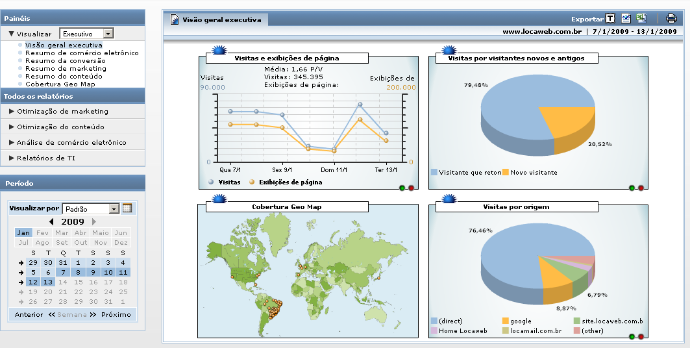
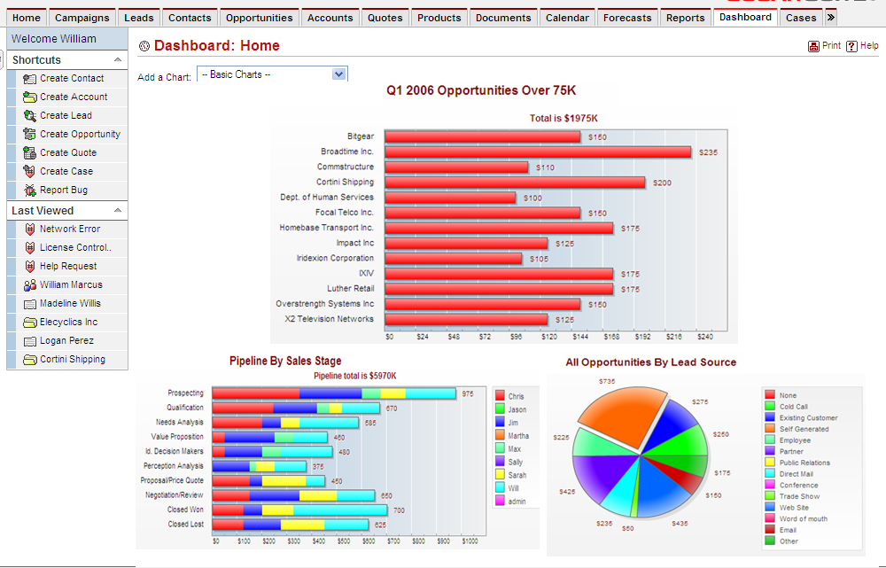
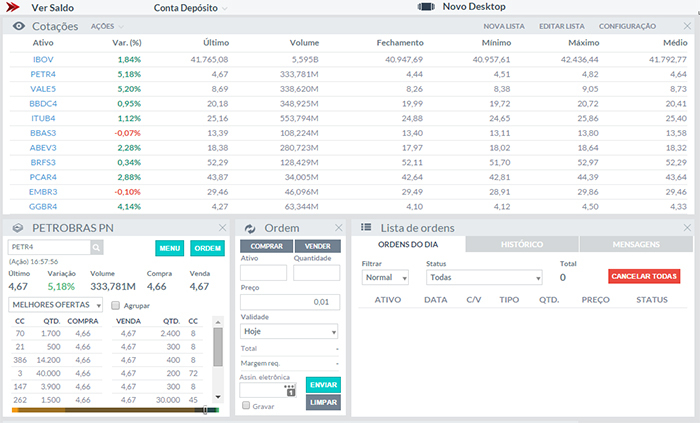
*Alguns exemplos de painéis, utilizando gráficos de vários tipos, mapas (primeira e segunda
imagens). Em algumas situações (terceira imagem), o uso de tabelas ainda é o mais indicado.*

### Guias

É o uso de mensagens, instruções e ajuda contextual para guiar o usuário durante a execução de uma
tarefa.

Três padrões de interação comumente usados para Guias são:

**Sistema de mensagens:** É usado quando o usuário precisa ser informado sobre as possíveis
consequências de uma ação que ele vai tomar. Cada ação deve ter explicações claras, os próximos
passos precisam estar visíveis, caso existam, e deve fornecer fácil acesso a fontes de dados
relevantes para ajudar o usuário na tomada de decisão.

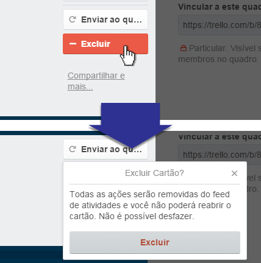

**Ajuda contextual:** Esse padrão é utilizado quando o usuário precisa da informação para ajudá-lo a
completar uma tarefa, seja para entender determinadas terminologias que a tarefa apresenta ou o
motivo de um dado está sendo solicitado ou como deve preenchê-lo, etc. Apresente essa ajuda
exatamente onde o usuário precisará dela, já contextualizada, mais que dar acesso a links genéricos
de ajuda.

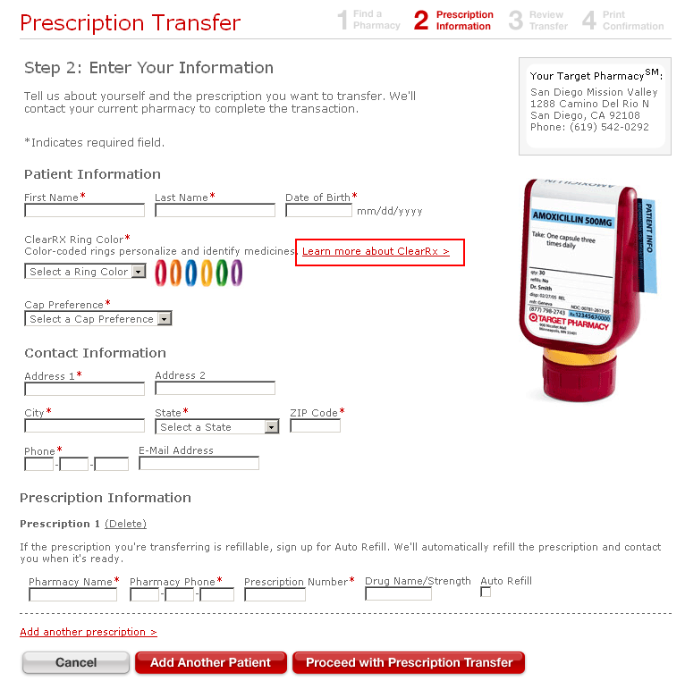
*Nesse exemplo, o link leva para mais informações que ajudará o usuário a decidir qual cor escolher
para o anel usado na embalagem da medicação que ele está pedindo.*

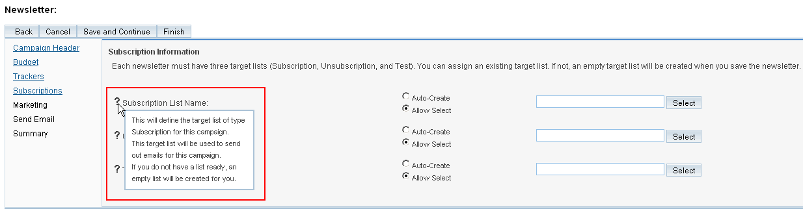
*Ao passar o mouse pela "?", abre um box com explicação sobre o que significa e qual a finalidade
daquela informação que está sendo solicitada ao usuário.*

**Guide me:** Padrão utilizado quando o usuário já tem experiência no que está fazendo, mas pode
faltar conhecimento para completar alguma parte dessa tarefa maior. Nesses casos, use uma área da
tela (ou tela separada) que guiará o usuário através de questões, ou informações detalhadas, para
determinar "como" ou "se" eles devem tomar determinada ação ou escolher determinada opção, sem perder
o contexto da tarefa maior.

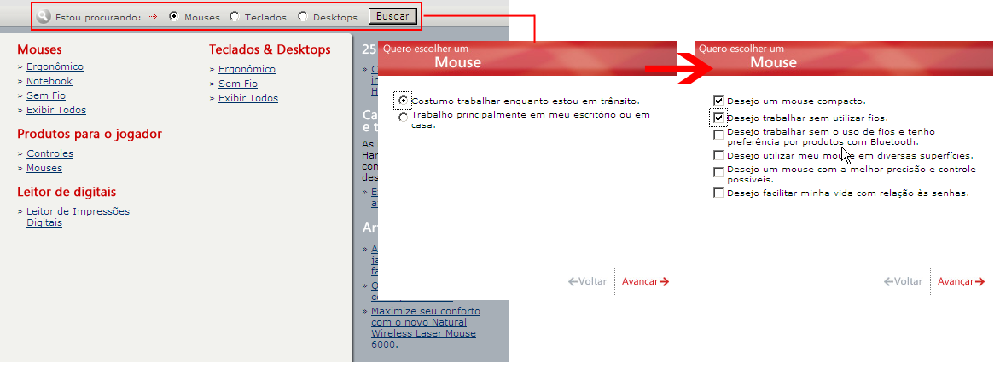
*No exemplo acima, a funcionalidade de busca em si pode ser facilmente usada pelo usuário, mas foi
colocado um guia com questões que o ajuda a limitar o resultado da busca aos mouses que mais se
adequam às suas necessidades.*

### Comunidade

Esses padrões estão relacionados a um tema bem em voga ultimamente: padrões de uso e interação para
mídias sociais, ou seja, padrões para funcionalidades presentes em qualquer ferramenta online que
permita a interação social.

**Votação *(vote to promote)*:** Usado quando existe a necessidade de promover (ou rebaixar) alguma
informação ou item em uma comunidade. Forneça um botão, ou alguma outra forma de *call to action*,
próximo ao conteúdo que se quer promover. É interessante fornecer detalhes contextuais, como a
quantidade de votos já recebidos, quando for possível.

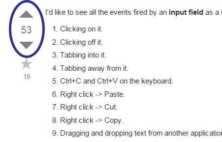

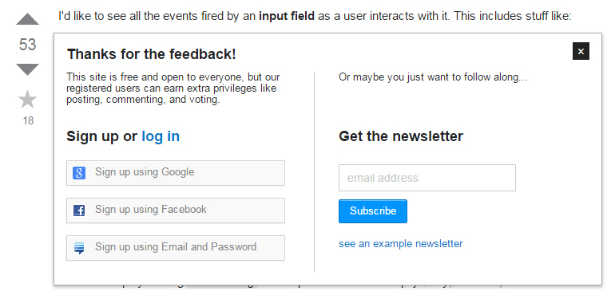

*Um exemplo que permite tanto promover como rebaixar um item (imagem 1). Em alguns casos precisa ser
inscrito para votar (imagem 2).*

**Avaliação (rating):** Quando o usuário precisa dar sua opinião ou dar sua nota sobre um determinado
conteúdo, mostre itens clicáveis (um bastante utilizado são estrelinhas) com uma escala clara de
avaliação e o estado desse mecanismo de avaliação deve iniciar "vazio".

*Avaliação de itens de uma loja virtual. Uma área com as avaliações já realizadas e uma área que mostra os comentários.*

**Acompanhamento (follow):** Utilizado quando o usuário precisa acompanhar uma questão ou um tópico
dentro de uma comunidade. Use algum tipo de call to action próximo ao item que pode ser acompanhado,
junto com informações que deixem claro o que será acompanhado.

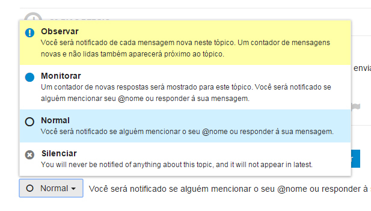
*Clicando no botão, é exibido formas de acompanhamento com informações contextualizadas que deixam
claro o que e como está sendo acompanhado.*

**Status de classificação (ranking):** Quando existe a necessidade de comunicar dentro da comunidade
o status/posição de um usuário, forneça esse status próximo à informação sobre o usuário.

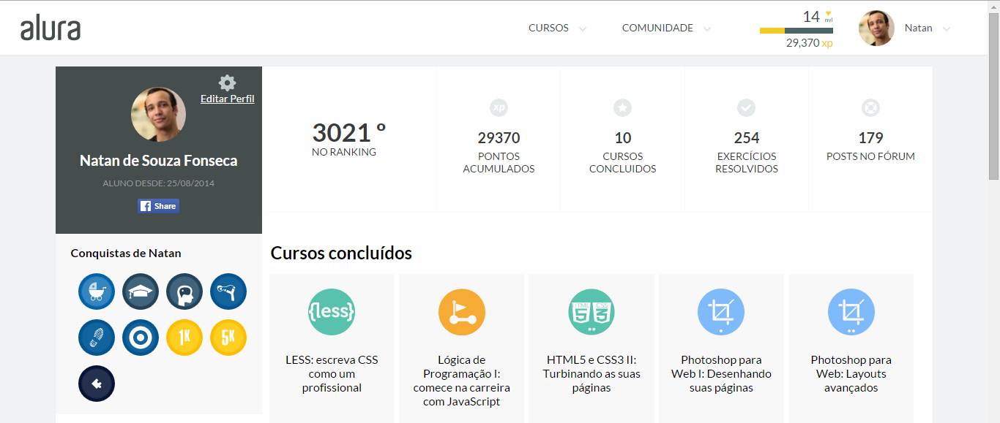
*No exemplo acima, além da posição no ranking, é mostrado também informações sobre a atividade do usuário*

## Gamestorming - Colocando em prática os heurísticas de Nielsen

### Objetivo
Entender na prática sobre os princípios de Nielsen.

### Ambiente
1. Duas cores de post-its;
2. Caneta.

### Regras
* Duração de 30 minutos.

### Passo a passo
Metade de um time vai se tornar consultores de usabilidade e ir em outro time e
passar pelos 10 heurísticas de Nielsen, depois a outra metade do time faz o mesmo trabalho.
Enquanto estiver passando pelas heurísticas de Nielsen os consultores escolhem um cor de
post-it para anotar os problemas encontrados e a segunda cor como solução.

## Protótipos

A criação de um protótipo é um passo importante antes que o produto seja lançado no mercado. Além de servir como uma ferramenta de comunicação - assim como os wireframes - protótipos também têm o
propósito de exploração e validação.

> **Protótipo**
> é um modelo da aplicação que deve permitir que as pessoas o manipulem de alguma forma e não deve ser
> um sistema desenvolvido completamente.

Como exploração, por exemplo, interagir com o protótipo de uma idéia ajuda a descobrir questões
estruturais do produto, como características que ele deve ter e estão faltando. Ou então, fazer
protótipos simples de várias conceitos pode ajudar a decidir qual o melhor para seguir adiante.

Como validação, o uso de protótipos permite avaliar interações-chave antes de construir todo um
design baseado nessas interações, e a diminuir também o risco de erros de usabilidade. Além disso,
prototipar e testar as opções possíveis evita os argumentos baseados em opiniões.

Ou seja, protótipos são usados para experimentar e ver aquilo que funciona, tanto para o designer,
quanto para o cliente e usuário. E o quanto antes isso for feito, menos esforço (e custo) é
necessário para corrigir o rumo e conduzir o desenvolvimento do produto para a direção correta.

A variável mais importante na construção do protótipo é sua **fidelidade**, que pode ser **baixa** ou
**alta**. E a fidelidade é multidimensional. Duas dimensões essenciais são a **visual** e a
**funcional**. Não tem como dizer que uma ou outra fidelidade é a correta, mas sim que á e mais
apropriada. E para saber qual é a mais apropriada, vários pontos precisam ser considerados, como:

* As questões que o protótipo precisa responder;
* O nível de interatividade do design;
* A cultura da empresa;
* A metodologia de desenvolvimento que a empresa segue;
* Como os usuários reagem a um nível baixo de fidelidade;
* Se existem padrões visuais já estabelecidos;
* Etc.

Múltiplas combinações de fidelidade são possíveis na criação de um protótipo:

* Baixa Fidelidade Visual (BFV)
* Baixa Fidelidade Funcional (BFF)
* Alta Fidelidade Visual (AFV)
* Alta Fidelidade Funcional (AFF)

### AFV - Alta fidelidade Visual
Normalmente, AFV é mais apropriada quando queremos testar se o design visual não prejudicará o design
de interação feito ou a usabilidade da aplicação; e/ou quando o protótipo for usado por pessoas
(clientes ou usuários) que normalmente ficam confusos ao se depararem com wireframes, prejudicando
assim a qualidade das respostas que se quer obter. E, se já existe padrões visuais bem estabelecidos,
a facilidade para aplicá-los em um protótipo estimula o uso de um de AFV.

### AFF - Alta fidelidade funcional
AFF é mais adequado quando é necessário saber se as interações-chave funcionam, se o design
implementa os requisitos como os analistas esperam e/ou para que o time de desenvolvimento entenda
com clareza quais os fluxos da aplicação e como ela se comporta. E principalmente se o produto for
uma aplicação mais complexa, com riqueza de interações, o AFF é mais apropriado. Também, do mesmo
jeito que o AFV, é mais indicado o uso do AFF quando as pessoas ficam confusos vendo apenas
wireframes.

### Dimensão de conteúdo
Além das dimensões visual e funcional, uma dimensão também considerada é a de **conteúdo**.
Protótipos com conteúdos ruins, que não fazem sentido no contexto da aplicação, normalmente produzem
resultados ruins. Sempre que possível, utilize um conteúdo plausível.

### Ferramentas
E as ferramentas para desenvolver protótipos são bastante variadas, indo de papel&caneta, passando
por ferramentas de elaboração de wireframes, até codificação com HTML, CSS, Javascript, etc. A
escolha depende de vários fatores, como custo, habilidade de quem vai desenvolver,  fidelidade que se
quer obter, entre outros. Além disso, não é necessário se limitar a uma única ferramenta: pode-se
começar com papel&caneta para concepção e exploração, validar com um protótipo de alta fidelidade
funcional no Axure e validar mais uma vez, quando o design estiver mais elaborado, com um protótipo
feito em HTML/CSS e Javascript.

## Gamestorming - Prototipagem em papel

### Objetivo
Desenvolver um protótipo de baixa fidelidade sem curva de aprendizado de uma ferramenta,
tornando possível o trabalho em um time heterogêneo.

### Ambiente
1. Folhas coloridas;
2. Post-its;
3. Cola;
4. Canetinhas;
5. Tesoura;
6. Régua;
7. E criativade.

### Regras
* Duração de 40 minutos.
