# Usabilidade em dispositivos móveis

*"Os detalhes não são detalhes. Eles são o design."
-- Charles Eames*

Por se tratar de outro contexto de uso e outro público, pensar em usabilidade para dispositivos móveis pode vir a ser um desafio em equipes que deixam para pensar nessa tipo de mídia apenas no final do projeto/prazo.

Com o uso frequente desse tipo de mídia o grau de exigência de seus usuários com relação a  interface cresceu tanto que cerca de 60% desses usuários tendem a abandonar uma página se ela não oferecer uma experiência *mobile* boa.

Pensar em mobile não é mais questão de ter um diferencial, é fazer o essencial. É uma questão que deve ser pensada e desenvolvida desde o início do planejamento do projeto.

## Lei de Fitts
Tentando prever, matematicamente, o tempo necessário para que um corpo se mova de um ponto a outro ponto, Paul Fitts publicou uma fórmula para isso em 1954, onde leva em consideração alguns itens como a distância entre esses pontos e a área de superfície do ponto final. Esse cálculo foi chamado de **Lei de Fitts**.

Trazendo essa lei para o meio digital, pode-ser trocar a palavra *corpo* pela palavra *mouse* ou *dedo*, e manter o objetivo para qual foi criada, essa última por conta do advento do mobile.
Por exemplo, pode-se prever o tempo que levaria para que uma pessoa escolha uma opção em um submenu depois de clicar em um dos itens principais de um menu, ou o tempo para clicar em um botão *call to action* depois de logar em um sistema.

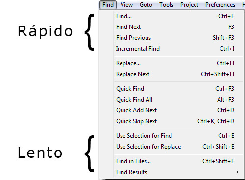

Por esse motivo que é uma boa prática manter a área clicável de um *checkbox* no check em si, e no texto ao lado também, justamente para que o alvo fique mais fácil de ser clicado:

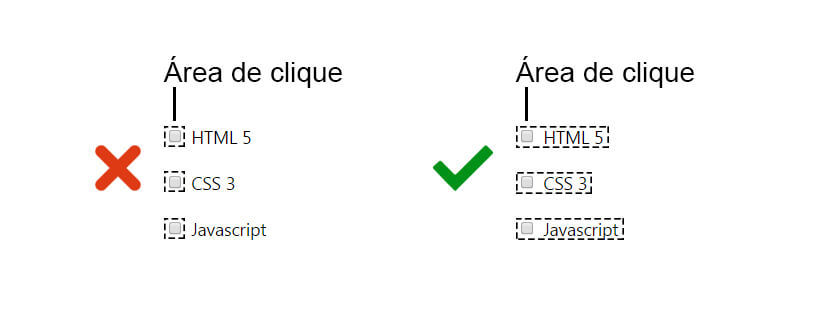

Outra questão que é necessária levar em consideração para aplicar a Lei de Fitts em interfaces desenvolvidas para dispositivos mobile é a orientação do dispositivo em si e em qual delas (paisagem ou retrato) que o usuário mais interage com o aplicativo.

Ainda pensando nessa questão, há um pesquisa que indica que cerca de 50% dos usuários interagem com a tela do celular **apenas** com uma mão e 15% com as duas, como isso não é uma regra, o mais indicado é a realização de testes com usuários em cada projeto específico para chegar em números mais precisos.

> ### Como os usuários realmente seguram seus dispositivos mobile
> http://www.uxmatters.com/mt/archives/2013/02/how-do-users-really-hold-mobile-devices.php

## Lei de Hick
Em um formulário de cadastro, muitas vezes o usuário precisa escolher alguma opção para continuar.
O tempo para escolher entre uma das opções aumenta proporcionalmente junto com o número de opções apresentadas.
E é essa relação entre tempo e escolhas, que se trata a **Lei de Hick**:

> ### Lei de Hick 
> O tempo que leva para fazer uma decisão aumenta com o número de opções apresentadas.

Quanto mais escolhas são eliminadas, mais agradável a experiência do usuário pode ser, mostrando a importância da simplicidade.
Ela se aplica tanto na web quanto no nosso cotidiano fora dela, como quando vamos a algum restaurante com muitas opções no cardápio e demoramos um tempo considerável para escolher um prato. 

Um exemplo voltado para web, em uma tela em que deve-se escolher um investimento desejado:

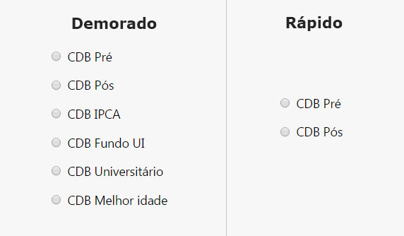

## Thumb Zones
O termo foi usado pela primeira no livro "Designing Mobile Interfaces" (Steven Hoober), e refere-se a área mais confortável para toque com uma mão só. Pesquisas indicam que 49% dos usuários interagem mais com o celular usando apenas uma mão, e usando o polegar para tocar na tela. Com isso, a preocupação de onde colocar elementos de interação na tela ganha mais uma variável, se é confortável de se alcançar ou não.

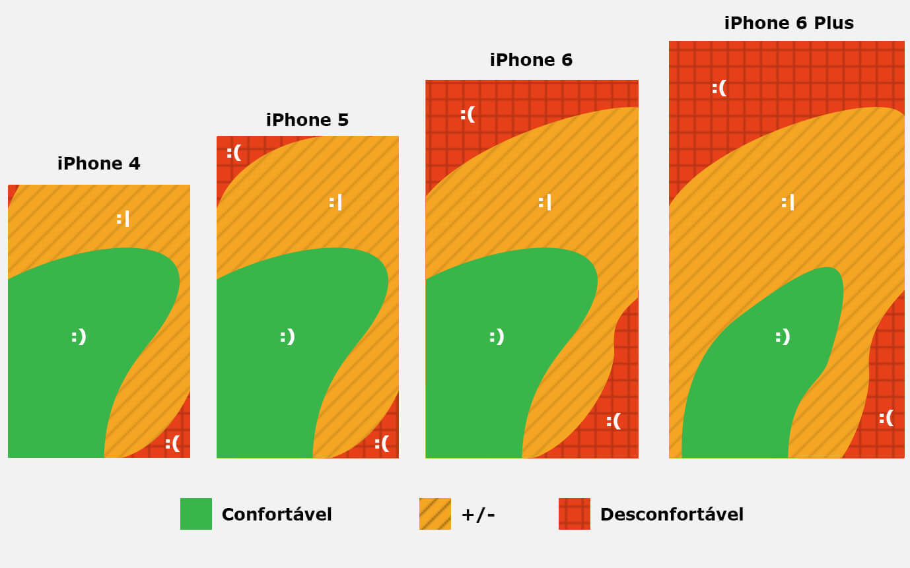

Uma das justificativas da Apple em não aumentar o tamanho da tela de seus aparelhos, era justamente por conta disso. De nada serve um elemento de interação (um botão por exemplo), se ele está fora de alcance. Ela acabou sucubindo a telas maiores de 4" por conta de pressão mercadológica do setor, os consumidores queriam telas maiores.
A solução foi "descer" a interface quando o usuário dá dois toques no botão home, deixando-a mais alcancável para os polegares.

Por conta da Thumb Zone que o Google, com seu padrão de interface Material Design, colocou o _call to action_ em suas aplicações na parte de baixo da interface, para tirar uma possível barreira de uso do usuário com a aplicação. Mesmo caso com o _burguer icon_ na **Alura**, localizado na parte inferior direita da tela.
Em ambas as empresas foi descoberto por meio de pesquisas que seus usuários usavam mais o celular com a mão esquerda, por isso do thumb zone espelhado.

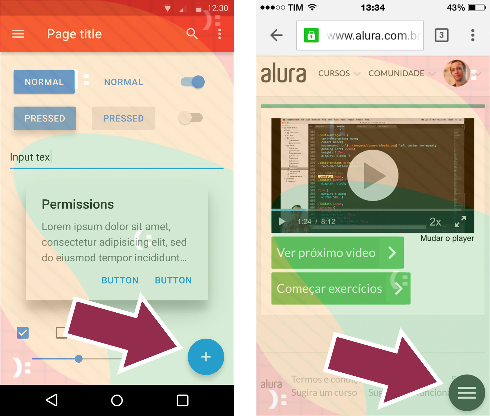

## Enriquecendo seu produto com Microinteractions

No nosso dia a dia realizamos tarefas como: aumentar o volume do rádio, trocar o canal da TV, abrir um torneira e fechar a porta. Todas essa pequenas tarefas é o que chamamos de **microinteractions**. Pensando da mesma forma no mundo web, um usuário no ecommerce adiciona o produto em um carrinho, navega por um carousel de fotos do produto, clica em botões e por aí vai. Essas são as **microinteractions** detro da web.

Assim que você identificar as **microinterações** dentro do seu produto o próximo passo é criar um "feedback" (essa é uma das 10 heurísticas de Nielsen) "próxima do mundo real" (essa aqui é outra heurística de Nielsen). Dessa forma, sem criar uma nova funcionalidade, você torna o seu produto mais divertido que o do seu concorrente.

> ### Alguns GIFs:
> http://blog.caelum.com.br/enriquecendo-seus-sistemas-com-microinteractions

As microinteractions são focadas em melhorar a experiência do usuário sem a necessidade de se criar uma nova funcionalidade para o produto. 

> ### Exemplos em vídeo 
> Nos links abaixo você pode ver uma animação desenvolvida pela Smart Design que mostra várias microinteractions presentes no nosso cotidiano.
> http://bit.ly/1nCZiJ2 ou https://vimeo.com/91559869

Pode ser algo visivelmente simples de ser desenvolvido, mas não é tão simples de colocar na prática. Exatamente por este motivo, **Dan Saffer**, designer que criou o termo, também criou um fluxo pra facilitar o desenvolvimento das nossas microinterações:

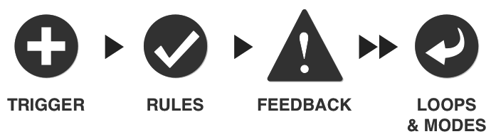

Os pontos dessa proposta de **Dan Saffer**:

### Trigger - Inicia a microinteração
Como o usuário dá o *start* na microinteração, pode ser um mouse over, um click, um toque na tela do celular, entre outros.

### Rules - O que acontece
Esse é o momento de levantar todas as regras relacionadas a microinteração. Por exemplo, dentro da plataforma de ensino de idiomas Duolingo, você não pode errar a frase que está realizando a tradução.

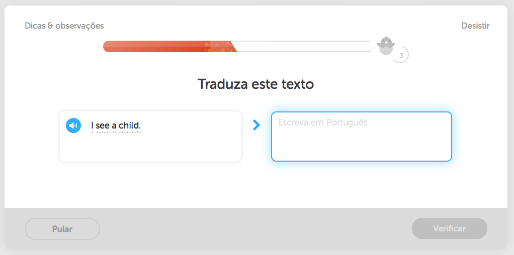

### Feedback - Situada no que está acontecendo
Com todas as regras (que podem ser invisíveis) que você levantou em mãos, esse é o momento de definir como será apresetando para o usuário quando ele acionar uma dessas regras. Por exemplo, quando usuário cometer um erro na tradução e em seguida **clicar no botão (trigger) 'Verificar'**, a plataforma deve mostrar para ele qual palavra ele errou:

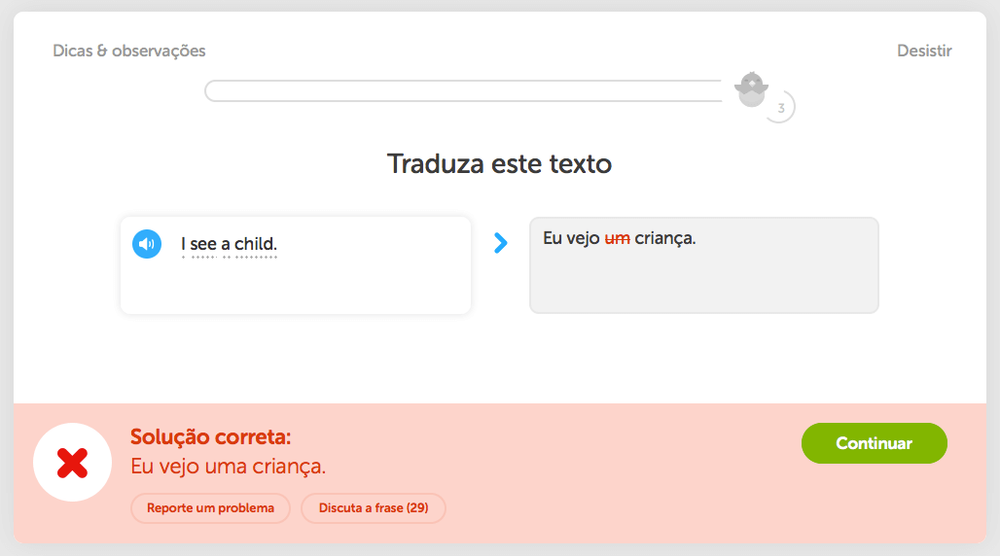

Vale a pena lembrar que o som de erro também é um feedback. Como o som da inicialização de um Mac ou mensagens de erro de um Windows.

### Loops
É utilizado pra definir de quanto em quanto tempo a microinteração vai acontecer. Ou se ela se repetirá com alguma interação do usuário ou algum conjunto de regras definido.

### Modes
São modos diferentes da mesma microinteração que pode ser afetado por uma interação do usuário. Por exemplo, dentro do Duolingo pra você conseguir fazer o módulo 2 é necessário fazer o módulo 1. Mas existe um exercício que você pode pular vários módulos com base no seu conhecimento.

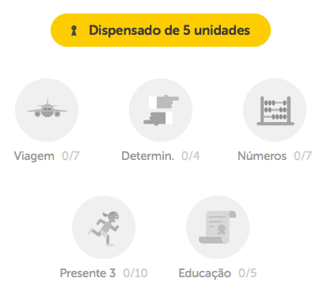

Com as microinterações estamos melhorando a experiência do usuário na Alura, Casa do Código e no site da Caelum sem a necessidade de criar novas funcionalidades.

## Tipografia
Outro item importante para qualquer projeto é a escolha de uma boa família de fontes, que faça sentido com o projeto e o contexto de uso.
A importância de uma boa fonte pode ser negligenciada pois na maioria dos casos não possui o mesmo impacto visual como as cores, imagens ou o layout em si.

O design nos ajuda a passar uma mensagem. E no contexto web a forma mais comum de fazer isso é através de textos, tornando a tipografia um item muito importante a ser avaliado.Escolhendo mal, seu conteúdo pode se tornar ilegível ou passar a mensagem errada para o usuário.

Podemos separar famílias de fontes em diversos grupos, e dos dois principais, o que difere de um para o outro é o uso da **serifa**.

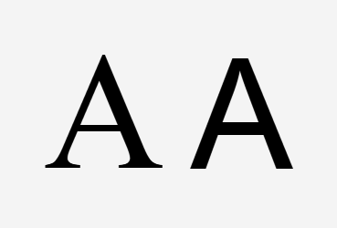

> ### Serifa
> Pequeno ornamento nas extremidades dos tipos (caracteres)

### Fontes serifadas
Fontes mais sérias, passam uma idéia de algo com mais credibilidade, remete a algo mais tradicional.
Um bom uso dessas fontes é em grandes blocos de texto, sejam impressos ou digitais, como livros ou posts com muito conteúdo. Algumas fontes:

* Times New Roman;
* Palatino;
* Georgia;
* Palatino;
* Monaco.

### Fontes não serifadas
Fontes mais modernas e geométricas, dão a sensação que foram desenvolvidas digitalmente, algo mais industrial. Fontes muito utilizadas pela área de *branding* para confecção de logotipos.

* Helvetica;
* Arial;
* Verdana;
* Open Sans;
* Segoe UI.

### Outros grupos
Há outros grupos de fontes como:

* monoespaçadas (ex: códigos HTML);
* cursivas (ex: convites impressos);
* fantasias (ex: logotipos);

> ### Download de fontes
> Lembre-se de **sempre** verificar a licença de uso das fontes que deseja usar
> * http://www.dafont.com
> * https://www.fontyukle.net
> * http://abduzeedo.com/tags/ffff

### Quantidade e peso

Quando um site possui muitas fontes, elas começam a chamar mais atenção que o próprio conteúdo, se tornam distrações. Limitar o número de fontes utilizadas no layout, em dois ou três, é uma boa ajuda para que isso não aconteça. 

Para criar um senso de hierarquia visual a fim de diferenciar elementos em uma página ou app, podemos usar fontes com diferentes **pesos** e tamanhos. As variantes mais conhecidas são:

* Regular;
* Italic;
* Negrito.

Não são todas as fontes que possuem essas variantes. E algumas possuem até um número bem elevado, como a fonte Helvetica:

### Altura da linha
Quando vamos abrir uma conta em um banco ou fazer um financiamento, normalmente os contratos parecem meio apertados demais para a folha. Isso não é um mero acidente ou acaso.

Textos assim passam essa sensação de aperto para deixar o leitor desconfortável, assim ele tende a reter menos o conteúdo ali escrito e o olho tende a falhar quando vai para a próxima linha. No caso de contratos, eles ainda deixam a folha sem margens para reforçar essa sensação.

Por isso, outro elemento importante na tipografia que ajuda a evitar esse sentimento é **altura da linha**, que é o espaço entre cada linha de texto.

Aumentando a altura da linha (*line height*) além de aumentar a legibilidade dos textos, pode deixar seu layout com um aspecto mais *clean*. Uma altura de linha mínima recomendada é **1.2**. Aqui um exemplo de uma altura de linha sem alteração (1) e uma altura de linha de 1.5 em um texto:

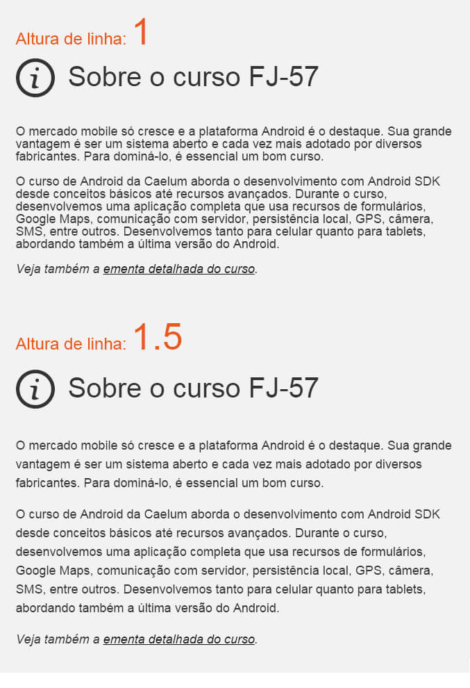

#### Outros cuidados com a fonte
* escolher com base na identidade da empresa;
* não distorcer;
* espaçamento entre letras.

## Gamestorming - Criando 8 Steps com foco na usabilidade

### Objetivo
Desenvolver outro **8 Steps**, agora levando em conta todos pontos de usabilidade desse capítulo.

### Ambiente
1. A história que foi escolhida pelo time;
2. Folha A3;
3. Minímo de 4 cores de caneta por aluno;
4. Folhas A4 para rascunho;
5. 3 bolinhas (votos positivos) verdes por integrante do time;
6. 1 bolinha (voto negativo) vermelha por integrante do time.

### Regras
* Duração de 80 minutos;
* Cada integrante do time deve fazer um 8 Steps mesmo sem habilidades artísticas.

### Passo a passo
1. Time escolhe uma história para solucionar as interações;
2. Divide a folha A3 em 8 partes iguais, cada parte da A3 vai ser um tela ou interação
que o usuário tem que realizar com a finalidade de resolver a história escolhida pelo time.
3. O time precisa definir o que cada cor de caneta vai significar, por exemplo:
Preta - desenho;
Azul - Mouse;
Verde - Touch;
Vermelha - Teclado.
4. Com a história e as cores definidas basta partir para solução com telas e interações,
cada integrante com sua folha A3, **sem colar**;
5. Colar todas as soluções na parede;
6. Cada integrante apresenta sua solução para o restante do grupo;
7. Depois cada integrante vota de forma livre utilizando primeiro votos positivos depois o negativo (sem discussões nesse parte);
8. Com os votos finalizados o time se junta a frente dos desenhos e discutem sobre o que querem construir;
9. Por fim, o time se junta para criar um versão final da solução da história.

