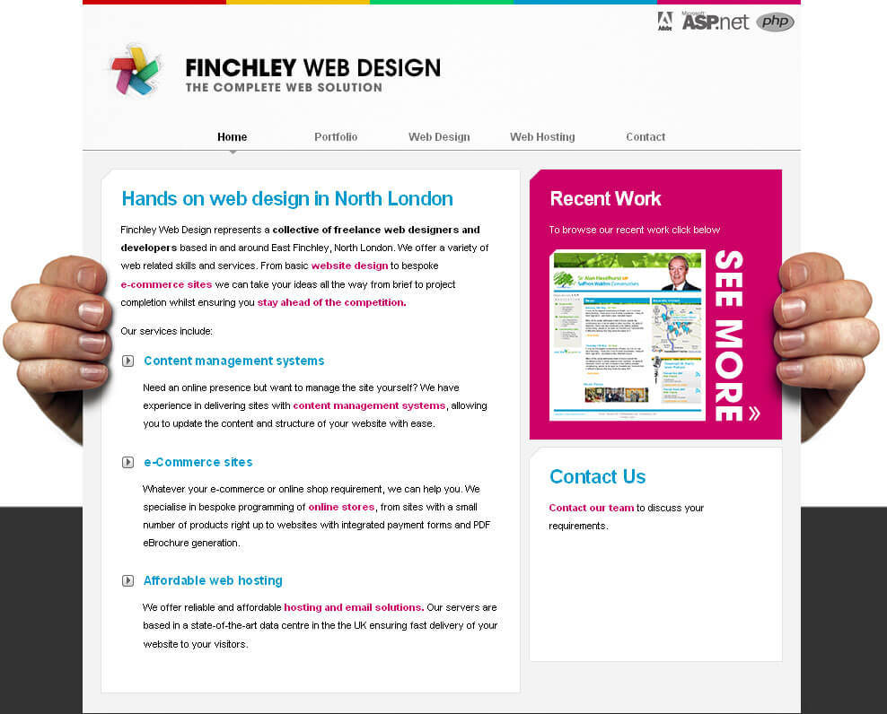
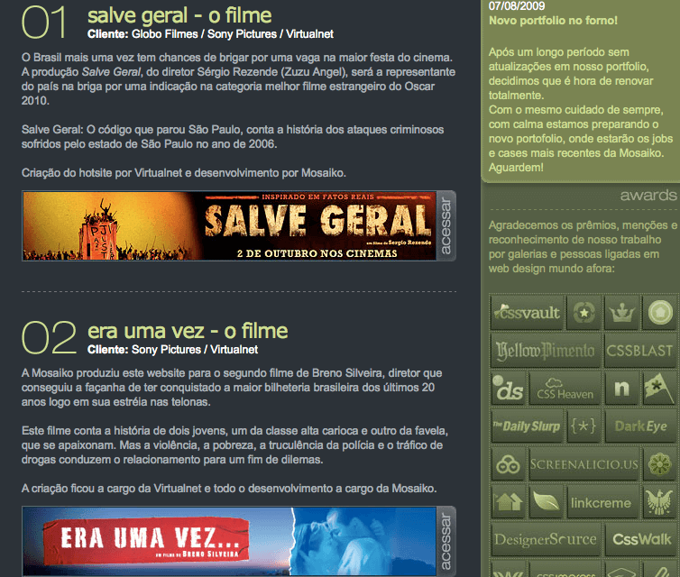
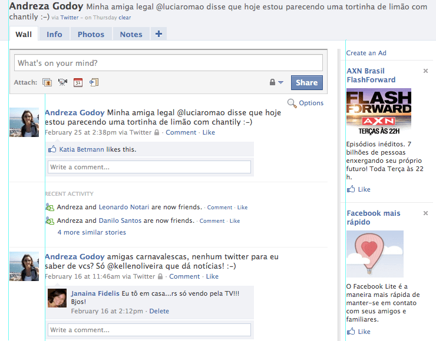
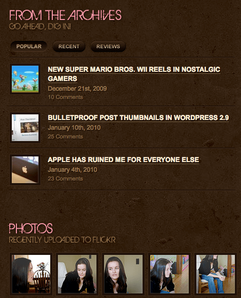
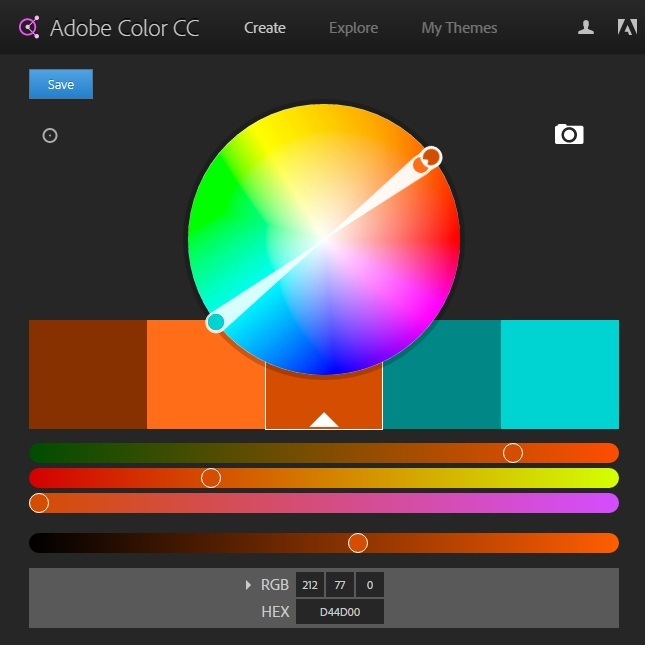

# Design Visual

A interface é onde as decisões tomadas pelo designer de interação, de como as pessoas usam o produto
e de como este deve responder, são percebidas. Ou seja, a interface é onde as funcionalidades
invisíveis de um sistema fica visível e pode ser acessada e usada.

O designer de interação na maioria das vezes já cria interfaces que são visuais ou que, ao menos, tem
alguns componentes visuais. Como já dito anteriormente, todos os elementos dos planos de estrutura e
esqueleto da experiência do usuário (design de interação, arquitetura da informação, design de
interface, de navegação e de informação) devem ser considerados como uma unidade no desenvolvimento
de um produto, não devendo ser tratados isoladamente. Além disso, quanto mais habilidades um designer
tiver para lidar com todos esses tipos de designs, até mesmo o visual, mais completo seu trabalho
será.

O design visual carrega a responsabilidade de comunicar as possibilidades, limitações e estados das
interações. Ele deve estar intrinsecamente ligado ao design de interação, deve construir a narrativa
visual da interação.

Em vez de avaliar as idéias do design visual apenas considerando o que aparece ser esteticamente
agradável, deve-se focar em quão bem elas funcionam, em quão efetivamente ele suporta os objetivos
definidos nos planos inferiores da experiência do usuário.

## O princípio C.R.A.P
Quatro princípios básicos, conhecidos como C.R.A.P., são essenciais para construir um design visual
eficiente e de qualidade.

### Contraste

Contraste visual é fundamental para direcionar a atenção do usuário para as partes essenciais da
interface, as partes que queremos que obrigatoriamente ele veja. Contraste ajuda o usuário a entender
a relação entre os elementos de navegação na página e é a principal forma de comunicar grupos de
informação. Mas para que o contraste funcione, as diferenças devem ser significantes. Diferenças
sutis acabam causando mais confusão. Contraste pode ser feito, por exemplo, utilizando diferentes
cores ou diferentes fontes de texto.

*O destaque na área "Recent Work" é dado com o contraste criado pelo box rosa.*

### Repetição

Repetição tem grande relação com consistência. Diferentes áreas da aplicação devem refletir a mesma
abordagem de design e um mesmo elemento da interface deve transmitir a mesma idéia em qualquer parte
da aplicação. Além disso, repetir elementos cria um senso de unidade e gera interesse visual.
Repetição deve ser considerada tanto para elementos gráficos como para tipografia, uso repetitivo de
fontes ou mesmo cores.

*Os títulos de cada artigo tem o mesmo formato e tamanho, bem como a imagem, que é um link para o
site citado no artigo. Também, o uso do mesmo esquema de cores, inclusive nos logos da lateral que
foram tratados para usar uma única cor, ressalta a repetição.*

### Alinhamento

Alinhamento fornece uma âncora visual e faz a página parecer mais unificada. A regra básica do
alinhamento é que todo elemento no design deve se alinhar ou relacionar com um outro elemento. Linhas
imaginárias provêem uma conexão visual entre os elementos, criando um relacionamento entre eles, e um
equilíbrio geral para a página ou tela, fazendo-a parecer clara, limpa e menos confusa.

*Nessa página é possível ver linhas imaginárias (ressaltadas em azul) que definem o alinhamento do
conteúdo.*

### Proximidade

Proximidade trabalha em conjunto com o alinhamento, onde os elementos relacionados devem também se
relacionar visualmente, através da aproximação. O contrário também é válido: aproximar elementos que
não têm nenhum tipo de relação pode confundir o usuário. Um design que não usa bem esse conceito será
difícil de seguir.

*Para cada título de seção, tem um subtítulo logo abaixo, que cria uma unidade entre esses dois
elementos. O conteúdo da seção também se relaciona com o título através da proximidade do conteúdo
com seu título e do espaçamento um pouco maior para o título da seção seguinte.*

Além dessas ferramentas, outros pontos precisam ser levadas em conta para um bom trabalho de design
visual:
* **Tipografia:** é uma escolha importante no design visual, possibilitando não apenas a legibilidade
  dos textos como cria uma identidade visual para a marca. Proporciona também uma hierarquia nos
  textos, utilizando diferentes tamanhos e pesos para títulos, textos, comentários, disclaimers,
  guiando melhor o usuário através da informação.
* **Cores:** podem ser uma das mais efetivas maneiras de comunicar a identidade de uma marca. Também
  tem importante papel na criação de contraste e uniformidade. Para designers de interação, cores são
  usadas como dicas para o uso de algumas funções ou para indicar importância.
* E como última dica, elimine do layout qualquer informação que não seja relevante para seu público.

## Especificação do Design

O nível de especificação que o designer de interação deve elaborar depende de vários fatores, como a
proximidade dele da equipe de desenvolvimento do produto, da cultura organizacional da empresa que
ele trabalha e o nível de exigência que ela impõe em termos de documentação, da metodologia de
desenvolvimento adotada, entre outros.

Normalmente se o design é feito por uma consultoria, o produto final do trabalho, além do design em
si (layout final de todas as telas da aplicação ou até mesmo a programação da interface pronta),
inclui também toda a documentação e especificação realizada no decorrer do desenvolvimento do design:
relatório de resultado das pesquisas, personas criadas, mapas e diagramas, cenários e/ou casos de
uso, wireframes, etc.

Se o design está sendo desenvolvido dentro da empresa, onde o nível de interação entre os designers e
os desenvolvedores é grande, as exigências de documentação ou especificação diminui bastante,
principalmente em um ambiente onde a cultura ágil impera.

Se protótipos de alta fidelidade funcional foram elaborados, estes já servem como uma especificação
dos fluxos de ações e comportamento da aplicação. O visual pode ser visto através dos layouts
produzidos, com indicação dos vários estados dos elementos da interface (foco, *mouseover*, estados
habilitados, desabilitados, etc.).

Além disso, os próprios wireframes, mesmo que não sejam navegáveis, podem especificar o comportamento
de cada elemento através de anotações que são feitas neles mesmos.

Algumas vezes, planilhas são usadas para definir todas as mensagens da aplicação, como de erro, de
alerta, de informação ou de ajuda, para que essas mensagens não precisem estar refletidas em todas as
partes de um wireframe ou layout. O wireframe e/ou layout pode mostrar como serão apresentados cada
tipo de mensagem e os textos em si podem ficar na planilha.

E qualquer outra documentação elaborada durante o processo de design da interface pode servir de
apoio no desenvolvimento da aplicação.

De qualquer maneira, nada substitui a eficiência de ter o designer sentado próximo à equipe de
implementação do produto, acompanhando de perto o desenvolvimento, tirando dúvidas que surgem sobre
determinados comportamentos e, de certa forma, servindo como QA (*Quality Assurance*) para garantir
que o produto será desenvolvido tal e como foi projetado.

## Teoria das Cores

As cores têm um papel importantíssimo em tecnologia e nosso mundo cotidiano.
Muitas vezes negligenciada, uma boa escolha de cores para o layout pode influenciar o usuário de várias maneiras, guiando-o por um caminho despertando suas emoções e muitos sentimentos únicos.

Isso por que as cores não são um fenômeno físico, cada pessoa interpreta uma determinada cor de maneira diferente da outra, é algo individual, mesmo tendo suas generalizações.
Por exemplo, para a maioria das pessoas, a maçã é vermelha, mas para uma pessoa com um certo grau de daltonismo esse vermelho pode ser até o que para a maioria é verde.

O azul por exemplo costuma ser conectado aos sentimentos de inovação e tecnologia, tanto que por isso que boa parte das redes sociais hoje em dia (Jan/16) escolheram essa cor como cor principal para sua marca.

Vários artistas e pesquisadores estudaram a luz e a cor, como Aristóteles, Da Vinci, Isaac Newton e Goethe, sendo usados os estudos desse último por pesquisadores da Gestalt.

Há a cor formada por luz, e a cor formada por pigmento. Esse material foca mais nesse primeiro, pois o conteúdo envolve mais dispositivos emissores de luz como celulares e monitores.

> ### Cor
> Percepção visual, e individual, provocada pela ação da luz sobre algumas células da retina, e compilada pelo sistema nervoso. Sendo assim apenas uma **informação visual**.

Chega numa determinada etapa do projeto, onde é necessário fazer a escolha de quais cores serão utilizadas. Depois de muita "tentativa e erro", achamos uma combinação que nos agrada. Mas será que foi uma boa escolha? Uma outra maneira de tomar essa decisão é baseando-se na **teoria das cores**. 

A teoria das cores nos ajuda a combinar cores de uma forma harmoniosa e com algum sentido. E nela há algumas regras básicas de uso de cores e a relação entre elas, como:

- cores complementares

- cores análogas

- cores triádicas

- Entre diversas outras que foram definidas com o passar do tempo.

Essas relações entre as cores são geralmente baseadas, ou podem ser facilmente visualizadas, nas suas posições no círculo cromático:

Decidir entre cores análogas e cores complementares, por exemplo, influencia no tipo da energia visual e na percepção do usuário que as vê. Afeta totalmente a atmosfera do projeto.

> ### Teoria das Cores
> Conjunto de regras e estudos que visa entender e combinar cores de uma forma harmoniosa e com algum embasamento. 

## Facilitando essa escolha com o Adobe Color

Uma ferramenta muito usada que ajuda a encontrar uma boa paleta cromática é a Adobe Color, em que você escolhe uma cor base, e vai testando a regra que mais te agradar e fazer sentido com o seu projeto.

> ### Adobe color
> https://color.adobe.com

Com essa ferramenta você também consegue salvar suas paletas na sua conta da Adobe e puxar as cores direto do Photoshop e/ou do Illustrator.

Você pode escolher a cor base seja por causa da **psicologia das cores** (laranja costuma ser conectado a juventude, roxo com criatividade) ou que faça sentido com a identidade visual da sua marca.

> ### Cor e cultura
> O sentimento ligado à uma determinada cor pode mudar de sentido de uma cultura para outra. O branco representa algo puro e inocente no Ocidente, já no Oriente é a cor da morte. No Japão, o mesmo vemelho usado em vestidos de noiva, é considerado extravagante demais na Europa e aqui nas Américas.

Com a cor base escolhida, dado as regras de combinações, podemos concluir que existe um conjunto **finito** de combinações consideradas agradáveis. Por isso que em alguns manuais de identidade visual acabamos notando semelhanças na escolha das cores, pois as combinações de cores para um resultado harmonioso é limitado.

O mesmo parece ser válido para a música e diversas outras áreas com um número limitado de harmonias: começando em um tom, existe um número limitado de tons harmônicos a ele, por isso muitas melodias “se parecem”.

Saber escolher as cores do seu projeto faz uma enorme diferença visual, seja para o bem ou para o mal.

