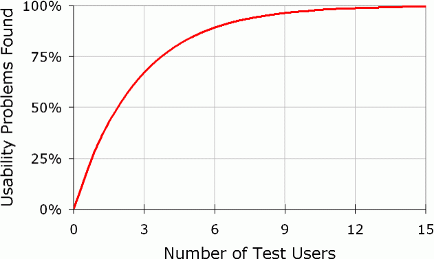

# Apêndice - Testes de Usabilidade

Teste de usabilidade é uma técnica de caixa-preta. O objetivo é observar usuários reais usando o
produto para descobrir problemas e pontos de melhorias. O produto, que pode ser um site, uma
aplicação web, um produto físico, não precisa estar completamente desenvolvido. Protótipos são
vastamente utilizados em testes de usabilidade para validação do que está sendo feito.

## O que é medido?
Testes de usabilidade geralmente envolve medir quão bem os participantes respondem a quatro áreas:

* **Desempenho:** Quanto tempo e quantos passos são necessários para que a pessoa complete tarefas
  básicas?
* **Precisão:** Quantos erros a pessoa cometeu? E eles foram fatais ou a pessoa conseguiu se
  recuperar com as informações recebidas pelo sistema?
* **Lembrança:** O quanto a pessoa se lembra mais tarde ou depois de períodos sem usar?
* **Resposta emocional:** Como a pessoa se sentiu depois de completar a tarefa? A pessoa estava
  confiante ou estressada? Ela recomendaria o produto a um amigo?

Nesse tipo de teste, um grupo representativo de usuários tenta completar tarefas, enquanto
observadores olham e tomam nota do que está acontecendo.

### "Pensar alto"
É importante que o usuário "pense alto", isto é, que verbalize sua intenção ao realizar as ações.

## Envolvidos
Um teste de usabilidade típico é composto, além do participante, por um moderador, que dá as
instruções ao participante de como o teste será realizado e passa a ele as tarefas que deverão ser
executadas; e o observador, normalmente o designer envolvido no desenvolvimento do produto. O ideal é
manter o mínimo de pessoas como observador, para que o participante não se sinta desconfortável no
momento do teste. Porém em algumas situações é interessante que o gerente do produto ou alguém do
time de desenvolvimento também participe como observador, pois dessa forma eles conseguem ter uma
visão mais real do produto que estão desenvolvendo.

### Local
O teste de usabilidade pode ser feito tanto no próprio ambiente onde a pessoa utilizará (ou utiliza)
o produto, como em um laboratório especial para isso. Ambos tem suas vantagens.

No próprio computador do participante, no seu próprio ambiente de trabalho, permite que tenhamos uma
idéia real de onde o produto será inserido: ele compartilha o computador?  Os recursos, como acesso a
internet, são satisfatórios? Qual a resolução de tela que ele usa? É frequentemente interrompido
quando está realizando suas tarefas? Entre outros.

A vantagem de usar um laboratório é a eficiência, pois é possível testar com várias pessoas em um
único dia, sem precisar ficar se deslocando; além do ambiente está em perfeitas condições para a
realização do teste: não existe interrupções, os recursos necessários sempre estão disponíveis, o
ambiente já está preparado para gravar todos os diálogos e as expressões faciais do participante,
alguns são equipados com aparelhos de *eye tracking* e, por ter aqueles espelhos especiais, pode-se
colocar vários observadores sem que o participante perceba e se sinta coagido ou desconfortável no
momento do teste.

### Moderador
A introdução ao teste deve ser feita pelo moderador, explicando o objetivo do teste e deixando bem
claro que o que está sendo testado é o produto e não o participante; que o papel do usuário naquele
teste é de colaborador, ao ajudar a melhorar o produto. Depois da introdução, o moderador passa ao
participante as tarefas que ele precisa realizar.

## Preparação prévia
Antes da realização do teste, o designer deve se preparar bem:

* Definir o perfil de usuário desejado;
* Realizar o recrutamento;
* Definir o que deve ser testado;
* Preparar os roteiros de teste;
* Alinhar com o moderador;
* Fazer um teste piloto para avaliar se o roteiro está adequado e realizar os ajustes, caso
  necessário.

### Anotar observações
Durante a realização do teste, assim como em qualquer pesquisa, o ideal é que o designer tenha um
pouco de tempo entre um teste e outro para consolidar as informações já obtidas, pois corre-se o
risco de esquecer detalhes importantes se deixar para fazer isso um tempo depois.

### Ajuste do protótipo entre testes
Também, dependendo
do tempo entre um teste e outro, o protótipo já pode ser ajustado caso sejam percebidas falhas graves
no desenho que esteja prejudicando os resultados dos testes.

### Elaborar relatório

Depois de concluídos os testes, o designer deve consolidar todas as informações obtidas, conversar
com os envolvidos no desenvolvimento do produto e apresentar o relatório dos achados do teste, para
juntos fazerem um plano de ação de tudo aquilo que precisa ser revisto e ajustado no design do
produto.

### Número de participantes

E com quantos participantes precisamos realizar um teste de usabilidade? Segundo um arquivo escrito
por Jakob Nielsen (http://www.nngroup.com/articles/why-you-only-need-to-test-with-5-users) esse número é 5.

Segundo esse artigo, assim que você testa com um único usuário, *insights* aparecem e você já tem
aprendido quase um terço de tudo o que há para saber sobre a usabilidade do design. Quando você testa
com um segundo usuário, você perceberá que essa pessoa faz quase as mesmas coisas que o primeiro
usuário, assim já existe algumas sobreposições no que você já aprendeu. Mas, ainda assim, aparecem
coisas novas que você não observou no primeiro teste, então o segundo ainda mostra alguns
*insights*, mas já bem menos que o primeiro. O terceiro teste fará muitas das coisas que já foi
observado no primeiro e no segundo teste, assim, adicionará muito menos informações do que os
primeiros testes. E a medida que você faz mais testes, você aprende cada vez menos, porque você
começa a ver as mesmas coisas novamente. Depois do décimo quinto teste, você já estará perdendo
tempo.

*Fonte: www.nngroup.com*

Esta curva mostra que você precisa testar com ao menos 15 pessoas para descobrir todos os problemas
de usabilidade do produto, mas então porque Nielsen recomenda apenas 5? A principal razão, segundo
ele, é que é melhor distribuir seu orçamento através de muitos testes menores em vez de gastá-lo todo
em um único e elaborado estudo.

Uma única ressalva feita pelo Nielsen é quando a aplicação tem vários grupos distintos de usuários.
Essa regra de 5 só vale quando o produto será usado por pessoas que usarão a aplicação de uma maneira
similar. Se, por exemplo, o teste será de uma aplicação que será usada por pais e filhos, então dois
grupos de usuários terão comportamentos suficientemente diferentes que torna-se necessário testar com
pessoas desses dois grupos. De qualquer forma, você não precisaria incluir tantos usuários no teste
como faria para teste de um único grupo de usuários. As sobreposições de informações garantirá um
melhor resultado testando um número menor de pessoas em cada grupo. Nielsen recomenda:

* 3 ou 4 usuários de cada categoria se estiver testando 2 grupos;
* 3 de cada categoria se estiver testando três ou mais grupos.

### Exemplo: script para Teste de Usabilidade

O seguinte script é uma adaptação e livre tradução do livro
*Rocket Surgery Made Easy de Steve Krug*

> **Nota para o moderador**
> Navegador deve estar aberto em uma página neutra, como a do Google.

Olá, <fulano de tal>. Meu nome é <sicrano> e irei te guiar através dessa sessão de testes de hoje.

Antes de começar, tenho algumas informações para passar a você e irei lê-las para ter certeza de que cobrirei tudo.

Você já deve ter uma idéia do motivo de você estar aqui, mas vou repassá-lo brevemente agora. Estamos pedindo a pessoas que tentem usar um website que estamos desenvolvendo para que possamos ver se ele trabalha como pretendido. A sessão deve levar em torno de <X> horas.

A primeira coisa que gostaria de deixar claro aqui é que estamos testando o site e não você. Você não pode fazer nada de errado aqui. Na verdade, aqui é provavelmente  o único lugar hoje que você não tem que se preocupar sobre estar cometendo erros.

A medida que você usa o site, eu pedirei a você que tente pensar alto o máximo possível: diga o que você está procurando, o que está tentando fazer, o que está pensando. Isso me ajudará bastante.

Também, por favor, não se preocupe de estar ferindo nossos sentimentos. Estamos fazendo isso para melhorar nosso site, então precisamos ouvir suas reações honestas.

Se você tiver qualquer questão a medida que prosseguimos no teste, pode perguntá-las. Eu posso não respondê-las de imediato, já que estamos interessados em ver como as pessoas fazem quando não tem alguém do lado ajudando. Mas se você ainda tiver alguma dúvida quando terminarmos, tentarei respondê-las. E se você precisar dar uma pausa a qualquer momento, é só me avisar.

**Caso estejam gravando a conversação durante o teste**: Você pode ter notado o microfone. Com sua permissão, nós estamos gravando o que acontece na tela e também nossas conversas. A gravação somente será usada para nos ajudar a descobrir como melhorar o site e não será vista por ninguém que não esteja trabalhando no projeto. E me ajuda bastante, pois não precisarei tomar nota de tudo.

**Caso outras pessoas estejam observando o teste**: Além disso, há algumas pessoas do time de design observando esta sessão em outra sala. Eles não podem nos ver, apenas a tela do computador.

Se você não se importa, peço que assine esse termo de permissão. Ele apenas diz que você nos dá a permissão de fazer a gravação e que ela só será vista pelas pessoas trabalhando no projeto.

> **Nota para o moderador**
> Dê ao participante o termo de permissão para ser assinado.
> Enquanto ele assina, inicie a gravação da tela.

**Se você tiver usando um termo de confidencialidade**: Nós lhe enviamos um termo de confidencialidade que diz que você não poderá falar para alguém sobre o que estamos lhe mostrando hoje, já que é um projeto que ainda não está público. Você trouxe o termo assinado?

> **Nota para o moderador**
> Se o participante não trouxe o termo assinado, entregue a ele outra cópia e dê a ele um tempo para ler e assinar.

Você tem alguma dúvida até o momento?

Ok. Antes de mostrar o site, gostaria de lhe fazer algumas poucas perguntas.

Primeiro, qual a sua ocupação? O que você faz durante o seu dia?

Agora, quantas horas na semana – apenas uma estimativa – você diria que gasta usando a internet, incluindo navegar e usar email, no trabalho e em casa?

E qual a divisão entre email e navegação – uma porcentagem aproximada?

Quais tipos de site você normalmente procura quando navega na web?

Você tem algum site favorito?

Ótimo. Acabamos com as perguntas e podemos começar a olhar o site.

> **Nota para o moderador**
> Abra o site no navegador.

Primeiro, vou pedir que você olhe esta página e me diga o que faria com ela: o que lhe chama atenção, que tipo de site você acha que é, o que pode fazer aqui e para que serve. Apenas olhe um pouco e faça uma pequena narrativa.

Pode baixar e subir a barra de rolagem, mas não clique em nada por enquanto.

> **Nota para o moderador**
> Deixe-o examinar e falar por no máximo 3 a 4 minutos.

Obrigada. Agora eu lhe pedirei para tentar fazer algumas tarefas específicas.

**Se o que você está testando não é algo específico da funcionalidade de busca**: Também peço que faça essas tarefas sem usar a busca. Nós aprenderemos muito mais sobre quão bem o site funciona se a busca não for usada.

E, mais uma vez, nos ajudará muito se você pensar alto enquanto estiver tentando executar a tarefa.

> **Nota para o moderador**
> Dê ao participante o primeiro cenário que você criou para o teste e o leia em voz alta.
> 
> Deixe o participante prosseguir até que você perceba que não está mais trazendo nenhum valor ou que o participante está ficando frustrado.
> 
> Repita para cada cenário de teste que tenha criado.

Obrigada! Você nos ajudou bastante.

**Caso outras pessoas estejam observando o teste**: Me dê licença um minuto que vou ver se as pessoas do time têm alguma pergunta que gostariam de fazer.

> **Nota para o moderador**
> No caso de ter observadores em outra sala, veja se eles têm alguma pergunta a fazer.
> 
> Faça as perguntas dos observadores.

Você tem alguma pergunta que queira fazer, agora que terminamos?

> **Nota para o moderador**
> Dê ao participante o incentivo ou ajuda de custo que tenha previamente acertado com ele.
> 
> Pare a gravação e grave o arquivo.
> 
> Agradeça a sua participação e o acompanhe até a saída.

## Gamestorming - Teste de usabilidade

### Objetivo
Entender como usuário utiliza um sistema, site ou app. E aplicar melhorias focado
na necessidade do usuário.

### Ambiente
1. Notebook;
2. Cartão com linhas;
3. Folhas A4;
4. Canestas;
5. Post-its.

### Regras
* Duração de 40 minutos.

### Passo a passo
1. Escolher um site ou app que não seja de uso comum como facebook, mas que algum
integrante do time conheça como o site funciona;
2. Definir um objetivo para o teste;
3. Criar um fluxo de teste que dure no máximo 5 minutos;
4. Realizar um teste beta com alguém do time;
5. Realizar o teste com um integrante de outro time. Antes de começar o teste não podemos nos
esquecer:
  5. Apresentar o produto;
  5. Deixar bem claro que quem está sendo testado é o site;
  5. Pedir para o usuário falar em voz alta o que ele está pensando;

### Exemplo: Termo de Permissão de Gravação

Obrigado por participar de nosso teste de usabilidade.

Nós gravaremos sua sessão para permitir que colaboradores da **__nome da empresa__**, que não puderam estar presentes aqui hoje, possam posteriormente observar o teste.

Por favor, leia o termo abaixo e assine no local indicado.

>### Termo
>Estou ciente de que minha sessão de teste de usabilidade será gravada.
>Permito que **__nome da empresa__** use esta gravação apenas para uso interno, com o propósito de melhorar a interface sendo testada.
>
>Nome:
>
>Assinatura:
>
>Data:

